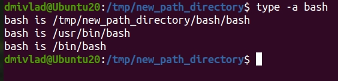

## Ответы на задания 03-sysadmin-01-terminal
1. Из за известных обстоятельств Ubuntu ставил со скачанного образа. Также занимаюсь поднятием VPN сервера (тут https://webhost1.ru/) с голландским IP-шником для возможности пользования сервисами. Сам vegrant установлен, как писать конфиги потренировался.
2. С GUI VirtualBox знаком давно, ранее работал.
3. С возможностями конфигурации ВМ чере vegrant ознакомился.
4. Чтобы изменить количество вычислительных ресурсов достаточно внести изменения в конфигурационный файл ВМ в следующие директивы или добавить их, если ранее они не были описаны:
* v.memory = 1024
* v.cpus = 2
5. Длину журнаа history можно задать переменной HISTSIZE, это описывается на строке 681 в man bash. Директива ignoreboth (для переменной HISTCONTROL) является сокращением для ignorespace и ignoredups.
6. Фигурные скобки применяются в том числе для описания шаблонных выражений. В man bash на строке 856 приводится следующее описание "Brace Expansion
Brace expansion is a mechanism by which arbitrary strings may be generated.  This mechanism is similar to pathname expansion, but the filenames generated need  not  exist.
Patterns  to  be  brace  expanded  take the form of an optional preamble, followed by either a series of comma-separated strings or a sequence expression between a pair of braces, followed by an optional postscript.  The preamble is prefixed to each string contained within the braces, and the postscript is then  appended  to  each  resulting string, expanding left to right. Brace expansions may be nested.  The results of each expanded string are not sorted; left to right order is preserved.  For example, a{d,c,b}e expands into `ade ace abe '.".
7. touch {1..100000}.ini создаст необходимое количество файлов. touch {1..300000}.ini вывалится с ошибкой bash: /usr/bin/touch: Argument list too long (слишком длинный список аргументов), файлы не создадутся.
8. Выражение [[ -d /tmp ]] позволяет проверить наличие каталога tmp.
9. Использовался следующий перечень команд:
* mkdir -p /tmp/new_path_directory/bash
* cp /bin/bash/ /tmp/new_path_directory/bash/
* PATH=/tmp/new_path_directory/bash/:$PATH
* cat /etc/environment (для проверки)
* type -a bash:

10. Обе утилиты входят в пакет at. Используются для планирования однократного выполнения задания. At - на конкретное время, batch - на время, когда нагруженность системы менее 1.5 (согласно man batch, строка 26).

