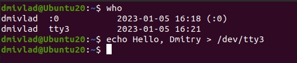
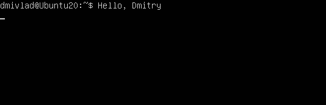
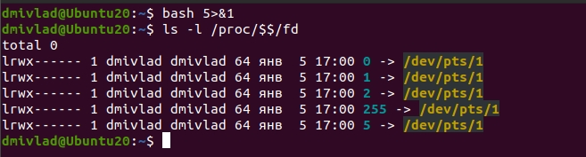
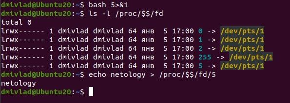
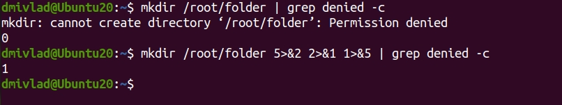
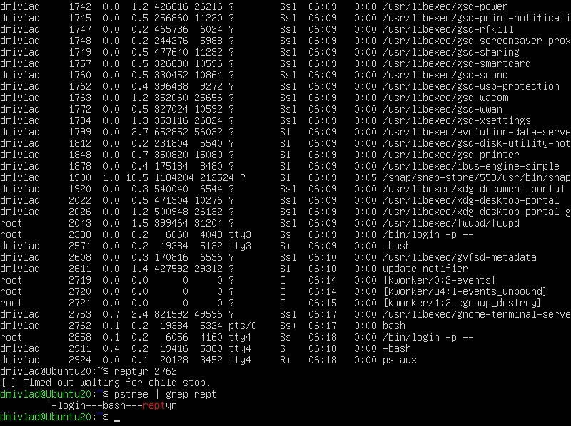

## Ответы на задания 03-sysadmin-02-terminal
1. Вывод команды type -a cd предоставляет следующие данные: *cd is a shell builtin*. Таким образом, cd - встроенная в bash утилита.
2. Команде *grep cpu /proc/cpuinfo | wc -l* в данном случае будет эквивалентна команда *grep -c 'cpu' /proc/cpuinfo *
3. Процесс с PID 1 в ОС Ubuntu 20.04 называется systemd(1).
4. Например, команда может выглядеть следующим образом *ls -l /root/ 2> /dev/pts/1*.
5. Один из вариантом работающего примера будет выглядеть таким образом *sort </proc/cpuinfo >aboutcpu.txt*.
6. Данные вывести можно. Наблюдать можно только после переключения в режим TTY, как показано на скриншотах:  
  
  
7. *bash 5>&1* создаст дескриптор и перенаправлит его в stdout  
  
*echo netology > /proc/$$/fd/5* перенаправить в созданный ранее дескриптор, который в свою очередь перенаправит в stdout и выведет в консоль netology.  
  
8. Использовать в качестве входного потока для pipe только stderr команды, не потеряв при этом отображение stdout на pty получится через промежуточный дескриптор. Пример на скриншоте:  

9. Команда cat /proc/$$/environ выведет список переменных окружения, инициализированных процессом, полученным из переменной $$ (собственный PID текущего экземпляра SHELL). Получить аналогичный вывод можно с помощью команды env.
10. */proc/<PID>/cmdline* - содержит запись командной строки, с помощью которой был запущен процесс, если процесс не явяется зомби. */proc/<PID>/exe* содержит символьную ссылку, указывающую на фактически выполняемую команду. Открыв данную ссылку можно запустить еще один экземпляр процесса.
11. Процессор model name : Intel(R) Core(TM) i5-10210U CPU @ 1.60GHz поддерживает следующий набор инструкций:fpu vme de pse tsc msr pae mce cx8 apic sep mtrr pge mca cmov pat pse36 clflush mmx fxsr sse sse2 ht syscall nx rdtscp lm constant_tsc rep_good nopl xtopology nonstop_tsc cpuid tsc_known_freq pni pclmulqdq ssse3 cx16 pcid sse4_1 **sse4_2** movbe popcnt aes rdrand hypervisor lahf_lm abm 3dnowprefetch invpcid_single ibrs_enhanced fsgsbase bmi1 bmi2 invpcid rdseed clflushopt md_clear flush_l1d arch_capabilities
12. Возможно, что при входе в оболочку localhost ожидает, что соединение будет инициироваться пользователем. В данном случае инициатор - процесс, поэтому ssh сессия не устанавливается. С ключами  -t -l (установка принудительного псевдотерминала и указания пользователя) подключение устанавливается, но сразу же завершается.  
vagrant@vagrant:~$ ssh -t -l vagrant localhost 'tty'
vagrant@localhost's password: 
/dev/pts/1
Connection to localhost closed.  
13. В Ubuntu 20.04 по умолчанию не установлены пакеты *screen* и *reptyr*, их необходимо было установить. Также утилита reptyr вылетала с ошибкой до того момента, пока в файле /etc/sysctl.d/10-ptrace.conf не было изменено значение переменной на 0. Получены следующие результаты:  
  
14. sudo echo string | tee /root/newfile запустит с повышенными привилегиями только echo, что не даст возможности tee записать в файл. В свою очередь конструкция echo string | sudo tee /root/newfile позволит stdout операции echo string перенаправить с помощью pipe в stdin tee, последняя сможет записать в файл, т.к. запущена от sudo.  

