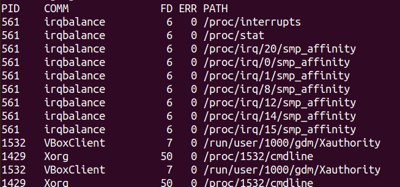
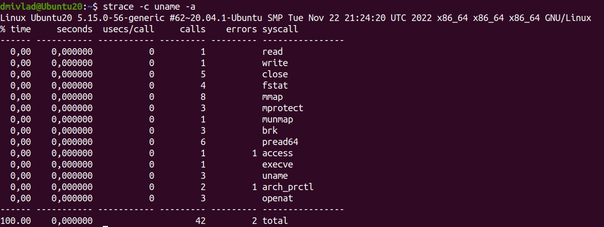

## Ответы на задания 03-sysadmin-03-os  
1. strace /bin/bash -c 'cd /tmp'. Используя данную команду можно определить, что *chdir* является системным вызовом, который использует утилита cd.  
2. Предположительно bash берет информацию из данного файла: usr/share/misc/magic.mgc. Согласно информации из man:  
*This manual page documents the format of magic files as used by the file(1) command, version 5.38.  The file(1) command identifies the type of a file using, among other tests, a test for whether the file contains certain “magic patterns”.  The database of these “magic patterns” is usually located in a binary file in /usr/share/misc/magic.mgc or a directory of source text magic pattern fragment files in /usr/share/misc/magic. The database specifies what patterns are to be tested for, what message or MIME type to print if a particular pattern is found, and additional information to extract from the file.*  
3. Необходимо с помощью lsof определить название файла и применить команду вида *echo > /var/log/dpkg.log* для очистки соответствующего файла.  
4. Замби процессы не занимают никаких ресурсов ОС, кроме записей в таблице процессов, которые ограничены.  
5. Файлы с вызовами группы open указаны на скриншоте:  
  
6. Полный список системных вызовов, которые использует утилита *uname -a* можно получить с помощью команды *strace -c uname -a*:  
  
Нас в данном случае интересует вызов uname. В man информацию можно получить следующей командой *man 2 uname | grep proc*. Цитата следующая: Part of the utsname information is also accessible via /proc/sys/kernel/{ostype, hostname, osrelease, version, domainname}.  
7. Разница двух операторов в том, что *;* выведет результат (выполнит последнюю команду) в любом случае, а *&&* только в случае успеха выполнения предыдущих команд. Учитывая фразу из man -e  Exit immediately if a command exits with a non-zero status использовать с *&&* смысла не имеет, т.к. выполнение команд будет прервано.  
8. Команда *set -euxo pipefail* состоит из следующих опций:
* -e  Exit immediately if a command exits with a non-zero status.  
* -u  Treat unset variables as an error when substituting.  
* -x  Print commands and their arguments as they are executed.  
* -o option-name  
Изпользовать в подобном виде в скриптах полезно, т.к. оболочка и проверяет инициализации переменных в скрипте и проверяет, чтобы все команды в скрипте завершились успешно.
9. Максимальное количество в системе процессов со статусом *S**, далее по количеству статус *I*. Процессов со статусом *R* минимальное количетсво - в моем случае всего 2. По вопросу статусов процессов, информация из man следующая:  
PROCESS STATE CODES  
Here are the different values that the s, stat and state output specifiers (header "STAT" or "S") will display to describe the state of a process:  
* D   * uninterruptible sleep (usually IO)  
* I    Idle kernel thread  
* R    running or runnable (on run queue)  
* S    interruptible sleep (waiting for an event to complete)  
* T    stopped by job control signal  
* t    stopped by debugger during the tracing  
* W    paging (not valid since the 2.6.xx kernel)  
* X    dead (should never be seen)  
* Z    defunct ("zombie") process, terminated but not reaped by its parent 
  
For BSD formats and when the stat keyword is used, additional characters may be displayed:  
* <    high-priority (not nice to other users)  
* N    low-priority (nice to other users)  
* L    has pages locked into memory (for real-time and custom IO)  
* s    is a session leader  
* l    is multi-threaded (using CLONE_THREAD, like NPTL pthreads do)  
* *+*  is in the foreground process group  

