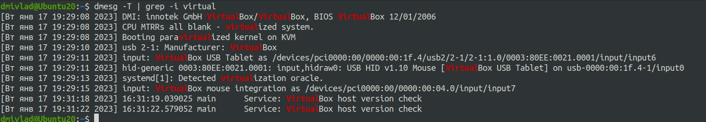

## Ответы на задания 03-sysadmin-04-os  
1. Создаем пользователя и группу user_node_exporter и назначаем права на скрипт node_exporter. Далее создаем файл по следующему пути /etc/systemd/system/node_exporter.service:  
```
After=network.target

[Service]
User=user_node_exporter
Group=user_node_exporter
Type=simple
ExecStart=/usr/local/bin/node_exporter
ExecReload=/bin/kill -HUP $MAINPID
Restart=on-failure

[Install]
WantedBy=multi-user.target  
```  
Убеждаемся, что сервис работает после перезагрузки, настроив его командой **systemctl enable node_exporter**:  

2. Для мониторинга CPU:  
* node_schedstat_running_seconds_total 
* process_cpu_seconds_total   
Для мониторинга памяти:  
*  node_memory_MemFree_bytes  
Для мониторинга диска:  
* node_disk_io_time_weighted_seconds_total  
* node_filesystem_avail_bytes  
Для мониторинга сети:    
* node_network_info  
3. Netdata установлена, конфиг поправлен, порты проброшены, работы на хост машине протестирована, результат на скриншоте:  
  
4. По выводу dmesg система может индентифицировать, что работает под управлением виртуального оборудования. В частности, вывод команды *dmesg -T | grep -i virtual* демонстрирует следующие результаты:  

5. Настройка по умолчанию параметра ядра fs.nr_open приведена на скриншоте:  
  
Данный параметр ядра определяет максимально возможное количетво открытых файлов для каждого процесса.  
Другой существующий лимит, который не позволит достичь данного числа определяется выводом команды *ulimit -n*.  
6. Запуск процесса sleep 1h в отдельном неймспэйсе продемонстрирован на скриншоте:  
  
Процесс в новом неймспейсе работает под PID1. Это можно проверить с помощью команды nsenter:  
  
7. Как было сказано на занятии вызов вида *:(){ :|:& };:* является форк бомбой. Это функция, которая в фоне вызывает саму себя бесконечное число раз. Стабилизировать систему помог механизм *[Сб янв 21 08:41:18 2023] cgroup: fork rejected by pids controller in /user.slice/user-1000.slice/user@1000.service*. Изменить настройки по умолчанию для данного механизма можно с помощью команды, описанной в упражнении №5 текущего зададния *ulimit -n*.  

