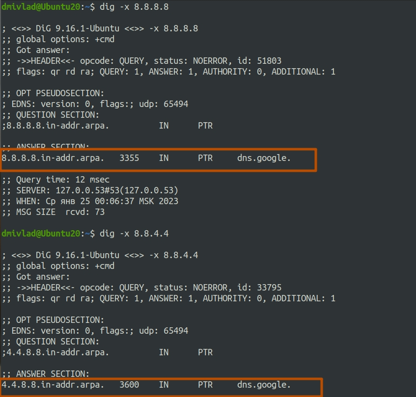

## Ответы на задания 03-sysadmin-06-net  
1. При данном запросе:
  
от сервера придет ответ **GET /questions HTTP/1.0**, что означает, что не переданы данные для авторизации.  
2. Перавый код ответа сервера отражен на скриншоте:  
  
Общее время загурзки страницы:  
  
Дольше всего загружалась сама страница https://stackoverflow.com/  
  
3. Адрес в интернете можно определить с помощью множества сервисов, в частности по примеру на скриншоте:  
  
Также адрес можно определить из консоли Linux с помощью внешних сервисов  
  
Кроме того можно зачастую можно определить адрес, воспользовавшись утилитами *pathping* или *traceroute*, отследив адрес, находящийся за шлюзом.  
4. Часть вывода команды whois показывает следующие данные о провайдере:  
  
Если воспользоваться командой *whois -h whois.radb.net 185.15.117.88* получим следующую информацию об автономной системе:  
  
5. Весь маршрут пакета, проходящего до адреса 8.8.8.8 отражен на скриншоте:  
  
6. Судя по выводу команды *mtr -zn 8.8.8.8* максимальные средние задержки наблюдаеются на участке, отмеченном цветом на скриншоте:  
  
7. Серверы, которые отвечают за домен dns.google: 8.8.8.8 и 8.8.4.4  
A записи продемонстрированы на скриншоте ниже:  
  
8. К каким серверам относятся ip адреса следует из вывода команды на скриншоте:  
  

