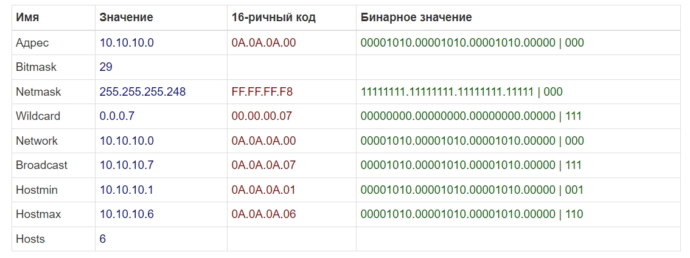

## Ответы на задания 03-sysadmin-07-net  
1. Список сетевых интерфейсов доступен по команде *ipconfig* в ОС Windows. Доступные приведены на скриншоте:  
  
В Linux для просмотра сетевых интерфейсов можно использовать команду *ip link show*, либо *ip addr*, либо посмотреть устройства на файловой системе с помощью команды *ls /sys/class/net*  
2. Для определения соседа по сетевому интерфейсу используется протокол **LLDP**. В Linux существует пакет **lldpd**, который позволяет пользоваться данным протоколом и получать соответствующую информацию.  
3. Технология, позволяющая разделать порты коммутатора и относить их к разным виртуальным сетям называется **VLAN** (стандарт 802.1q). В ОС Linux для управления виртуальными сетями используется пакет **vlan**. Пример рабочего конфига при использовании **netplan**:  
```  
network:
   version: 2
   ethernets:
     enp0s3:
      dhcp4: false
      dhcp6: false
      addresses:
       - 192.168.155.51/24
      gateway4: 192.168.155.1
      nameservers:
       addresses: [8.8.8.8, 1.1.1.1]
    
   vlans:
    enp0s3.111:
      id: 111
      link: enp0s3
      addresses: [192.168.155.57/24]
```  
4. Агрегация сетевых интерфейсов в Linux, так же называемая **bonding** может функционировать в следующих режимах:  
* mode=0 (balance-rr). При этом методе объединения трафик распределяется по принципу «карусели»: пакеты по очереди направляются на сетевые карты объединённого интерфейса. Например, если у нас есть физические интерфейсы eth0, eth1, and eth2, объединенные в bond0, первый пакет будет отправляться через eth0, второй — через eth1, третий — через eth2, а четвертый снова через eth0 и т.д.  
* mode=1 (active-backup). Когда используется этот метод, активен только один физический интерфейс, а остальные работают как резервные на случай отказа основного.  
* mode=2 (balance-xor). В данном случае объединенный интерфейс определяет, через какую физическую сетевую карту отправить пакеты, в зависимости от MAC-адресов источника и получателя.  
* mode=3 (broadcast). Широковещательный режим, все пакеты отправляются через каждый интерфейс. Имеет ограниченное применение, но обеспечивает значительную отказоустойчивость.  
* mode=4 (802.3ad). Особый режим объединения. Для него требуется специально настраивать коммутатор, к которому подключен объединенный интерфейс. Реализует стандарты объединения каналов IEEE и обеспечивает как увеличение пропускной способности, так и отказоустойчивость.  
* mode=5 (balance-tlb). Распределение нагрузки при передаче. Входящий трафик обрабатывается в обычном режиме, а при передаче интерфейс определяется на основе данных о загруженности.  
* mode=6 (balance-alb). Адаптивное распределение нагрузки. Аналогично предыдущему режиму, но с возможностью балансировать также входящую нагрузку.  
Пример работающего конфигурационного файла при использовании **netplan**:  
```  
network:
    version: 2
    renderer: networkd
    ethernets:
        enp0s3: {}
        enp2s3: {}
    bonds:
        bond0:
            dhcp4: no
            interfaces:
            - enp0s3
            - enp2s3
            parameters:
                mode: active-backup
            addresses:
                - 192.168.155.51/24
            gateway4: 192.168.155.1
            mtu: 1500
            nameservers:
                addresses:
                    - 8.8.8.8
```  
5. IP адресов в сети с маской /29 всего 8. При этом для хостовой части - только 6, т.к. один адрес самой сети, и последний - broadcast адрес.  Из сети с маской /24 можно получить 32 сети с маской /29. Примеры сетей, нарезанных из сети 10.10.10.0/24 приведены на скриншотах:  
  
  
6. В случае занятости указанных в задании диапазонов частных ip адресов допустимо взять из следующего диапазона: *100.64.0.0 — 100.127.255.255*. Для того, чтобы соблюсти требование о максимальном количестве хостов в 50-60 штук достаточно использовать следующую сеть: *100.64.0.0/26*.  
7. Проверка arp таблицы в Windows  
    
Проверка arp таблицы в Linux  
  
В Windows польностью очистить arp таблицу можно командой *arp -d*. Удалить выборочную запись можно следующей командой *arp -d 224.0.0.251*.  


