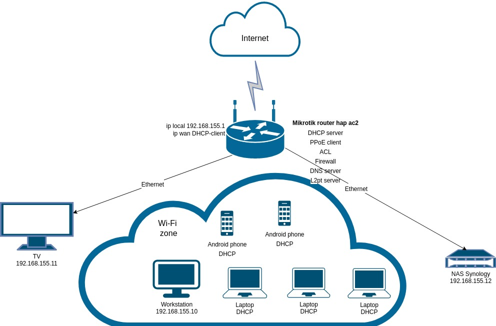

## Ответы на задания 03-sysadmin-08-net  
1. *show ip route 178.176.76.156/32* указал на ошибку синтаксиса:  
   
В свою очередь вывод команды *show ip route 178.176.76.156* выглядит таким образом:  
  
Вывод команды *show bgp 178.176.76.156* следующий:  
```  
BGP routing table entry for 178.176.72.0/21, version 2664457787
Paths: (20 available, best #14, table default)
  Not advertised to any peer
  Refresh Epoch 1
  3333 31133 25159, (aggregated by 25159 10.205.141.129)
    193.0.0.56 from 193.0.0.56 (193.0.0.56)
      Origin IGP, localpref 100, valid, external
      path 7FE0133F0470 RPKI State valid
      rx pathid: 0, tx pathid: 0
  Refresh Epoch 1
  20912 3257 3356 31133 25159, (aggregated by 25159 10.205.141.129)
    212.66.96.126 from 212.66.96.126 (212.66.96.126)
      Origin IGP, localpref 100, valid, external
      Community: 3257:8070 3257:30515 3257:50001 3257:53900 3257:53902 20912:65004
      path 7FE0B231E538 RPKI State valid
      rx pathid: 0, tx pathid: 0
  Refresh Epoch 1
  6939 31133 25159, (aggregated by 25159 10.205.141.129)
    64.71.137.241 from 64.71.137.241 (216.218.253.53)
      Origin IGP, localpref 100, valid, external
      path 7FE09A43B538 RPKI State valid
      rx pathid: 0, tx pathid: 0
  Refresh Epoch 1
  8283 31133 25159, (aggregated by 25159 10.205.141.129)
    94.142.247.3 from 94.142.247.3 (94.142.247.3)
      Origin IGP, metric 0, localpref 100, valid, external
      Community: 8283:1 8283:101 8283:102
      unknown transitive attribute: flag 0xE0 type 0x20 length 0x30
        value 0000 205B 0000 0000 0000 0001 0000 205B
              0000 0005 0000 0001 0000 205B 0000 0005
              0000 0002 0000 205B 0000 0008 0000 001A
              
      path 7FE165F8B210 RPKI State valid
      rx pathid: 0, tx pathid: 0
  Refresh Epoch 1
  7018 3356 31133 25159, (aggregated by 25159 10.205.141.129)
    12.0.1.63 from 12.0.1.63 (12.0.1.63)
      Origin IGP, localpref 100, valid, external
      Community: 7018:5000 7018:37232
      path 7FE030A46678 RPKI State valid
      rx pathid: 0, tx pathid: 0
  Refresh Epoch 1
  3257 1299 31133 25159, (aggregated by 25159 10.205.141.129)
    89.149.178.10 from 89.149.178.10 (213.200.83.26)
      Origin IGP, metric 10, localpref 100, valid, external
      Community: 3257:8794 3257:30052 3257:50001 3257:54900 3257:54901
      path 7FE15400F598 RPKI State valid
      rx pathid: 0, tx pathid: 0
  Refresh Epoch 1
  3561 3910 3356 31133 25159, (aggregated by 25159 10.205.141.129)
    206.24.210.80 from 206.24.210.80 (206.24.210.80)
      Origin IGP, localpref 100, valid, external
      path 7FE162E53C50 RPKI State valid
      rx pathid: 0, tx pathid: 0
  Refresh Epoch 1
  19214 174 31133 25159, (aggregated by 25159 10.205.141.129)
    208.74.64.40 from 208.74.64.40 (208.74.64.40)
      Origin IGP, localpref 100, valid, external
      Community: 174:21101 174:22028
      path 7FE1783F20C8 RPKI State valid
      rx pathid: 0, tx pathid: 0
  Refresh Epoch 1
  49788 12552 31133 25159, (aggregated by 25159 10.205.141.129)
    91.218.184.60 from 91.218.184.60 (91.218.184.60)
      Origin IGP, localpref 100, valid, external
      Community: 12552:12000 12552:12100 12552:12101 12552:22000
      Extended Community: 0x43:100:0
      path 7FE00F6227B8 RPKI State valid
      rx pathid: 0, tx pathid: 0
  Refresh Epoch 1
  3549 3356 31133 25159, (aggregated by 25159 10.205.141.129)
    208.51.134.254 from 208.51.134.254 (67.16.168.191)
      Origin IGP, metric 0, localpref 100, valid, external
      Community: 3356:2 3356:22 3356:100 3356:123 3356:513 3356:901 3356:2084 3549:2581 3549:30840
      path 7FE179500898 RPKI State valid
      rx pathid: 0, tx pathid: 0
  Refresh Epoch 1
  3267 31133 25159, (aggregated by 25159 10.205.141.129)
    194.85.40.15 from 194.85.40.15 (185.141.126.1)
      Origin IGP, metric 0, localpref 100, valid, external
      path 7FE0BF9A6F10 RPKI State valid
      rx pathid: 0, tx pathid: 0
  Refresh Epoch 1
  4901 6079 31133 25159, (aggregated by 25159 10.205.141.129)
    162.250.137.254 from 162.250.137.254 (162.250.137.254)
      Origin IGP, localpref 100, valid, external
      Community: 65000:10100 65000:10300 65000:10400
      path 7FE0DA358510 RPKI State valid
      rx pathid: 0, tx pathid: 0
  Refresh Epoch 1
  101 3356 31133 25159, (aggregated by 25159 10.205.141.129)
    209.124.176.223 from 209.124.176.223 (209.124.176.223)
      Origin IGP, localpref 100, valid, external
      Community: 101:20100 101:20110 101:22100 3356:2 3356:22 3356:100 3356:123 3356:513 3356:901 3356:2084
      Extended Community: RT:101:22100
      path 7FE0ABCF2608 RPKI State valid
      rx pathid: 0, tx pathid: 0
  Refresh Epoch 1
  3356 31133 25159, (aggregated by 25159 10.205.141.129)
    4.68.4.46 from 4.68.4.46 (4.69.184.201)
      Origin IGP, metric 0, localpref 100, valid, external, best
      Community: 3356:2 3356:22 3356:100 3356:123 3356:513 3356:901 3356:2084
      path 7FE13321D918 RPKI State valid
      rx pathid: 0, tx pathid: 0x0
  Refresh Epoch 1
  57866 3356 31133 25159, (aggregated by 25159 10.205.141.129)
    37.139.139.17 from 37.139.139.17 (37.139.139.17)
      Origin IGP, metric 0, localpref 100, valid, external
      Community: 3356:2 3356:22 3356:100 3356:123 3356:513 3356:901 3356:2084 57866:100 65100:3356 65103:1 65104:31
      unknown transitive attribute: flag 0xE0 type 0x20 length 0x30
        value 0000 E20A 0000 0064 0000 0D1C 0000 E20A
              0000 0065 0000 0064 0000 E20A 0000 0067
              0000 0001 0000 E20A 0000 0068 0000 001F
              
      path 7FE0AFFB23F0 RPKI State valid
      rx pathid: 0, tx pathid: 0
  Refresh Epoch 2
  2497 174 31133 25159, (aggregated by 25159 10.205.141.129)
    202.232.0.2 from 202.232.0.2 (58.138.96.254)
      Origin IGP, localpref 100, valid, external
      path 7FE168014568 RPKI State valid
      rx pathid: 0, tx pathid: 0
  Refresh Epoch 1
  20130 6939 31133 25159, (aggregated by 25159 10.205.141.129)
    140.192.8.16 from 140.192.8.16 (140.192.8.16)
      Origin IGP, localpref 100, valid, external
      path 7FE115C885A0 RPKI State valid
      rx pathid: 0, tx pathid: 0
  Refresh Epoch 1
  3303 31133 25159, (aggregated by 25159 10.205.141.129)
    217.192.89.50 from 217.192.89.50 (138.187.128.158)
      Origin IGP, localpref 100, valid, external
      Community: 3303:1004 3303:1006 3303:1030 3303:1031 3303:3056 65101:1085 65102:1000 65103:276 65104:150
      path 7FE16E568108 RPKI State valid
      rx pathid: 0, tx pathid: 0
  Refresh Epoch 1
  1351 6939 31133 25159, (aggregated by 25159 10.205.141.129)
    132.198.255.253 from 132.198.255.253 (132.198.255.253)
      Origin IGP, localpref 100, valid, external
      path 7FE10ED28368 RPKI State valid
      rx pathid: 0, tx pathid: 0
  Refresh Epoch 1
  852 31133 25159, (aggregated by 25159 10.205.141.129)
    154.11.12.212 from 154.11.12.212 (96.1.209.43)
      Origin IGP, metric 0, localpref 100, valid, external
      path 7FE11B68BC08 RPKI State valid
      rx pathid: 0, tx pathid: 0
```  
2. Создание dummy0 интерфейса:  
*sudo ip link add dummy0 type dummy*  
*sudo ip addr add 192.168.198.15 dev dummy0*  
*sudo ip link set dummy0 up*  
  
Добавление статических маршрутов командами:  
*sudo ip route add 10.1.1.0/24 via 192.168.198.15*  
*sudo ip route add 10.1.25.0/32 via 192.168.198.15*  
Подтверждение добавления маршрутов:  
  
3. Частичный вывод команды *ss -ta*  
  
На скриншоте видно, что используются протоколы HTTP, HTTPS. Используются браузером и магазином приложений.  
4. Проверка используемый udp сокетов производится командой *ss -ua*. Ее вывод представлен на скриншоте:  
  
Используется в частности протокол BOOTP для автоматического получения ip адреса.  
5. Схема L3 домашней сети представлена на скриншоте:  
  

