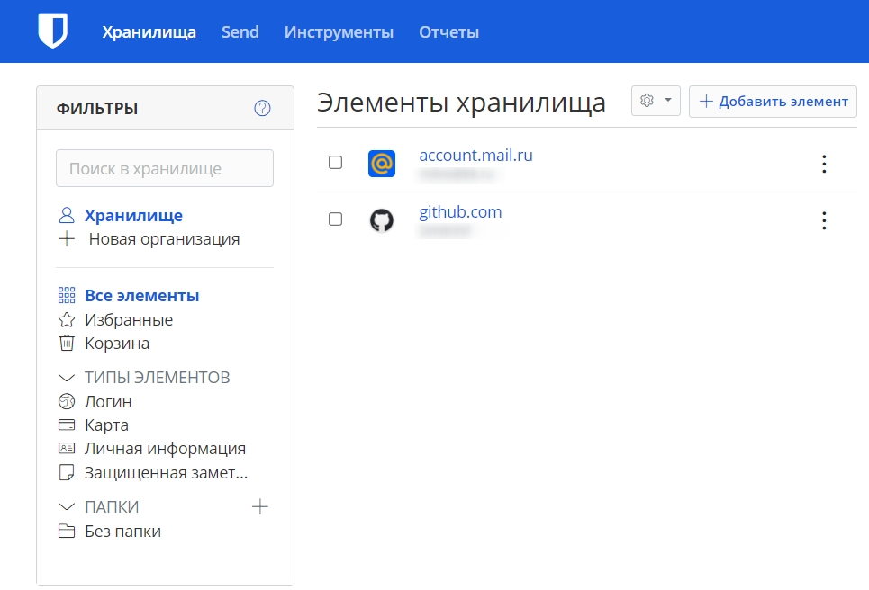
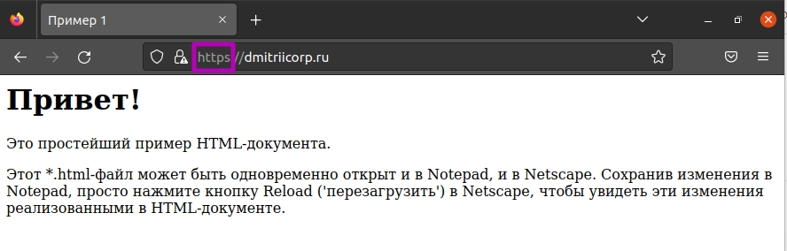
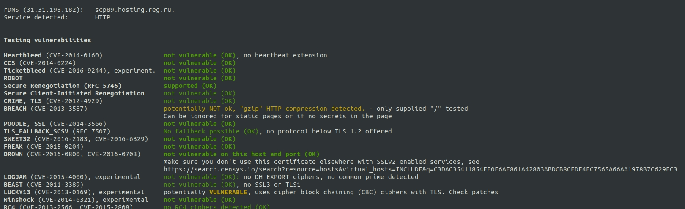
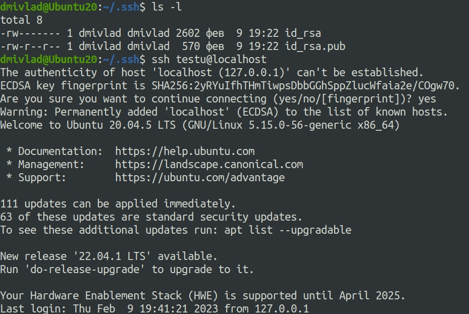
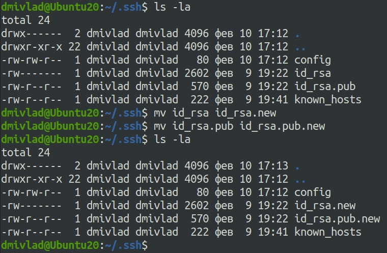
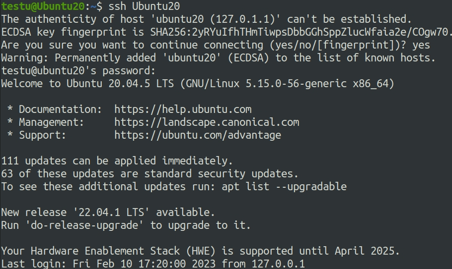
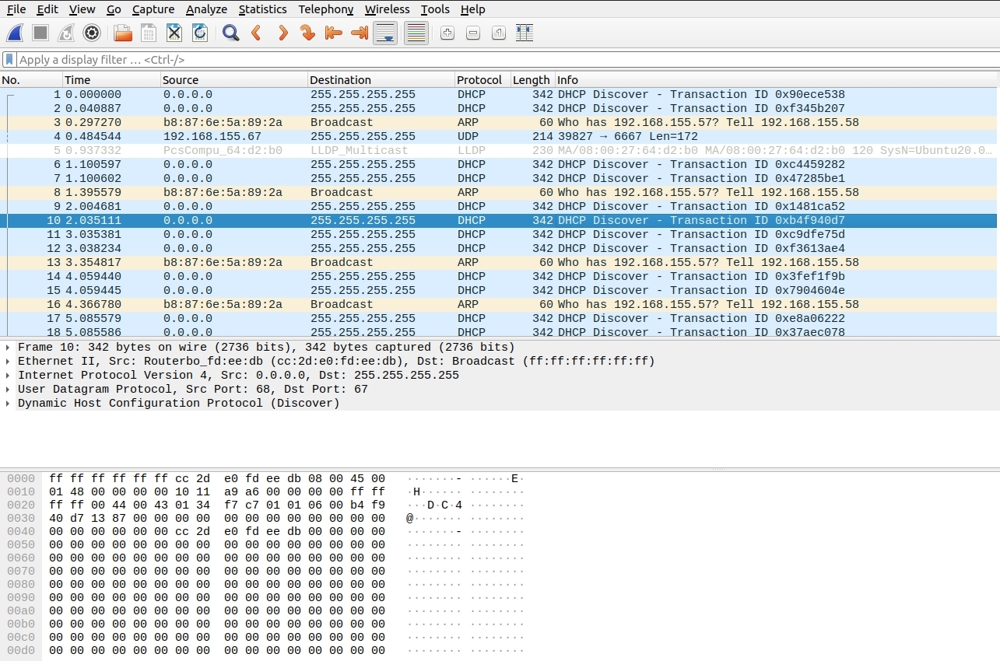

## Ответы на задания 03-sysadmin-09-security  
1. Регистрация прошла успешно, пароли сохраняются:  
  
2. Настройка двухфакторной аутентификации прошла успешно:  
  
3. Настройка apache сервера и https на самоподписанном сертификате прошла успешно:  
  
4. Тестирование на TLS уязвимости произвольного сайта прошло успешно:  
  
5. Сервер SSH устанавливается с помощью команды *sudo apt-get install ssh*  
Удалось подключиться к серверу по ранее сгенеренному сертификату:  
  
6. Файлы ключей переименованы, что отражено на скриншоте:  
  
Подключение к ssh серверу по hostname:  
  
7. Захват пакетов в файл командой *sudo tcpdump -w enp0s3.pcap -c 100 -i enp0s3* представлен на скриншоте:  
  
Открытие enp0s3.pcap файла в Wireshark выглядит следующим образом:  
  

