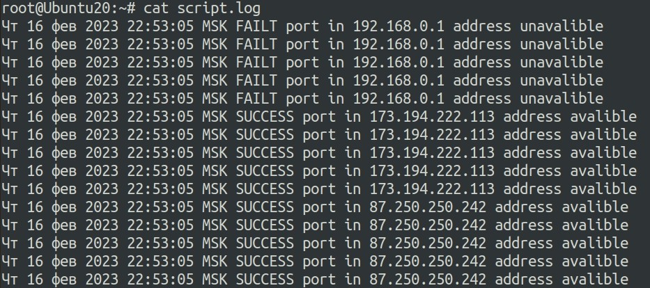

## Ответы на задания 04-script-01-bash  
1. В приеденном скрипте:  
```  
a=1
b=2
c=a+b
d=$a+$b
e=$(($a+$b))  

```  
*echo $c* выведет значение *a+b*, так именно такая строка была присвоена переменной c.  
*echo $d* выведет значение *1+2*, так по сути будет являться конкатенацией значений двух строковых переменных.  
*echo $e* выведет значение *3*, так по в данном примере использованы символы для приведения типов переменных к арифметическим.  

2. Рабочий скрипт с комментариями ниже:  
```
while ((1==1)) #была допущена синтаксическая ошибка  
do
	curl https://localhost:4757
	if (($? != 0)) #строка проверяет код ответа предыдущей команды
	then
		date >> curl.log
	else
		break # выход из цикла при успешном коде ответа 0
	fi
done
```  
3. Скрипт, выполняющий проверку доступности портов на указанных адресах показан ниже:  
```  
#!/bin/bash 
port_number=80
log_date=$(date)
array_ip=("192.168.0.1" "173.194.222.113" "87.250.250.242")
for i in ${array_ip[@]}
        do
                count=0
                while (($count<5))
                        do
                                nc -z -w 1 $i $port_number
                                        if (($? != 0))
                                                then
                                                echo "$log_date FAILT port in $i address unavalible" >> script.log
                                                else
                                                echo "$log_date SUCCESS port in $i address avalible" >> script.log
                                        fi
                                count=$(($count+1))
                        done
done
``` 
Результат работы скрипта - на скриншоте:  
  
4. Скрипт, дописанный по заданным парамертам:  
```
#!/bin/bash 
port_number=80
log_date=$(date)
array_ip=("192.168.0.1" "173.194.222.113" "87.250.250.242")
for i in ${array_ip[@]}
        do
           count=0
                        while (($count<5))
                        do
                                nc -z -w 1 $i $port_number
                                        if (($? == 0))
                                                then
                                                echo "$log_date SUCCESS port in $i address avalible" >> script.log
                                                else
                                                echo "$log_date FAILT port in $i address unavalible" >> script.log
                                                echo $i >> error.log
                                                exit 1
                                        fi
                        count=$(($count+1))

                        done
done
```


