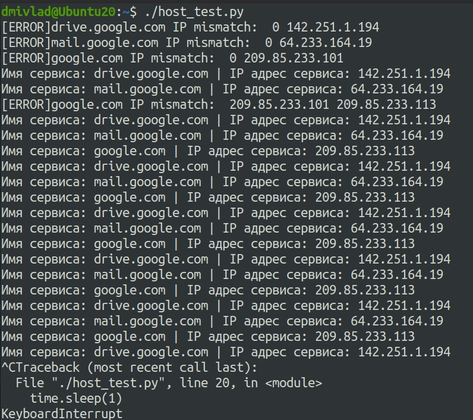

## Ответы на задания 04-script-02-py
1. Пояснение по поводу скрипта:  
```
a = 1
b = '2'
c = a + b
```  
Вопрос: Какое значение будет присвоено переменной c? Ответ: Переменной c не будет присвоено никакое значение из-за ошибки интерпритации типа данных.  
Вопрос: Как получить для переменной c значение 12? Ответ: Чтобы получить 12 необходимо привести переменную a к строковому типу и далее присвоить с значение a+b, таким образом произойдет конкатенация строк.
Вопрос: Как получить для переменной c значение 3? Ответ: Чтобы получить 3 необходимо переменную b привести к целочисленному значению *b=int(b)* и далее присвоить с значение a+b, таким образом произойдет сложение целочисленных значений.  
2. **Условие.**  Мы устроились на работу в компанию, где раньше уже был DevOps Engineer. Он написал скрипт, позволяющий узнать, какие файлы модифицированы в репозитории, относительно локальных изменений. Этим скриптом недовольно начальство, потому что в его выводе есть не все изменённые файлы, а также непонятен полный путь к директории, где они находятся. Как можно доработать скрипт ниже, чтобы он исполнял требования вашего руководителя?  
```python  
#!/usr/bin/env python3

import os

bash_command = ["cd ~/netology/sysadm-homeworks", "git status"]
result_os = os.popen(' && '.join(bash_command)).read()
is_change = False
for result in result_os.split('\n'):
    if result.find('modified') != -1:
        prepare_result = result.replace('\tmodified:   ', '')
        print(prepare_result)
        break
```  

**Решение**. Исправленный скрипт с комментариями ниже:  
```python
#!/usr/bin/env python3

import os

home_folder = "~/web/devops-netology"
bash_command = [f"cd {home_folder}", "git status"]
result_os = os.popen(' && '.join(bash_command)).read()
#is_change = False  Данная переменная не используется
for result in result_os.split('\n'):
    if result.find('modified') != -1:
        prepare_result = result.replace('\tmodified:', home_folder)
        print(prepare_result)
#       break       Данный оператор не нужно использовать, чтобы не прерывать скрипт при первом найденном файле с изменениями
```  
Демонстрация работы скрипта представлена на скриншоте:  
  
3. **Условие.** Доработать скрипт выше так, чтобы он не только мог проверять локальный репозиторий в текущей директории, но и умел воспринимать путь к репозиторию, который мы передаём, как входной параметр. Мы точно знаем, что начальство будет проверять работу этого скрипта в директориях, которые не являются локальными репозиториями.  
**Решение.** Доработанный скрипт, позволяющий указывать путь к репозиторию представлен ниже:  
```python  
#!/usr/bin/env python3

import os

print("Введите полный путь к репозиторию:")
home_folder = input()
if home_folder != "":
    print("Изменены следующие файлы в репозитории:")
    bash_command = [f"cd {home_folder}", "git status"]
    result_os = os.popen(' && '.join(bash_command)).read()
    for result in result_os.split('\n'):
        if result.find('modified') != -1:
            prepare_result = result.replace('\tmodified:', home_folder)
            print(prepare_result)
else:
    print("По данному пути нет репозитория или Вы ввели пустую строку")
```  
Демонстрация его работы на скриншоте:  
  
4. **Условие**.  Наша команда разрабатывает несколько веб-сервисов, доступных по HTTPS. Мы точно знаем, что на их стенде нет никакой балансировки, кластеризации, за DNS прячется конкретный IP сервера, где установлен сервис. 

Проблема в том, что отдел, занимающийся нашей инфраструктурой, очень часто меняет нам сервера, поэтому IP меняются примерно раз в неделю, при этом сервисы сохраняют за собой DNS-имена. Это бы совсем никого не беспокоило, если бы несколько раз сервера не уезжали в такой сегмент сети нашей компании, который недоступен для разработчиков. 

Мы хотим написать скрипт, который: 

- опрашивает веб-сервисы; 
- получает их IP; 
- выводит информацию в стандартный вывод в виде: <URL сервиса> - <его IP>. 

Также должна быть реализована возможность проверки текущего IP сервиса c его IP из предыдущей проверки. Если проверка будет провалена — оповестить об этом в стандартный вывод сообщением: [ERROR] <URL сервиса> IP mismatch: <старый IP> <Новый IP>. Будем считать, что наша разработка реализовала сервисы: `drive.google.com`, `mail.google.com`, `google.com`.  
**Решение.** Скрипт представлен ниже:  
```python  
#!/usr/bin/env python3

import socket
import time

services = {'drive.google.com': 0, 'mail.google.com': 0, 'google.com': 0}

while True:
    for hosts in services:
       result_ip = socket.gethostbyname(hosts)
       if result_ip != services[hosts]:
        print("[ERROR]" + hosts, "IP mismatch: ", services[hosts], result_ip)
        time.sleep(1)
        services[hosts] = result_ip
       else:
        print("Имя сервиса: " + hosts, "|",  "IP адрес сервиса: " + result_ip)
        time.sleep(1)

```  
Вывод выглядит следующим образом:  
  

