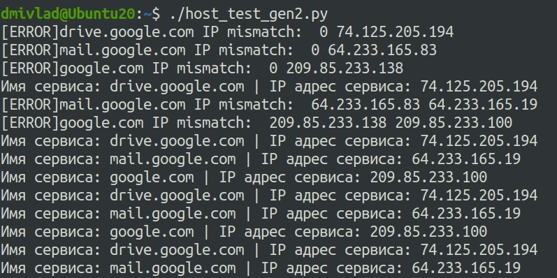

## Ответы на задания 04-script-03-yaml  
1.  **Условие.** Мы выгрузили JSON, который получили через API-запрос к нашему сервису:  
```  
    { "info" : "Sample JSON output from our service\t",
        "elements" :[
            { "name" : "first",
            "type" : "server",
            "ip" : 7175 
            }
            { "name" : "second",
            "type" : "proxy",
            "ip : 71.78.22.43
            }
        ]
    }
```  
Нужно найти и исправить все ошибки, которые допускает наш сервис.  
**Решение**  
```
    { "info" : "Sample JSON output from our service\t",
        "elements" :[
            { "name" : "first",
            "type" : "server",
            "ip" : 7175 
            },
            { "name" : "second",
            "type" : "proxy",
            "ip" : "71.78.22.43"
            }
        ]
    }
```  
- В строке №6 не хватало запятой  
- В строке №9 не хватало 3-х кавычек  
- IP адрес в строке №5 указан весьма странным образом, но это не ошибка синтаксиса  
2. **Условие**
В прошлый рабочий день мы создавали скрипт, позволяющий опрашивать веб-сервисы и получать их IP. К уже реализованному функционалу нам нужно добавить возможность записи JSON и YAML-файлов, описывающих наши сервисы.  
Формат записи JSON по одному сервису: `{ "имя сервиса" : "его IP"}`.  
Формат записи YAML по одному сервису: `- имя сервиса: его IP`.  
Если в момент исполнения скрипта меняется IP у сервиса — он должен так же поменяться в YAML и JSON-файле.  
### Мой скрипт:  
```python
#!/usr/bin/env python3

import socket
import time
import json
import yaml

services = {'drive.google.com': 0, 'mail.google.com': 0, 'google.com': 0}

while True:
    for hosts in services:
       result_ip = socket.gethostbyname(hosts)
       if result_ip != services[hosts]:
        print("[ERROR]" + hosts, "IP mismatch: ", services[hosts], result_ip)
        with open('iphosts.json', 'a') as jsonfile:
           datajson=json.dumps({hosts:result_ip}) 
           jsonfile.write(datajson)
        with open('iphosts.yaml', 'a') as yamlfile:
            datayaml=yaml.dumps({hosts:result_ip})
            yamlfile.write(datayaml)
        time.sleep(1)
        services[hosts] = result_ip
       else:
        print("Имя сервиса: " + hosts, "|",  "IP адрес сервиса: " + result_ip)
        time.sleep(1)

```  
### Вывод скрипта при запуске во время тестирования:




### JSON-файл(ы), который(е) записал ваш скрипт:

```json
{"drive.google.com": "74.125.205.194"}{"drive.google.com": "74.125.205.194"}{"mail.google.com": "64.233.165.83"}{"google.com": "209.85.233.138"}{"mail.google.com": "64.233.165.19"}{"google.com": "209.85.233.100"}
```

### YAML-файл(ы), который(е) записал ваш скрипт:

```yaml
drive.google.com: 74.125.205.194
mail.google.com: 64.233.165.83
google.com: 209.85.233.138
mail.google.com: 64.233.165.19
google.com: 209.85.233.100
```

