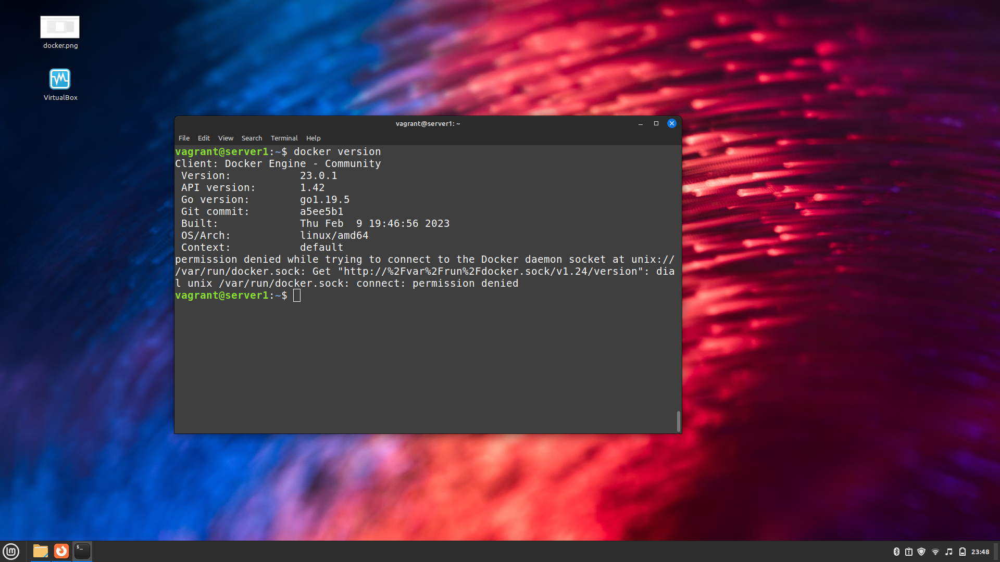

## Ответы на задания 05-virt-02-iaac  
1. **Условие**  
 - Опишите основные преимущества применения на практике IaaC-паттернов.  
 - Какой из принципов IaaC является основополагающим?  
**Решение**  
 - Используя IaaC, документация по организации инфраструктуры формируется в процессе работы и написания кода, инженеры получают возможность быстро разворачивать элементы инфраструктуры и вносить изменения в их конфигурации в том числе массовые изменения. Стабильность среды - еще одно преимущество IaaC, достигается за счет автоматизации процессов развертывая, исключающей или минимизирующей человеческий фактор, а значит, количество ошибок. Последнее, что необходимо отметить, разворачивая и развивая инфраструктуру по принципам IaaC команды экономят время (средства), необходимое на повторное развертываение инфраструктуры.
 - Главный принцип - идемпотентность. На практике для devops-инженера это понятие в первую очередь связано с предсказуемостью и соответствием результата ожиданиям. Применение паттернов IaaC позволяет получать один и тот же результат, повторно выполняя операции.  
 2. **Условие**  
 - Чем Ansible выгодно отличается от других систем управление конфигурациями?  
 - Какой, на ваш взгляд, метод работы систем конфигурации более надёжный — push или pull?  
**Решение**  
 - Ansible отличается относительной простотой, а значит, низким порогом вхождения. С точки зрения руководителя команды/бизнеса это в свою очередь означает более простой поиск инженера для поддержки инфраструктуры, не высокая стоимость обслуживания. Кроме того, Ansible написан на Python, т.о. имеет нативную поддержку в большинстве Linux-like систем. В качестве языка разметки, описывающего конфигурационные файлы использует универсальный YAML. Не требует установку агентов на управляемых хостах.  
 - Выбор системы в зависимости от метода работы должен основываться на конкретной ситуации и задачах. С точки зрения надежности, считаю, что системы, ориентированные на Pull метод являюся более надежными, но в то же время являются более дорогостоящими в обслуживании и поддержке.  
 3. **Условие**  
 Установите на личный компьютер:

- [VirtualBox](https://www.virtualbox.org/),
- [Vagrant](https://github.com/netology-code/devops-materials),
- [Terraform](https://github.com/netology-code/devops-materials/blob/master/README.md),
- Ansible.

*Приложите вывод команд установленных версий каждой из программ, оформленный в Markdown.*  
**Решение**  
```
root@Ubuntu20:/home/dmivlad/Downloads# vboxmanage --version
6.1.38_Ubuntur153438
```
```
root@Ubuntu20:/home/dmivlad/Downloads# vboxmanage --version
6.1.38_Ubuntur153438
```
```
root@Ubuntu20:/home/dmivlad/Downloads# terraform --version
Terraform v1.4.2
on linux_amd64
```
```
root@Ubuntu20:/home/dmivlad/Downloads# ansible --version
ansible 2.9.6
  config file = /etc/ansible/ansible.cfg
  configured module search path = ['/root/.ansible/plugins/modules', '/usr/share/ansible/plugins/modules']
  ansible python module location = /usr/lib/python3/dist-packages/ansible
  executable location = /usr/bin/ansible
  python version = 3.8.10 (default, Nov 14 2022, 12:59:47) [GCC 9.4.0]
```
 4. **Условие**  
Воспроизведите практическую часть лекции самостоятельно.  

- Создайте виртуальную машину.  
- Зайдите внутрь ВМ, убедитесь, что Docker установлен с помощью команды  
```
docker ps,
```
Vagrantfile из лекции и код ansible находятся в [папке](https://github.com/netology-code/virt-homeworks/tree/virt-11/05-virt-02-iaac/src).  
**Решение**  
С решением задачи возникли сложности, так как изначально планировал использовать только хост-машину на Windows, однако, поняв, что не работает Nested VR-x пришлось искать резервную машинку, ставить Linux (Mint) и разворачивать по сути всю инфраструктуру заново. В итоге все получилось:  


