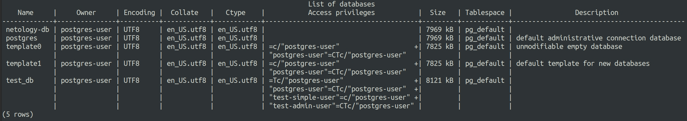
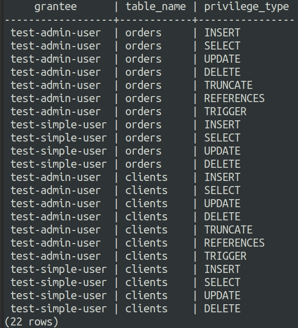

# Ответы на задания 06-db-02-sql   
## Задача 1  
Используя Docker, поднимите инстанс PostgreSQL (версию 12) c 2 volume, в который будут складываться данные БД и бэкапы.  
Приведите получившуюся команду или docker-compose-манифест.   
## Решение 1  
Привер docker-compose файла:  
```
version: "3"

services:
  postgresql:
    image: postgres:12
    container_name: postgres12
    ports:
      - "0.0.0.0:5432:5432"
    volumes:
      - /home/dmivlad/SQL/data://var/lib/postgres/data
      - /home/dmivlad/SQL/backups://var/lib/postgres/backups
    environment:
      POSTGRES_USER: "postgres-user"
      POSTGRES_PASSWORD: "mypassword"
      POSTGRES_DB: "netology-db"

```  
Демонстрация работоспособности контейнера:  
  
## Задача 2  
В БД из задачи 1:  
- создайте пользователя test-admin-user и БД test_db;
- в БД test_db создайте таблицу orders и clients (спeцификация таблиц ниже);
- предоставьте привилегии на все операции пользователю test-admin-user на таблицы БД test_db;
- создайте пользователя test-simple-user;
- предоставьте пользователю test-simple-user права на SELECT/INSERT/UPDATE/DELETE этих таблиц БД test_db.
Таблица orders:  
- id (serial primary key);
- наименование (string);
- цена (integer).
Таблица clients:  
- id (serial primary key);
- фамилия (string);
- страна проживания (string, index);
- заказ (foreign key orders).
Приведите:  
- итоговый список БД после выполнения пунктов выше;
- описание таблиц (describe);
- SQL-запрос для выдачи списка пользователей с правами над таблицами test_db;
- список пользователей с правами над таблицами test_db.  
## Решение 2  
Создаем пользователя и БД:  
  
Создаем таблицы:  
  
После всех манипуляций выводим полный список БД:  
  
Выводим описание таблиц:  
  
SQL запрос для получения таблицы привелегий доступа пользователей:  
```
SELECT grantee, table_name, privilege_type FROM information_schema.table_privileges WHERE grantee in ('test-admin-user', 'test-simple-user') and table_name in ('clients', 'orders')
```
Таблица привелегий пользователей:  
  
## Задача 3  
Используя SQL-синтаксис, наполните таблицы следующими тестовыми данными:

Таблица orders

|Наименование|цена|
|------------|----|
|Шоколад| 10 |
|Принтер| 3000 |
|Книга| 500 |
|Монитор| 7000|
|Гитара| 4000|

Таблица clients

|ФИО|Страна проживания|
|------------|----|
|Иванов Иван Иванович| USA |
|Петров Петр Петрович| Canada |
|Иоганн Себастьян Бах| Japan |
|Ронни Джеймс Дио| Russia|
|Ritchie Blackmore| Russia|

Используя SQL-синтаксис:
- вычислите количество записей для каждой таблицы.

Приведите в ответе:

    - запросы,
    - результаты их выполнения.  
## Решение 3  
Пример запроса на внесение данных:  
```
INSERT INTO orders VALUES (1, 'Шоколад', 10), (2, 'Принтер', 3000), (3, 'Книга', 500), (4, 'Монитор', 7000), (5, 'Гитара', 4000);
```
Выборка данных после их внесения:  
  
Вычисляем количество записей в таблице с помощью запроса:  
```
select count(1) from orders;
```
Получаем следующий результат:  
  

Пример запроса на внесение данных в следующую таблицу:  
```
INSERT INTO clients VALUES (1, 'Иванов Иван Иванович', 'USA'), (2, 'Петров Петр Петрович', 'Canada'), (3, 'Иоганн Себастьян Бах', 'Japan'), (4,  'Ронни Джеймс Дио', 'Russia'), (5, 'Ritchie Blackmore', 'Russia');
```
Выборка данных после их внесения:  
  
Вычисляем количество записей в таблице с помощью запроса:  
```
select count(1) from clients;
```
Получаем следующий результат:  
  
## Задача 4  
Часть пользователей из таблицы clients решили оформить заказы из таблицы orders.

Используя foreign keys, свяжите записи из таблиц, согласно таблице:

|ФИО|Заказ|
|------------|----|
|Иванов Иван Иванович| Книга |
|Петров Петр Петрович| Монитор |
|Иоганн Себастьян Бах| Гитара |

Приведите SQL-запросы для выполнения этих операций.

Приведите SQL-запрос для выдачи всех пользователей, которые совершили заказ, а также вывод этого запроса.
 
Подсказка: используйте директиву `UPDATE`.  
## Решение 4  
Запросы, необходимые для выполнения условий задачи:  
```
UPDATE clients SET "заказ" = (SELECT id FROM orders WHERE "наименование"='Книга') WHERE "фамилия"="Иванов Иван Иванович";

UPDATE clients SET "заказ" = (SELECT id FROM orders WHERE "наименование"='Монитор') WHERE "фамилия"='Петров Петр Петрович';  

UPDATE clients SET "заказ" = (SELECT id FROM orders WHERE "наименование"='Гитара') WHERE "фамилия"='Иоганн Себастьян Бах';
```

Запрос, для выдачи всех пользователей, совершивших заказ может выглядеть следующим образом:  
```
SELECT a.* FROM clients a JOIN orders b ON a.заказ = b.id;
```

Результат будет таковым:  
  
## Задача 5  
Получите полную информацию по выполнению запроса выдачи всех пользователей из задачи 4 
(используя директиву EXPLAIN).

Приведите получившийся результат и объясните, что значат полученные значения.  
## Решение 5    
  
О чем говорят полученные данные:  
- планировщик выбирает соединение по хешу, записывая строки из таблицы в хеш-таблицу в памяти, затем производится сканирование другой таблицы и проверка соответствия данных по заданным параметрам;
- Seq Scan последовательно читает данные из таблицы clients;  
- cost - величина, описывающая затратность вычислительных ресурсов для проведения операции, где первая цифра показывает затраты на получение первой строки, вторая - всех
- rows показывает сколько строк вернется при выполнении операции.  
- width - средний размер возвращаемой строки в байтах.  
## Задача 6  
Создайте бэкап БД test_db и поместите его в volume, предназначенный для бэкапов (см. задачу 1).  
Остановите контейнер с PostgreSQL, но не удаляйте volumes.  
Поднимите новый пустой контейнер с PostgreSQL.  
Восстановите БД test_db в новом контейнере.  
Приведите список операций, который вы применяли для бэкапа данных и восстановления.  
## Решение 6  
Для создания бэкапа использовалась команда:  
```
export PGPASSWORD=mypassword && pg_dumpall -h localhost -U postgres-user > /var/lib/postgres/backups/netology-db-backups.sql
```
Далее создаем второй контейнер командой:  
```
docker run -d -e POSTGRES_USER=postgres-user -e POSTGRES_PASSWORD=mypassword -e POSTGRES_DB=test_db -v /home/dmivlad/SQL/backups://var/lib/postgres/backups --name postgres12new postgres:12
```
Убеждаемся, что оба контейнера работают:  
  

Восстанавливаем данные из дампа командой:  
```
export PGPASSWORD=mypassword && psql -h localhost -U postgres-user -f /var/lib/postgres/backups/netology-db-backups.sql test_db
```


