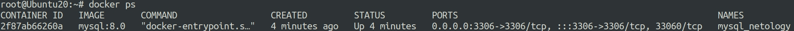
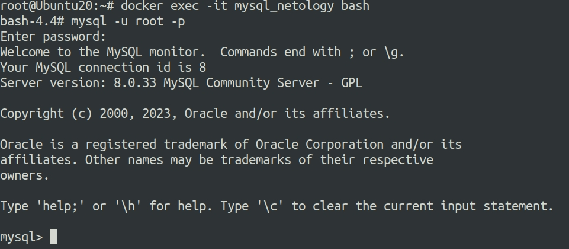
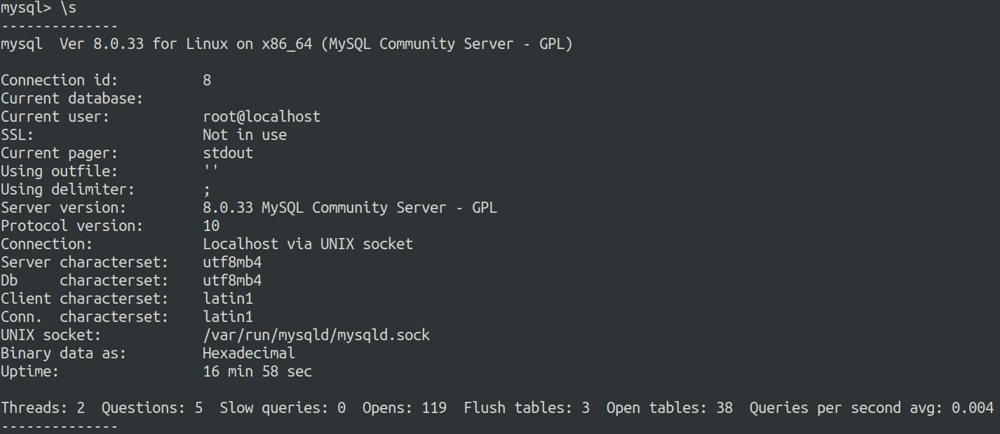
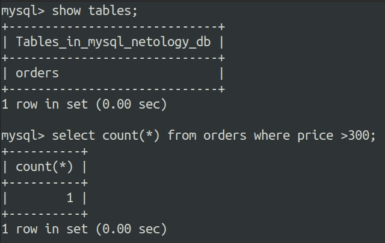
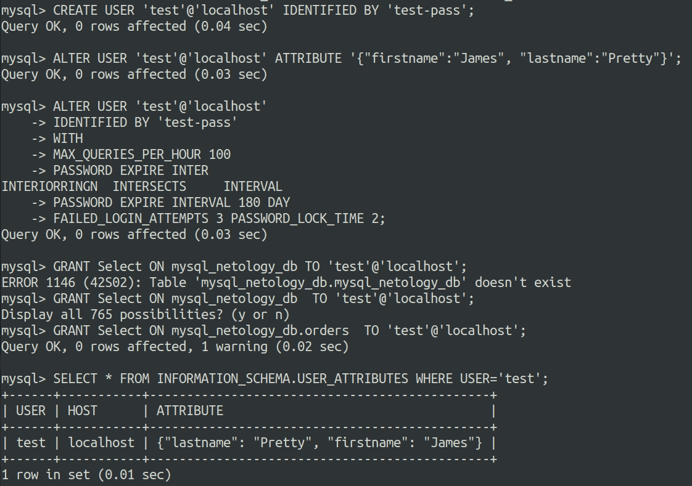
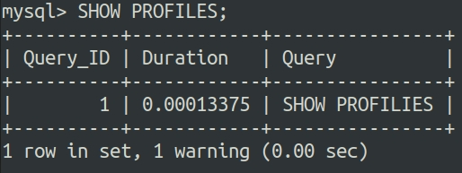
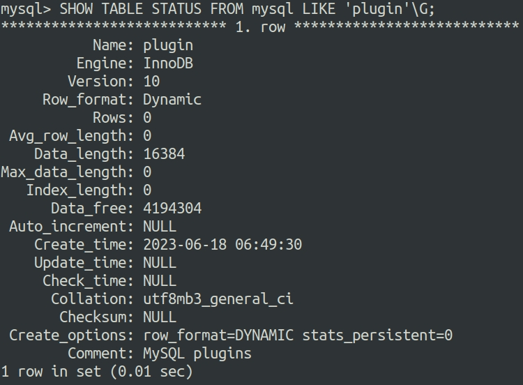
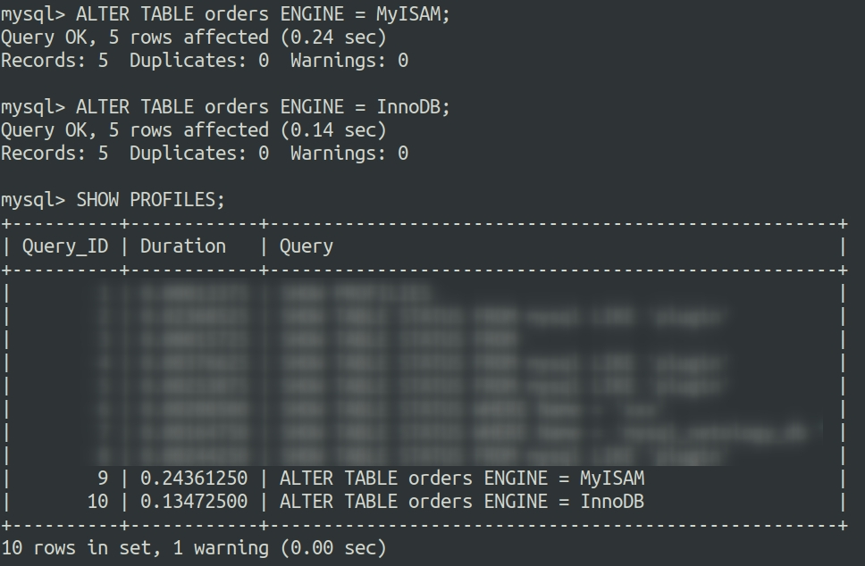

# Ответы на задания 06-db-03-mysql  

## Задача 1

Используя docker поднимите инстанс MySQL (версию 8). Данные БД сохраните в volume.

Изучите [бэкап БД](https://github.com/netology-code/virt-homeworks/tree/master/06-db-03-mysql/test_data) и 
восстановитесь из него.

Перейдите в управляющую консоль `mysql` внутри контейнера.

Используя команду `\h` получите список управляющих команд.

Найдите команду для выдачи статуса БД и **приведите в ответе** из ее вывода версию сервера БД.

Подключитесь к восстановленной БД и получите список таблиц из этой БД.

**Приведите в ответе** количество записей с `price` > 300.

В следующих заданиях мы будем продолжать работу с данным контейнером.

## Решение 1
Для поднятия контейнера используем следующий набор команд:  
```
docker pull mysql:8.0
docker volume create data_mysql
docker run -d --rm --name mysql_netology -e MYSQL_ROOT_PASSWORD=mysql -ti -p 3306:3306 -v data_mysql:/etc/mysql/ mysql:8.0
```
Выводим список запущенных контейнеров:  
  

Подключаемся к контейнеру и серверу MySQL:  
  

Команда для получения статуса:  
```
status    (\s) Get status information from the server.
```
Ее вывод:  
  

Создаем базу данных, копируем дамп в контейнер, восстанавливаем дамп, подключаемся к дампу:  
```
docker exec mysql_netology /usr/bin/mysql -u root --password=mysql -e 'CREATE DATABASE mysql_netology_db'
docker cp test_dump.sql mysql_netology:/etc/mysql
mysql -u root -p mysql_netology_db < test_dump.sql 
mysql> use mysql_netology_db

```
Получаем список таблиц и делаем необходимую выборку:  

  


## Задача 2

Создайте пользователя test в БД c паролем test-pass, используя:
- плагин авторизации mysql_native_password
- срок истечения пароля - 180 дней 
- количество попыток авторизации - 3 
- максимальное количество запросов в час - 100
- аттрибуты пользователя:
    - Фамилия "Pretty"
    - Имя "James"

Предоставьте привелегии пользователю `test` на операции SELECT базы `test_db`.
    
Используя таблицу INFORMATION_SCHEMA.USER_ATTRIBUTES получите данные по пользователю `test` и 
**приведите в ответе к задаче**.

## Решение 2  

Вся последовательность команд показана на скриншоте:  

  


## Задача 3

Установите профилирование `SET profiling = 1`.
Изучите вывод профилирования команд `SHOW PROFILES;`.

Исследуйте, какой `engine` используется в таблице БД `test_db` и **приведите в ответе**.

Измените `engine` и **приведите время выполнения и запрос на изменения из профайлера в ответе**:
- на `MyISAM`
- на `InnoDB`

## Решение 3

Включаем профилирование:  
```
set profiling=1;
```

Вывод команды `SHOW PROFILES;` с указанием времени исполнения запроса:  

  

Узнаем какой текущий движок используется:  

  

Изменяем движок сначана на MyISAM, затем возвращаем на InnoDB:  

  


## Задача 4 

Изучите файл `my.cnf` в директории /etc/mysql.

Измените его согласно ТЗ (движок InnoDB):
- Скорость IO важнее сохранности данных
- Нужна компрессия таблиц для экономии места на диске
- Размер буффера с незакомиченными транзакциями 1 Мб
- Буффер кеширования 30% от ОЗУ
- Размер файла логов операций 100 Мб

Приведите в ответе измененный файл `my.cnf`.


## Решение 3

Обновленный файл конфигурации ниже. Добавленные опции в разделе *new params*

```
# For advice on how to change settings please see
# http://dev.mysql.com/doc/refman/8.0/en/server-configuration-defaults.html

[mysqld]
#
# Remove leading # and set to the amount of RAM for the most important data
# cache in MySQL. Start at 70% of total RAM for dedicated server, else 10%.
# innodb_buffer_pool_size = 128M
#
# Remove leading # to turn on a very important data integrity option: logging
# changes to the binary log between backups.
# log_bin
#
# Remove leading # to set options mainly useful for reporting servers.
# The server defaults are faster for transactions and fast SELECTs.
# Adjust sizes as needed, experiment to find the optimal values.
# join_buffer_size = 128M
# sort_buffer_size = 2M
# read_rnd_buffer_size = 2M

# Remove leading # to revert to previous value for default_authentication_plugin,
# this will increase compatibility with older clients. For background, see:
# https://dev.mysql.com/doc/refman/8.0/en/server-system-variables.html#sysvar_default_authentication_plugin
# default-authentication-plugin=mysql_native_password
skip-host-cache
skip-name-resolve
datadir=/var/lib/mysql
socket=/var/run/mysqld/mysqld.sock
secure-file-priv=/var/lib/mysql-files
user=mysql

#new params
innodb_flush_log_at_trx_commit = 2
innodb_log_buffer_size  = 1M
max_binlog_size = 100M
key_buffer_size = 700M
innodb_file_per_table=1

pid-file=/var/run/mysqld/mysqld.pid
[client]
socket=/var/run/mysqld/mysqld.sock

!includedir /etc/mysql/conf.d/
```

---
