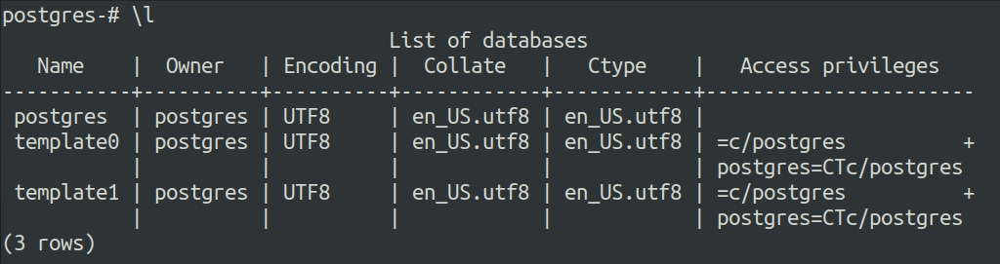
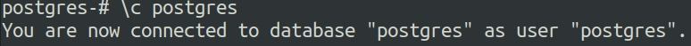
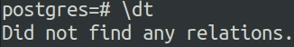
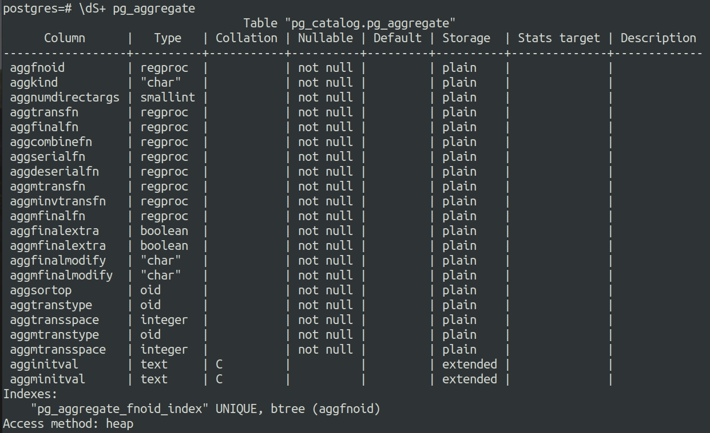
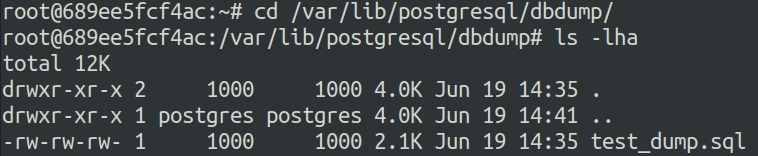
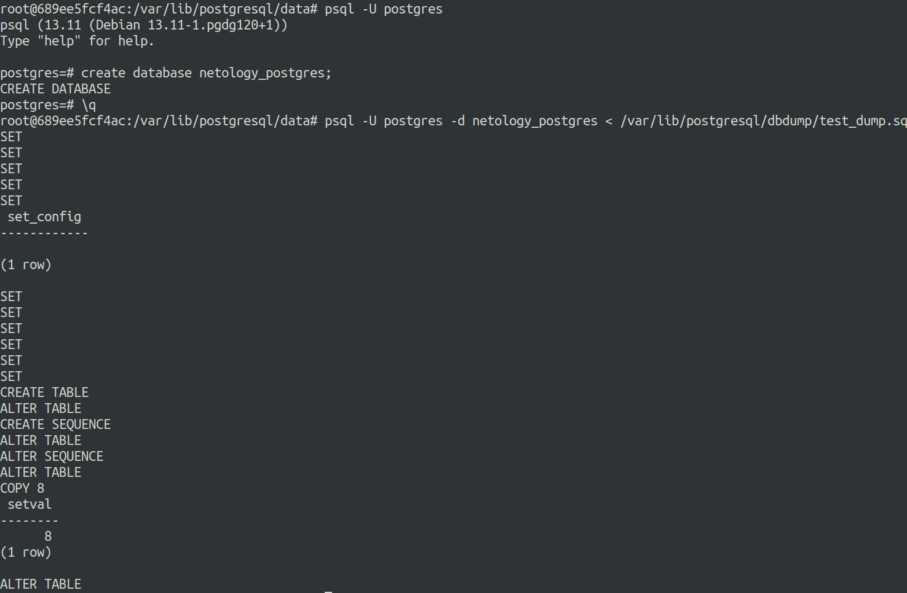
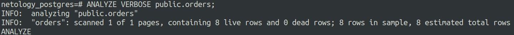
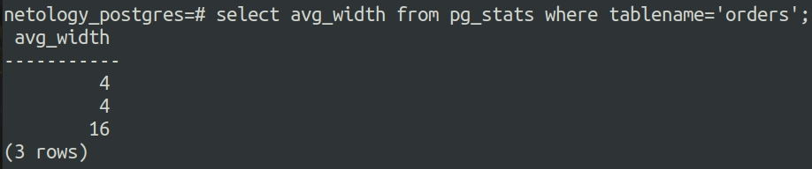
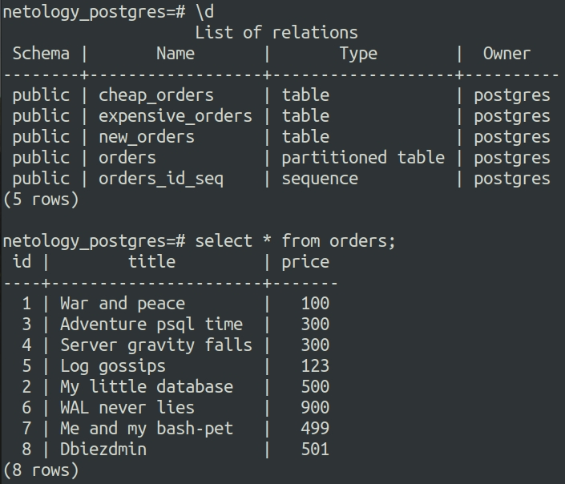

# Ответы на задания 06-db-04-postgresql  

## Задача 1

Используя docker поднимите инстанс PostgreSQL (версию 13). Данные БД сохраните в volume.

Подключитесь к БД PostgreSQL используя `psql`.

Воспользуйтесь командой `\?` для вывода подсказки по имеющимся в `psql` управляющим командам.

**Найдите и приведите** управляющие команды для:
- вывода списка БД
- подключения к БД
- вывода списка таблиц
- вывода описания содержимого таблиц
- выхода из psql

## Решение 1  

Для поднятия контейнера используем следующий набор команд:  

```
docker pull postgres:13
docker volume create volume_psql
docker run -d --rm --name psql_netology -e POSTGRES_USER=postgres -e POSTGRES_PASSWORD=postgres -ti -p 5432:5432 -v volume_psql:/var/lib/postgresql/data postgres:13
docker exec -ti psql_netology bash
```

Выводы управляющих команд  

Список баз данных:  

  

Подключение к базе данных:  

  

Выводим список таблиц:  

  

Выводим описание содержимого таблицы pg_aggregate:  

  


## Задача 2

Используя `psql` создайте БД `test_database`.

Изучите [бэкап БД](https://github.com/netology-code/virt-homeworks/tree/master/06-db-04-postgresql/test_data).

Восстановите бэкап БД в `test_database`.

Перейдите в управляющую консоль `psql` внутри контейнера.

Подключитесь к восстановленной БД и проведите операцию ANALYZE для сбора статистики по таблице.

Используя таблицу [pg_stats](https://postgrespro.ru/docs/postgresql/12/view-pg-stats), найдите столбец таблицы `orders` 
с наибольшим средним значением размера элементов в байтах.

**Приведите в ответе** команду, которую вы использовали для вычисления и полученный результат.

## Решение 2  

Поднимаем контейнер и подключаем volumes:  
```
docker run -d --rm --name psql_netology -e POSTGRES_USER=postgres -e POSTGRES_PASSWORD=postgres -ti -p 5432:5432 -v volume_psql:/var/lib/postgresql/data -v /home/dmivlad/DB/Postgres:/var/lib/postgresql/dbdump postgres:13  
```

Проверяем, что дамп примонтирован к контейнеру:  

  

Создаем БД и восстанавливаем данные из дампа:  

  


Анализируем данные командой:  
```
ANALYZE VERBOSE public.orders;
```

Получаем следующий результат:  

  

Ищем столбец таблицы *orders* с наибольшим средним значением размера элементов:  

  


## Задача 3

Архитектор и администратор БД выяснили, что ваша таблица orders разрослась до невиданных размеров и
поиск по ней занимает долгое время. Вам, как успешному выпускнику курсов DevOps в нетологии предложили
провести разбиение таблицы на 2 (шардировать на orders_1 - price>499 и orders_2 - price<=499).

Предложите SQL-транзакцию для проведения данной операции.

Можно ли было изначально исключить "ручное" разбиение при проектировании таблицы orders?


## Решение 3  

Для решения выполняем следующий код:

```
alter table orders rename to new_orders;
create table orders (id integer, title varchar(80), price integer) partition by range(price);
create table cheap_orders partition of orders for values from (0) to (499);
netology_postgres=# create table expensive_orders partition of orders for values from (499) to (100000);
insert into orders (id, title, price) select * from new_orders;
```

Получаем следующий результат. Выводим список таблиц и выборку данных из новой таблицы:  

  

Исходя из презентации шардирование - разделение таблиц на куски по какому-либо принципу, благодаря правильности которого достигается эффективная работа с БД. В данной тестовой БД не вижу никаких проблем шардировать таблицу изначально.  

## Задача 4

Используя утилиту `pg_dump` создайте бекап БД `test_database`.

Как бы вы доработали бэкап-файл, чтобы добавить уникальность значения столбца `title` для таблиц `test_database`?

## Решение 4  

Дамп базы делаем с применением следующей команды:  
```
pg_dump -U postgres -d netology_postgres > /var/lib/postgresql/dbdump/netology_postgres.sql.bak
```

Уникальность может быть добавлена с примерением уникального ID для значения, в случае с postgres это index.  

---

