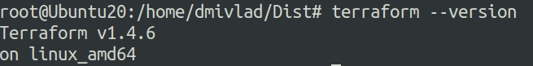
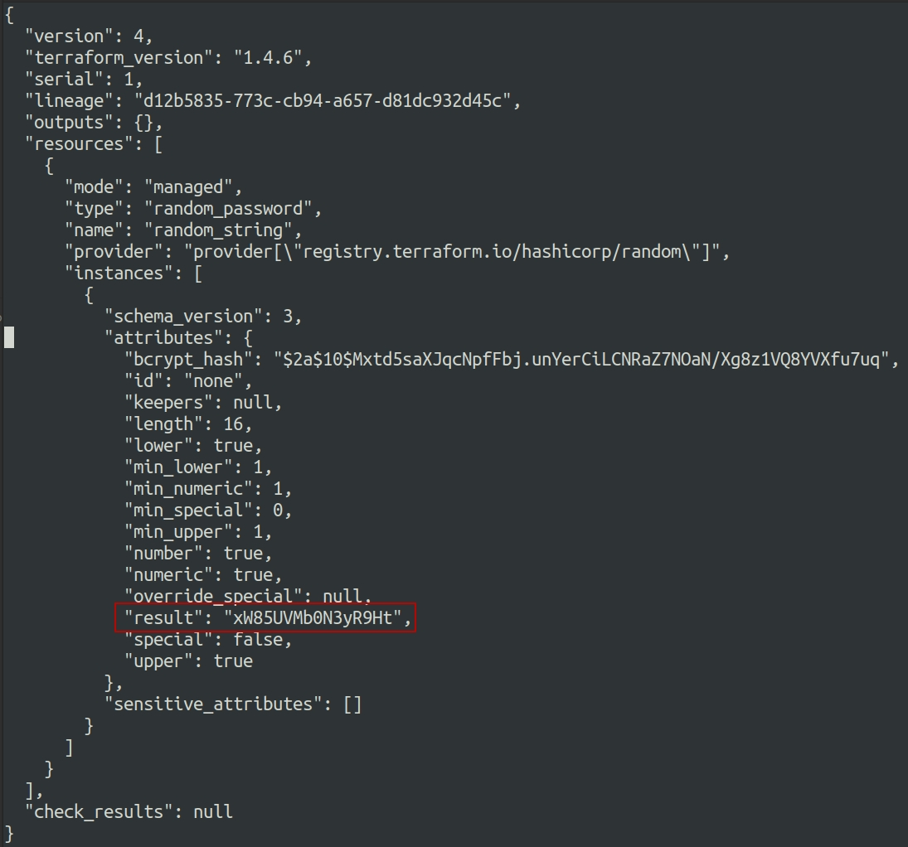
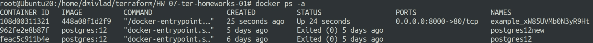
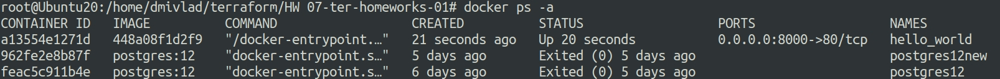

# Ответы на задания 07-ter-homeworks-01  
Скриншот, демонстрирующий работоспособность terraform
  
## Задача 1  
1. Перейдите в каталог [**src**](https://github.com/netology-code/ter-homeworks/tree/main/01/src). Скачайте все необходимые зависимости, использованные в проекте. 
2. Изучите файл **.gitignore**. В каком terraform файле согласно этому .gitignore допустимо сохранить личную, секретную информацию?
3. Выполните код проекта. Найдите  в State-файле секретное содержимое созданного ресурса **random_password**, пришлите в качестве ответа конкретный ключ и его значение.
4. Раскомментируйте блок кода, примерно расположенный на строчках 29-42 файла **main.tf**.
Выполните команду ```terraform validate```. Объясните в чем заключаются намеренно допущенные ошибки? Исправьте их.
5. Выполните код. В качестве ответа приложите вывод команды ```docker ps```
6. Замените имя docker-контейнера в блоке кода на ```hello_world```, выполните команду ```terraform apply -auto-approve```.
Объясните своими словами, в чем может быть опасность применения ключа  ```-auto-approve``` ? В качестве ответа дополнительно приложите вывод команды ```docker ps```
7. Уничтожьте созданные ресурсы с помощью **terraform**. Убедитесь, что все ресурсы удалены. Приложите содержимое файла **terraform.tfstate**. 
8. Объясните, почему при этом не был удален docker образ **nginx:latest** ? Ответ подкрепите выдержкой из документации провайдера.  
## Решение 1  
1. Необходимые зависимости скачаны.  
2. Согласно представленному файлу .gitignore допустимо хранить личную (секретную) информацию в файле personal.auto.tfvars, объявляя необходимые переменные.  
3. Выполняем код проекта, предварительно создавая переменную окружения (без ее определения не работает обращение к зеркалу Yandex) следующими командами:  
```
export TF_CLI_CONFIG_FILE=/home/dmivlad/terraform/HW\ 07-ter-homeworks-01/.terraformrc  
terraform init  
terraform plan
terraform apply  
```
В результате получаем запущенный проект и сгенерированный State файл со следующим содержимым и сгенерированным паролем:  
  
4. Первая ошибка в конфиге - не указано имя ресурса. Вторая - неверное имя ресурса, т.к. имя может начинаться только с буквы или подчеркивания, в конфиге начинается с цифры. Третья ошибка в строке **name  = "example_${random_password.random_string_fake.resuld}"** - лишняя запись **_fake** и в слово result должно писаться правильно. Ошибки исправлены.  
5. Выполняем код. Вывод команды следующий:  
  
6. Имя контейнера заменено. Опасность применения ключа **auto-approve** заключается в том, что при его использовании terraform игнорирует интерактивное утверждение плана, что в случае ошибок в конфигурации может привести к негативным последствиям. Вывод команды следующий:  
  
7. Инфраструктура уничтожена командой:  
```
terraform destroy
```
Содержимое файла **terraform.tfstate** следующее:  
```
{
  "version": 4,
  "terraform_version": "1.4.6",
  "serial": 11,
  "lineage": "d12b5835-773c-cb94-a657-d81dc932d45c",
  "outputs": {},
  "resources": [],
  "check_results": null
}
```
8. Образ docker не будет удален из-за директивы **keep_locally**
Описание в документации провайдера приведено на [**странице**](https://registry.terraform.io/providers/kreuzwerker/docker/latest/docs/resources/image).  

