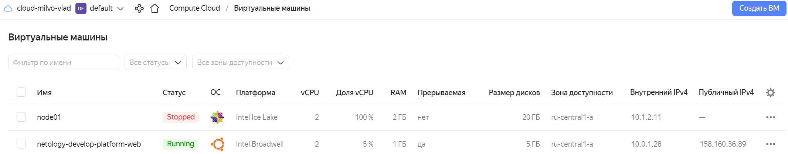
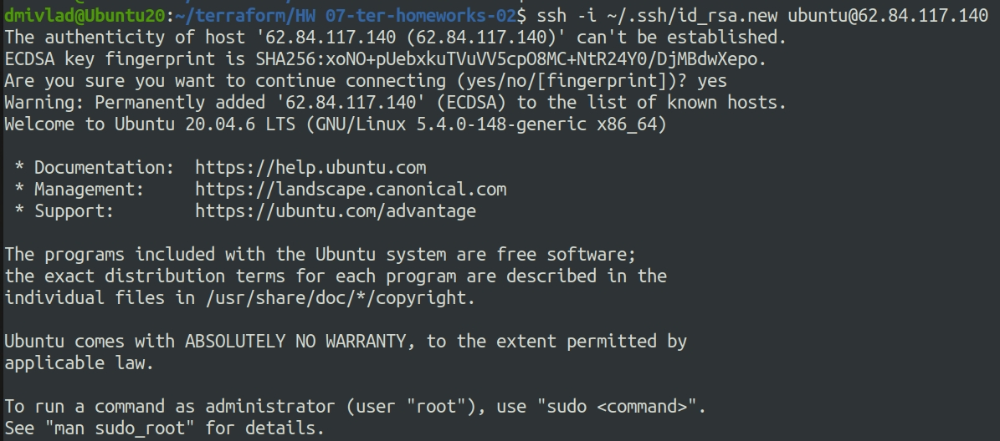
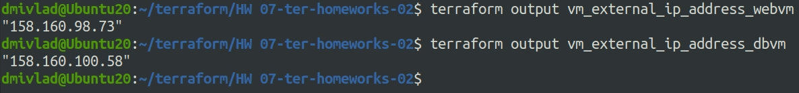

# Ответы на задания 07-ter-homeworks-02
### Задание 1

1. Изучите проект. В файле variables.tf объявлены переменные для yandex provider.
2. Переименуйте файл personal.auto.tfvars_example в personal.auto.tfvars. Заполните переменные (идентификаторы облака, токен доступа). Благодаря .gitignore этот файл не попадет в публичный репозиторий. **Вы можете выбрать иной способ безопасно передать секретные данные в terraform.**
3. Сгенерируйте или используйте свой текущий ssh ключ. Запишите его открытую часть в переменную **vms_ssh_root_key**.
4. Инициализируйте проект, выполните код. Исправьте возникшую ошибку. Ответьте в чем заключается ее суть?
5. Ответьте, как в процессе обучения могут пригодиться параметры```preemptible = true``` и ```core_fraction=5``` в параметрах ВМ? Ответ в документации Yandex cloud.

В качестве решения приложите:
- скриншот ЛК Yandex Cloud с созданной ВМ,
- скриншот успешного подключения к консоли ВМ через ssh,
- ответы на вопросы.

### Решение 1
Все мероприятия проведены: изучен проект, файл из пункта 2 переименован, идентификаторы облака заполнены. Проект инициализирован, ошибка исправлена. Заключалась она в том, что в блоке:
```
  platform_id = var.vm_web_platformid
  resources {
    cores         = 1
    memory        = 1
    core_fraction = 5
  }
```
содержится недопустимое значение парамета cores. После исправления данного параметра на 2 ошибку удалось исправить, проект инициализирован. Параметры ```preemptible = true``` и ```core_fraction=5``` пригодятся для экономии средств. Первый - позволяет создать прерываемую ВМ, то есть те, которые могут быть принудительно остановлены и не тарифицироваться без необходимости. Второй - выделение процессорного времени, чем больше цифра, тем дороже и тем мощнее.   
Скриншоты созданной ВМ и подключения ниже:  
  
  
### Задание 2

1. Изучите файлы проекта.
2. Замените все "хардкод" **значения** для ресурсов **yandex_compute_image** и **yandex_compute_instance** на **отдельные** переменные. К названиям переменных ВМ добавьте в начало префикс **vm_web_** .  Пример: **vm_web_name**.
2. Объявите нужные переменные в файле variables.tf, обязательно указывайте тип переменной. Заполните их **default** прежними значениями из main.tf. 
3. Проверьте terraform plan (изменений быть не должно). 

### Решение 2
Все мероприятия проведены. После внесенных изменений файл variables.tf без блока ssh выглядит следующим образом:  
```
###cloud vars
variable "token" {
  type        = string
  description = "OAuth-token; https://cloud.yandex.ru/docs/iam/concepts/authorization/oauth-token"
}

variable "cloud_id" {
  type        = string
  description = "https://cloud.yandex.ru/docs/resource-manager/operations/cloud/get-id"
}

variable "folder_id" {
  type        = string
  description = "https://cloud.yandex.ru/docs/resource-manager/operations/folder/get-id"
}

variable "default_zone" {
  type        = string
  default     = "ru-central1-a"
  description = "https://cloud.yandex.ru/docs/overview/concepts/geo-scope"
}
variable "default_cidr" {
  type        = list(string)
  default     = ["10.0.1.0/24"]
  description = "https://cloud.yandex.ru/docs/vpc/operations/subnet-create"
}

variable "vpc_name" {
  type        = string
  default     = "develop"
  description = "VPC network & subnet name"
}

variable "vm_web_image" {
  type = string
  default = "ubuntu-2004-lts"
  description = "Image for UP VM"
}

variable "vm_web_name" {
  type = string
  default = "netology-develop-platform-web"
  description = "Assign name for VM"  
}

variable "prefix_name_vm" {
  type = string
  default = "netology"
}

variable "type_name_vm" {
  type = string
  default = "develop-platform"
}

variable "original_name_vm_web" {
  type = string
  default = "web"
}

variable "vm_web_platformid" {
  type = string
  default = "standard-v1"
  description = "Assign platform name"  
}

variable "vm_web_imageid" {
  type = any
  default = "fd8qssu7gclkmoi9flt4"  
  description = "Add boot disk ID"
}

variable "vm_web_subnetid" {
  type = string
  default = "yandex_vpc_subnet.develop.id"
  description = "Add subnet ID"  
}

```
Файл main.tf выглядит так:  
```
resource "yandex_vpc_network" "develop" {
  name = var.vpc_name
}
resource "yandex_vpc_subnet" "develop" {
  name           = var.vpc_name
  zone           = var.default_zone
  network_id     = yandex_vpc_network.develop.id
  v4_cidr_blocks = var.default_cidr
}

data "yandex_compute_image" "ubuntu" {
  family = var.vm_web_image
}
resource "yandex_compute_instance" "platform" {
  name        = var.vm_web_name
  platform_id = var.vm_web_platformid
  resources {
    cores         = 2
    memory        = 1
    core_fraction = 5
  }

  boot_disk {
    initialize_params {
      image_id = var.vm_web_imageid
    }
  }
  scheduling_policy {
    preemptible = true
  }
  network_interface {
    subnet_id = yandex_vpc_subnet.develop.id
    nat       = true
  }

  metadata = {
    serial-port-enable = 1
    ssh-keys           = "ubuntu:${var.vms_ssh_root_key}"
  }

}

```

Изменений в terraform plan нет.


### Задание 3

1. Создайте в корне проекта файл 'vms_platform.tf' . Перенесите в него все переменные первой ВМ.
2. Скопируйте блок ресурса и создайте с его помощью вторую ВМ(в файле main.tf): **"netology-develop-platform-db"** ,  cores  = 2, memory = 2, core_fraction = 20. Объявите ее переменные с префиксом **vm_db_** в том же файле('vms_platform.tf').
3. Примените изменения.

### Решение 3
Файл 'vms_platform.tf' создан и выглядит следующим образом:  
```
###cloud varsdb

variable "vm_db_name" {
  type = string
  default = "netology-develop-platform-db"
  description = "Assign name for VM"  
}

variable "vm_db_platformid" {
  type = string
  default = "standard-v1"
  description = "Assign platform name"  
}

variable "vm_db_imageid" {
  type = string
  default = "fd8qssu7gclkmoi9flt4"  
  description = "Add boot disk ID"
}

variable "vm_db_subnetid" {
  type = string
  default = "yandex_vpc_subnet.develop.id"
  description = "Add subnet ID"  
}

###ssh vars

variable "vms_ssh_root_key" {
  type        = string
  default     = "ssh-rsa AAAAB3NzaC1yc2EAAAADAQABAAABgQC9mi/8PO7m2/yrKy7ZnFr15bvdUrC6DUmqn/5DVKiHAO7hy9e9b+ktQ5WaejyCyrPr4pn474suPPLL2s6ZY71041pwKD2kQ1QeYNL0woHqOFCjlxeXpDAGVwUkwFekyUwCwmM1WWpZ9IqhPB50kN2FHnbzMONFti6nGJ/hl7sS9MH4+lKjf/eKQFBn/0u7Dm07RyFRCxc2ui8H1CSXJk84fWcmEftuJlQ9BrGuG2BWXtlCBgRbzb0Fg/AP+3LHi5N9CrxsN1YWdxPj80k9omrlKA5pEO5iuEWIJDjuNRTZnniLV6NgaDAsJuekLy9CzburqpAIycI6EK86KDUHr1sqRMnqjNVwdjbZ8z8W8PYlwpi3skmY9mNyGyGJcdLKgeno5S9NMmbcNNWGixdf6AdEvNL/pnLf/JHnEiO0S2WvCf8zMC6PKC65cneMtNTHfBMAxryFzr1HGJ7h4bQoL/X5uor1gbh5UwBYntSaAgKwl7aRi8dbeJaNg4eN2PC0E5U= dmivlad@Ubuntu20"
  description = "ssh-keygen -t ed25519"
}

```
Обновленный файл main.tf после обновления выглядит так:  

```
resource "yandex_vpc_network" "develop" {
  name = var.vpc_name
}
resource "yandex_vpc_subnet" "develop" {
  name           = var.vpc_name
  zone           = var.default_zone
  network_id     = yandex_vpc_network.develop.id
  v4_cidr_blocks = var.default_cidr
}

data "yandex_compute_image" "ubuntu" {
  family = var.vm_web_image
}
resource "yandex_compute_instance" "platform" {
  name        = var.vm_web_name
  platform_id = var.vm_web_platformid
  resources {
    cores         = 2
    memory        = 1
    core_fraction = 5
  }

  boot_disk {
    initialize_params {
      image_id = var.vm_web_imageid
    }
  }
  scheduling_policy {
    preemptible = true
  }
  network_interface {
    subnet_id = yandex_vpc_subnet.develop.id
    nat       = true
  }

  metadata = {
    serial-port-enable = 1
    ssh-keys           = "ubuntu:${var.vms_ssh_root_key}"
  }

}

resource "yandex_compute_instance" "platform_db" {
  name        = var.vm_db_name
  platform_id = var.vm_db_platformid
  resources {
    cores         = 2
    memory        = 2
    core_fraction = 20
  }

  boot_disk {
    initialize_params {
      image_id = var.vm_db_imageid
    }
  }
  scheduling_policy {
    preemptible = true
  }
  network_interface {
    subnet_id = yandex_vpc_subnet.develop.id
    nat       = true
  }

  metadata = {
    serial-port-enable = 1
    ssh-keys           = "ubuntu:${var.vms_ssh_root_key}"
  }

}

```

### Задание 4

1. Объявите в файле outputs.tf output типа map, содержащий { instance_name = external_ip } для каждой из ВМ.
2. Примените изменения.

В качестве решения приложите вывод значений ip-адресов команды ```terraform output```

### Решение 4
Задачи выполнены, скриншот ниже:  
  

Код файла выглядит следующим образом:  
```
output "vm_external_ip_address_webvm" {
    value = yandex_compute_instance.platform.network_interface.0.nat_ip_address
    description = "webvm external ip"
}

output "vm_external_ip_address_dbvm" {
    value = yandex_compute_instance.platform_db.network_interface.0.nat_ip_address
    description = "dbvm external ip"
}
```

### Задание 5

1. В файле locals.tf опишите в **одном** local-блоке имя каждой ВМ, используйте интерполяцию ${..} с несколькими переменными по примеру из лекции.
2. Замените переменные с именами ВМ из файла variables.tf на созданные вами local переменные.
3. Примените изменения.

### Решение 5

В файле locals.tf описаные переменные следующим образом:  
```
locals {
  name_web="${var.prefix_name_vm}-${var.type_name_vm}-${var.original_name_vm_web}"
  name_db="${var.prefix_name_vm}-${var.type_name_vm}-${var.original_name_vm_db}"
}
```

Обновленный main.tf выглядит следующим образом:  
```
resource "yandex_vpc_network" "develop" {
  name = var.vpc_name
}
resource "yandex_vpc_subnet" "develop" {
  name           = var.vpc_name
  zone           = var.default_zone
  network_id     = yandex_vpc_network.develop.id
  v4_cidr_blocks = var.default_cidr
}

data "yandex_compute_image" "ubuntu" {
  family = var.vm_web_image
}
resource "yandex_compute_instance" "platform" {
name = local.name_web
  platform_id = var.vm_web_platformid
  resources {
    cores         = 2
    memory        = 1
    core_fraction = 5
  }

  boot_disk {
    initialize_params {
      image_id = var.vm_web_imageid
    }
  }
  scheduling_policy {
    preemptible = true
  }
  network_interface {
    subnet_id = yandex_vpc_subnet.develop.id
    nat       = true
  }

  metadata = {
    serial-port-enable = 1
    ssh-keys           = "ubuntu:${var.vms_ssh_root_key}"
  }

}

resource "yandex_compute_instance" "platform_db" {
  name = local.name_db
  platform_id = var.vm_db_platformid
  resources {
    cores         = 2
    memory        = 2
    core_fraction = 20
  }

  boot_disk {
    initialize_params {
      image_id = var.vm_db_imageid
    }
  }
  scheduling_policy {
    preemptible = true
  }
  network_interface {
    subnet_id = yandex_vpc_subnet.develop.id
    nat       = true
  }

  metadata = {
    serial-port-enable = 1
    ssh-keys           = "ubuntu:${var.vms_ssh_root_key}"
  }

}


```

### Задание 6

1. Вместо использования 3-х переменных  ".._cores",".._memory",".._core_fraction" в блоке  resources {...}, объедените их в переменные типа **map** с именами "vm_web_resources" и "vm_db_resources".
2. Так же поступите с блоком **metadata {serial-port-enable, ssh-keys}**, эта переменная должна быть общая для всех ваших ВМ.
3. Найдите и удалите все более не используемые переменные проекта.
4. Проверьте terraform plan (изменений быть не должно).

### Решение 6  

Переменные типа map описаны в файле variables.tf в следующием блоке:  
```
###resources vars

variable "resources_vm_web"{
  type = map
  default = {
    "cores" = "2"
    "memory" = "1"
    "cores_fraction" = "5"
  }
}

variable "resources_vm_db"{
  type = map
  default = {
    "cores" = "2"
    "memory" = "2"
    "cores_fraction" = "20"
  }
}

#metadata vars

variable "metadata" {
  type = map
  default = {
    "serial-port-enable" = "1"
    "ssh-keys" = "ubuntu:${var.vms_ssh_root_key}"
  }
}
```

После удаления незадействованных переменный файл vatiables.tf выглядит следующим образом:  
```
###cloud vars
variable "token" {
  type        = string
  description = "OAuth-token; https://cloud.yandex.ru/docs/iam/concepts/authorization/oauth-token"
}

variable "cloud_id" {
  type        = string
  description = "https://cloud.yandex.ru/docs/resource-manager/operations/cloud/get-id"
}

variable "folder_id" {
  type        = string
  description = "https://cloud.yandex.ru/docs/resource-manager/operations/folder/get-id"
}

variable "default_zone" {
  type        = string
  default     = "ru-central1-a"
  description = "https://cloud.yandex.ru/docs/overview/concepts/geo-scope"
}
variable "default_cidr" {
  type        = list(string)
  default     = ["10.0.1.0/24"]
  description = "https://cloud.yandex.ru/docs/vpc/operations/subnet-create"
}

variable "vpc_name" {
  type        = string
  default     = "develop"
  description = "VPC network & subnet name"
}

variable "vm_web_image" {
  type = string
  default = "ubuntu-2004-lts"
  description = "Image for UP VM"
}

variable "prefix_name_vm" {
  type = string
  default = "netology"
}

variable "type_name_vm" {
  type = string
  default = "develop-platform"
}

variable "original_name_vm_web" {
  type = string
  default = "web"
}

variable "original_name_vm_db" {
  type = string
  default = "db"
}

variable "vm_web_platformid" {
  type = string
  default = "standard-v1"
  description = "Assign platform name"  
}

variable "vm_web_imageid" {
  type = any
  default = "fd8qssu7gclkmoi9flt4"  
  description = "Add boot disk ID"
}

variable "vm_web_subnetid" {
  type = string
  default = "yandex_vpc_subnet.develop.id"
  description = "Add subnet ID"  
}

###resources vars

variable "resources_vm_web"{
  type = map
  default = {
    "cores" = "2"
    "memory" = "1"
    "core_fraction" = "5"
  }
}

variable "resources_vm_db"{
  type = map
  default = {
    "cores" = "2"
    "memory" = "2"
    "core_fraction" = "20"
  }
}


#metadata vars

variable "metadata" {
  type = map
  default = {
    "serial-port-enable" = "1"
    "ssh-keys" = "ubuntu:ssh-rsa AAAAB3NzaC1yc2EAAAADAQABAAABgQC9mi/8PO7m2/yrKy7ZnFr15bvdUrC6DUmqn/5DVKiHAO7hy9e9b+ktQ5WaejyCyrPr4pn474suPPLL2s6ZY71041pwKD2kQ1QeYNL0woHqOFCjlxeXpDAGVwUkwFekyUwCwmM1WWpZ9IqhPB50kN2FHnbzMONFti6nGJ/hl7sS9MH4+lKjf/eKQFBn/0u7Dm07RyFRCxc2ui8H1CSXJk84fWcmEftuJlQ9BrGuG2BWXtlCBgRbzb0Fg/AP+3LHi5N9CrxsN1YWdxPj80k9omrlKA5pEO5iuEWIJDjuNRTZnniLV6NgaDAsJuekLy9CzburqpAIycI6EK86KDUHr1sqRMnqjNVwdjbZ8z8W8PYlwpi3skmY9mNyGyGJcdLKgeno5S9NMmbcNNWGixdf6AdEvNL/pnLf/JHnEiO0S2WvCf8zMC6PKC65cneMtNTHfBMAxryFzr1HGJ7h4bQoL/X5uor1gbh5UwBYntSaAgKwl7aRi8dbeJaNg4eN2PC0E5U= dmivlad@Ubuntu20"
  }
  
}
```

Файл main.tf выглядит таким образом:  
```
resource "yandex_vpc_network" "develop" {
  name = var.vpc_name
}
resource "yandex_vpc_subnet" "develop" {
  name           = var.vpc_name
  zone           = var.default_zone
  network_id     = yandex_vpc_network.develop.id
  v4_cidr_blocks = var.default_cidr
}

data "yandex_compute_image" "ubuntu" {
  family = var.vm_web_image
}
resource "yandex_compute_instance" "platform" {
name = local.name_web
  platform_id = var.vm_web_platformid
  resources {
    cores         = var.resources_vm_web.cores
    memory        = var.resources_vm_web.memory
    core_fraction = var.resources_vm_web.core_fraction
  }

  boot_disk {
    initialize_params {
      image_id = var.vm_web_imageid
    }
  }
  scheduling_policy {
    preemptible = true
  }
  network_interface {
    subnet_id = yandex_vpc_subnet.develop.id
    nat       = true
  }

  metadata = {
    serial-port-enable = var.metadata.serial-port-enable
    ssh-keys           = var.metadata.ssh-keys

  }
}

resource "yandex_compute_instance" "platform_db" {
  name = local.name_db
  platform_id = var.vm_db_platformid
  resources {
    cores         = var.resources_vm_db.cores
    memory        = var.resources_vm_db.memory
    core_fraction = var.resources_vm_db.core_fraction
  }

  boot_disk {
  initialize_params {
      image_id = var.vm_db_imageid
    }
  }
  scheduling_policy {
    preemptible = true
  }
  network_interface {
    subnet_id = yandex_vpc_subnet.develop.id
    nat       = true
  }

  metadata = {
    serial-port-enable = var.metadata.serial-port-enable
    ssh-keys           = var.metadata.ssh-keys

  }

}
```


