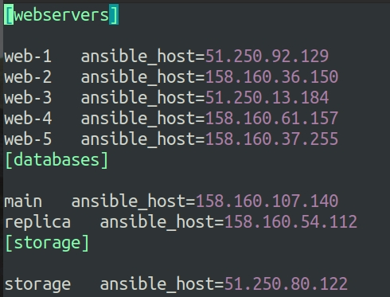

# Ответы на задания 07-ter-homeworks-02  
## Задача 1  
1. Изучите проект.
2. Заполните файл personal.auto.tfvars
3. Инициализируйте проект, выполните код (он выполнится даже если доступа к preview нет).

Примечание: Если у вас не активирован preview доступ к функционалу "Группы безопасности" в Yandex Cloud - запросите доступ у поддержки облачного провайдера. Обычно его выдают в течении 24-х часов.

Приложите скриншот входящих правил "Группы безопасности" в ЛК Yandex Cloud  или скриншот отказа в предоставлении доступа к preview версии.

## Решение 1  

Задание выполнено, скриншот security groups ниже:  
  

------

### Задание 2

1. Создайте файл count-vm.tf. Опишите в нем создание двух **одинаковых** ВМ  web-1 и web-2(не web-0 и web-1!), с минимальными параметрами, используя мета-аргумент **count loop**. Назначьте ВМ созданную в 1-м задании группу безопасности.
2. Создайте файл for_each-vm.tf. Опишите в нем создание 2 ВМ с именами "main" и "replica" **разных** по cpu/ram/disk , используя мета-аргумент **for_each loop**. Используйте переменную типа list(object({ vm_name=string, cpu=number, ram=number, disk=number  })). При желании внесите в переменную все возможные параметры.
3. ВМ из пункта 2.2 должны создаваться после создания ВМ из пункта 2.1.
4. Используйте функцию file в local переменной для считывания ключа ~/.ssh/id_rsa.pub и его последующего использования в блоке metadata, взятому из ДЗ №2.
5. Инициализируйте проект, выполните код.

## Решение 2  

1. Файл count-vm.tf подготовлен и имеет следующее содержание:  

```
resource "yandex_compute_instance" "platform" {
  count = 2
  name = "web-${count.index +  1}"
  platform_id = "standard-v1"
  resources {
    cores         = 2
    memory        = 1
    core_fraction = 5
  }

  boot_disk {
    initialize_params {
      image_id = "fd8qssu7gclkmoi9flt4"
    }
  }
  scheduling_policy {
    preemptible = true
  }
  network_interface {
    subnet_id = yandex_vpc_subnet.develop.id
    nat       = true
  }

  metadata = {
    serial-port-enable = 1
    ssh-keys           = "ubuntu:ssh-rsa AAAAB3NzaC1yc2EAAAADAQABAAABgQC9mi/8PO7m2/yrKy7ZnFr15bvdUrC6DUmqn/5DVKiHAO7hy9e9b+ktQ5WaejyCyrPr4pn474suPPLL2s6ZY71041pwKD2kQ1QeYNL0woHqOFCjlxeXpDAGVwUkwFekyUwCwmM1WWpZ9IqhPB50kN2FHnbzMONFti6nGJ/hl7sS9MH4+lKjf/eKQFBn/0u7Dm07RyFRCxc2ui8H1CSXJk84fWcmEftuJlQ9BrGuG2BWXtlCBgRbzb0Fg/AP+3LHi5N9CrxsN1YWdxPj80k9omrlKA5pEO5iuEWIJDjuNRTZnniLV6NgaDAsJuekLy9CzburqpAIycI6EK86KDUHr1sqRMnqjNVwdjbZ8z8W8PYlwpi3skmY9mNyGyGJcdLKgeno5S9NMmbcNNWGixdf6AdEvNL/pnLf/JHnEiO0S2WvCf8zMC6PKC65cneMtNTHfBMAxryFzr1HGJ7h4bQoL/X5uor1gbh5UwBYntSaAgKwl7aRi8dbeJaNg4eN2PC0E5U= dmivlad@Ubuntu20"

  }
}
```
2. Файл for_each-vm.tf подготовлен и выглядит следующим образом:  
```
resource "yandex_compute_instance" "for_each_creating" {
    depends_on = [ yandex_compute_instance.count_creating ]
for_each = {
    main = {cpu=2, ram=1, core_fraction=20},
    replica = {cpu=4, ram=2, core_fraction=5}
}
  name = "${each.key}"
  platform_id = "standard-v1"
  resources {
    cores         = "${each.value.cpu}"
    memory        = "${each.value.ram}"
    core_fraction = "${each.value.core_fraction}"
  }

  boot_disk {
    initialize_params {
      image_id = "fd8qssu7gclkmoi9flt4"
    }
  }
  scheduling_policy {
    preemptible = true
  }
  network_interface {
    subnet_id = yandex_vpc_subnet.develop.id
    nat       = true
  }

  metadata = {
    serial-port-enable = 1
    ssh-keys           = "ubuntu:ssh-rsa AAAAB3NzaC1yc2EAAAADAQABAAABgQC9mi/8PO7m2/yrKy7ZnFr15bvdUrC6DUmqn/5DVKiHAO7hy9e9b+ktQ5WaejyCyrPr4pn474suPPLL2s6ZY71041pwKD2kQ1QeYNL0woHqOFCjlxeXpDAGVwUkwFekyUwCwmM1WWpZ9IqhPB50kN2FHnbzMONFti6nGJ/hl7sS9MH4+lKjf/eKQFBn/0u7Dm07RyFRCxc2ui8H1CSXJk84fWcmEftuJlQ9BrGuG2BWXtlCBgRbzb0Fg/AP+3LHi5N9CrxsN1YWdxPj80k9omrlKA5pEO5iuEWIJDjuNRTZnniLV6NgaDAsJuekLy9CzburqpAIycI6EK86KDUHr1sqRMnqjNVwdjbZ8z8W8PYlwpi3skmY9mNyGyGJcdLKgeno5S9NMmbcNNWGixdf6AdEvNL/pnLf/JHnEiO0S2WvCf8zMC6PKC65cneMtNTHfBMAxryFzr1HGJ7h4bQoL/X5uor1gbh5UwBYntSaAgKwl7aRi8dbeJaNg4eN2PC0E5U= dmivlad@Ubuntu20"

  }
}
```

3. Пункт реализован с помощью директивы depends_on = [ yandex_compute_instance.count_creating ]  
4. Файл locals.tf создан и имеет следующее содержимое:  
```
locals {
  ssh_public_key="$~/.ssh/id_rsa.pub.new"
}
```
Блоки metadata в файлах count-vm.tf и for_each-vm.tf заменены и имеют следующий вид:  
```
  metadata = {
    serial-port-enable = 1
    ssh-keys           = local.ssh_public_key

  }
```

Проект инициализирован, все ВМ запущены:  
  

------

### Задание 3

1. Создайте 3 одинаковых виртуальных диска, размером 1 Гб с помощью ресурса yandex_compute_disk и мета-аргумента count в файле **disk_vm.tf** .
2. Создайте в том же файле одну ВМ c именем "storage" . Используйте блок **dynamic secondary_disk{..}** и мета-аргумент for_each для подключения созданных вами дополнительных дисков.

## Решение 3  

Файл disk_vm.tf, согласно задания подготовлен и выглядит следующим образом:  

```
### make virtual HDD
resource "yandex_compute_disk" "disk_count_creating" {
    count = 3
    name = "vmdisk-${count.index + 1}"
    type = "network-hdd"
    zone = var.default_zone
    size = 1
}

## make storage VM
resource "yandex_compute_instance" "storage" {
  name = "storage"
  platform_id = "standard-v1"
  resources {
    cores         = 2
    memory        = 1
    core_fraction = 5
  }

  boot_disk {
    initialize_params {
      image_id = "fd8qssu7gclkmoi9flt4"
    }
  }

  dynamic secondary_disk {
    for_each = yandex_compute_disk.disk_count_creating.*.id
        content {
            disk_id = secondary_disk.value
    
    }     
  }

  scheduling_policy {
    preemptible = true
  }
  network_interface {
    subnet_id = yandex_vpc_subnet.develop.id
    nat       = true
  }

  metadata = {
    serial-port-enable = 1
    ssh-keys           = local.ssh_public_key

  }
}

```

------

### Задание 4

1. В файле ansible.tf создайте inventory-файл для ansible.
Используйте функцию tepmplatefile и файл-шаблон для создания ansible inventory-файла из лекции.
Готовый код возьмите из демонстрации к лекции [**demonstration2**](https://github.com/netology-code/ter-homeworks/tree/main/demonstration2).
Передайте в него в качестве переменных группы виртуальных машин из задания 2.1, 2.2 и 3.2.(т.е. 5 ВМ)
2. Инвентарь должен содержать 3 группы [webservers], [databases], [storage] и быть динамическим, т.е. обработать как группу из 2-х ВМ так и 999 ВМ.
4. Выполните код. Приложите скриншот получившегося файла. 

Для общего зачета создайте в вашем GitHub репозитории новую ветку terraform-03. Закомитьте в эту ветку свой финальный код проекта, пришлите ссылку на коммит.   
**Удалите все созданные ресурсы**.

### Решение 4

Все мероприятия проведены, файл hosts.cfg создается. Скриншот ниже:   
  

