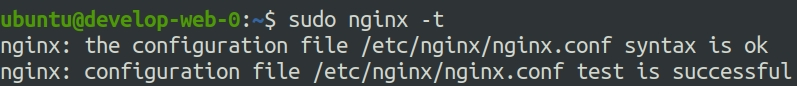
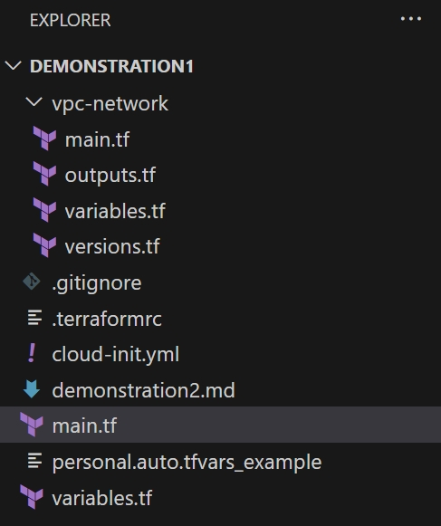
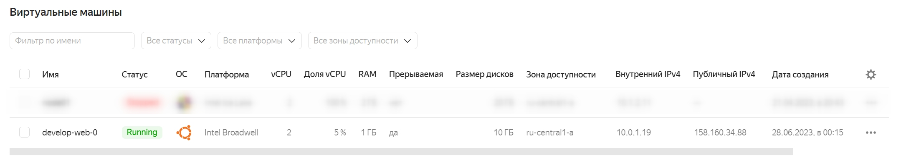
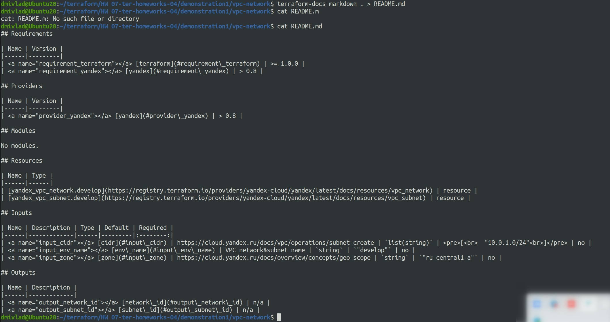

# Ответы на задания 07-ter-homeworks-04  
### Задание 1

1. Возьмите из [демонстрации к лекции готовый код](https://github.com/netology-code/ter-homeworks/tree/main/04/demonstration1) для создания ВМ с помощью remote модуля.
2. Создайте 1 ВМ, используя данный модуль. В файле cloud-init.yml необходимо использовать переменную для ssh ключа вместо хардкода. Передайте ssh-ключ в функцию template_file в блоке vars ={} .
Воспользуйтесь [**примером**](https://grantorchard.com/dynamic-cloudinit-content-with-terraform-file-templates/). Обратите внимание что ssh-authorized-keys принимает в себя список, а не строку!
3. Добавьте в файл cloud-init.yml установку nginx.
4. Предоставьте скриншот подключения к консоли и вывод команды ```sudo nginx -t```.

### Решение 1

Задание выполнено. Доработан файл main.tf, который выглядит следующим образом:

```
terraform {
  required_providers {
    yandex = {
      source = "yandex-cloud/yandex"
    }
  }
  required_version = ">=0.13"
}


provider "yandex" {
  token     = var.token
  cloud_id  = var.cloud_id
  folder_id = var.folder_id
  zone      = var.default_zone
}


#создаем облачную сеть
resource "yandex_vpc_network" "develop" {
  name = "develop"
}

#создаем подсеть
resource "yandex_vpc_subnet" "develop" {
  name           = "develop-ru-central1-a"
  zone           = "ru-central1-a"
  network_id     = yandex_vpc_network.develop.id
  v4_cidr_blocks = ["10.0.1.0/24"]
}

module "test-vm" {
  source          = "git::https://github.com/udjin10/yandex_compute_instance.git?ref=main"
  env_name        = "develop"
  network_id      = yandex_vpc_network.develop.id
  subnet_zones    = ["ru-central1-a"]
  subnet_ids      = [ yandex_vpc_subnet.develop.id ]
  instance_name   = "web"
  instance_count  = 1
  image_family    = "ubuntu-2004-lts"
  public_ip       = true

  metadata = {
      user-data          = data.template_file.cloudinit.rendered
      serial-port-enable = 1
      ssh-keys = var.public_key
  }

}


#Пример передачи cloud-config в ВМ для демонстрации №3
data template_file "cloudinit" {
 template = file("./cloud-init.yml")
 vars = {
  username = "ubuntu"
  ssh-key = file("~/.ssh/id_rsa.pub.new")
 }
}
```

Файл cloud-init.yml выглядит таким образом:  

```
#cloud-config
users:
  - name: ubuntu
    groups: sudo
    shell: /bin/bash
    sudo: ['ALL=(ALL) NOPASSWD:ALL']
    ssh_authorized_keys:
        - ${ssh-key}
package_update: true
package_upgrade: false
packages:
 - vim
 - nginx
runcmd:
 - systemctl enable nginx
 - systemctl start nginx

```
В файл variables.tf добавлена переменная *public_key*.  

Вывод команда *nginx -t* на поднятой ВМ:  

  

------

### Задание 2

1. Напишите локальный модуль vpc, который будет создавать 2 ресурса: **одну** сеть и **одну** подсеть в зоне, объявленной при вызове модуля. например: ```ru-central1-a```.
2. Модуль должен возвращать значения vpc.id и subnet.id
3. Замените ресурсы yandex_vpc_network и yandex_vpc_subnet, созданным модулем.
4. Сгенерируйте документацию к модулю с помощью terraform-docs.    
 
Пример вызова:
```
module "vpc_dev" {
  source       = "./vpc"
  env_name     = "develop"
  zone = "ru-central1-a"
  cidr = "10.0.1.0/24"
}
```
### Решение 2

Задание выполнено, структура папок проекта следующая:  

  

Код файла main.tf после доработок выглядит таким образом:  

```
terraform {
  required_providers {
    yandex = {
      source = "yandex-cloud/yandex"
    }
  }
  required_version = ">=0.13"
}


provider "yandex" {
  token     = var.token
  cloud_id  = var.cloud_id
  folder_id = var.folder_id
  zone      = var.default_zone
}

module "vpc-network" {
  source       = "./vpc-network"
  env_name     = "develop"
  zone = "ru-central1-a"
  cidr = ["10.0.1.0/24"]
}

module "test-vm" {
  source          = "git::https://github.com/udjin10/yandex_compute_instance.git?ref=main"
  env_name        = "develop"
  network_id      = module.vpc-network.network_id
  subnet_zones    = ["ru-central1-a"]
  subnet_ids      = [module.vpc-network.subnet_id]
  instance_name   = "web"
  instance_count  = 1
  image_family    = "ubuntu-2004-lts"
  public_ip       = true

  metadata = {
      user-data          = data.template_file.cloudinit.rendered
      serial-port-enable = 1
      ssh-keys = var.public_key
  }

}


#Пример передачи cloud-config в ВМ для демонстрации №3
data template_file "cloudinit" {
 template = file("./cloud-init.yml")
 vars = {
  username = "ubuntu"
  ssh-key = file("~/.ssh/id_rsa.pub.new")
 }
}


```

Файл vpc-network/main.tf так:  

```
#создаем облачную сеть
resource "yandex_vpc_network" "develop" {
  name = "develop"
}

#создаем подсеть
resource "yandex_vpc_subnet" "develop" {
  name           = "develop-ru-central1-a"
  zone           = "ru-central1-a"
  network_id     = yandex_vpc_network.develop.id
  v4_cidr_blocks = ["10.0.1.0/24"]
}

```

файл vpc-network/outputs.tf  

```
output "network_id" {
    value = yandex_vpc_network.develop.id
  
}

output "subnet_id" {
    value = yandex_vpc_subnet.develop.id
  
}
```


файл vpc-network/variables.tf  

```
variable "zone" {
  type        = string
  default     = "ru-central1-a"
  description = "https://cloud.yandex.ru/docs/overview/concepts/geo-scope"
}
variable "cidr" {
  type        = list(string)
  default     = ["10.0.1.0/24"]
  description = "https://cloud.yandex.ru/docs/vpc/operations/subnet-create"
}

variable "env_name" {
  type        = string
  default     = "develop"
  description = "VPC network&subnet name"
}
```


файл vpc-network/versions.tf

```
terraform {
  required_version = ">= 1.0.0"

  required_providers {
    yandex = {
      source  = "yandex-cloud/yandex"
      version = "> 0.8"
    }
  }
}
```

После применения ВМ завелась, скриншот ниже: 

  

Скачиваем и устанавливаем пакет terraform-docs  

```
sudo curl -sSLo ./terraform-docs.tar.gz https://terraform-docs.io/dl/v0.16.0/terraform-docs-v0.16.0-$(uname)-amd64.tar.gz
mv terraform-docs /usr/local/bin/

```

Вывод результата:  

  

------
### Задание 3
1. Выведите список ресурсов в стейте.
2. Удалите из стейта модуль vpc.
3. Импортируйте его обратно. Проверьте terraform plan - изменений быть не должно.
Приложите список выполненных команд и вывод.

### Решение 3

Список команд для получения результата

```
terraform state list #выводим список модулей
terraform state show module.vpc-network.yandex_vpc_subnet.develop #узнаем дополнительные параметры модуля
terraform state rm module.vpc-network.yandex_vpc_subnet.develop #удаляем один из модулей
terraform import module.vpc-network.yandex_vpc_subnet.develop e9ba5asivke4pfaals16 #импортируем и восстанавливаем модуль
terraform plan #проверяем, что изменений не будет
```

------
