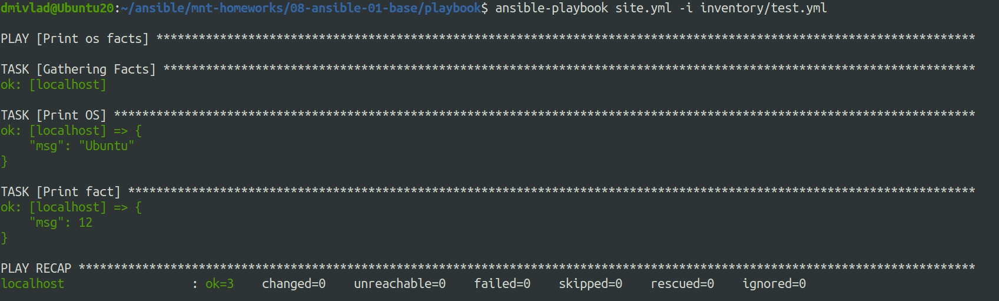
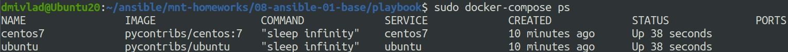
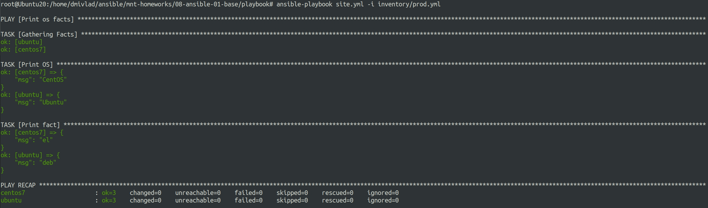
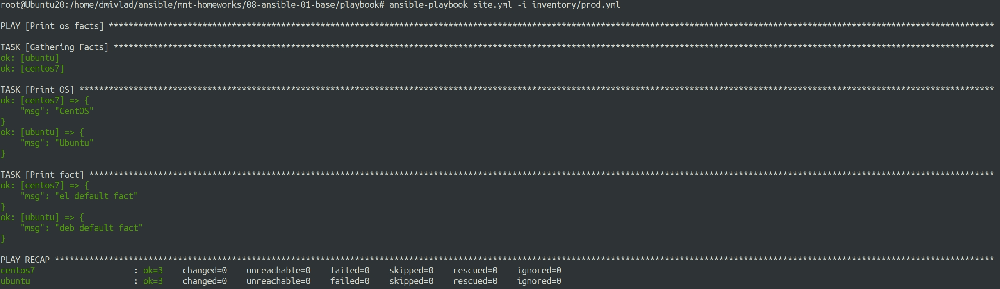
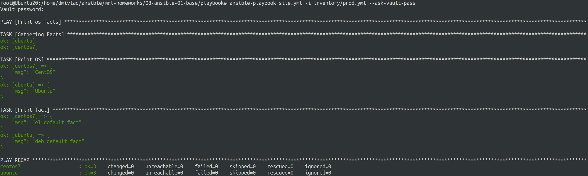
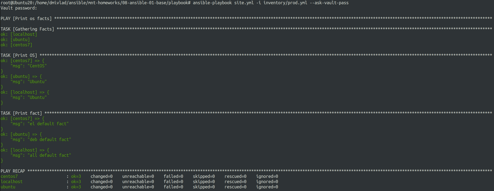

# Ответы на задания 08-ansible-01-base  
### Задания  
1. Попробуйте запустить playbook на окружении из `test.yml`, зафиксируйте какое значение имеет факт `some_fact` для указанного хоста при выполнении playbook'a.
2. Найдите файл с переменными (group_vars) в котором задаётся найденное в первом пункте значение и поменяйте его на 'all default fact'.
3. Воспользуйтесь подготовленным (используется `docker`) или создайте собственное окружение для проведения дальнейших испытаний.
4. Проведите запуск playbook на окружении из `prod.yml`. Зафиксируйте полученные значения `some_fact` для каждого из `managed host`.
5. Добавьте факты в `group_vars` каждой из групп хостов так, чтобы для `some_fact` получились следующие значения: для `deb` - 'deb default fact', для `el` - 'el default fact'.
6.  Повторите запуск playbook на окружении `prod.yml`. Убедитесь, что выдаются корректные значения для всех хостов.
7. При помощи `ansible-vault` зашифруйте факты в `group_vars/deb` и `group_vars/el` с паролем `netology`.
8. Запустите playbook на окружении `prod.yml`. При запуске `ansible` должен запросить у вас пароль. Убедитесь в работоспособности.
9. Посмотрите при помощи `ansible-doc` список плагинов для подключения. Выберите подходящий для работы на `control node`.
10. В `prod.yml` добавьте новую группу хостов с именем  `local`, в ней разместите localhost с необходимым типом подключения.
11. Запустите playbook на окружении `prod.yml`. При запуске `ansible` должен запросить у вас пароль. Убедитесь что факты `some_fact` для каждого из хостов определены из верных `group_vars`.
12. Заполните `README.md` ответами на вопросы. Сделайте `git push` в ветку `master`. В ответе отправьте ссылку на ваш открытый репозиторий с изменённым `playbook` и заполненным `README.md`.

### Решения  
1. Playbook запущен, вывод результата на скриншоте:  
  
Факт имеет значение 12.
2. Файл *examp.yml* найден, значение поменяно.  
3. Создаем файл docker-compose.yaml:  
```
version: '3'
services:
  centos7:
    image: pycontribs/centos:7
    container_name: centos7
    restart: unless-stopped
    entrypoint: "sleep infinity"

  ubuntu:
    image: pycontribs/ubuntu
    container_name: ubuntu
    restart: unless-stopped
    entrypoint: "sleep infinity"
```

Запускаем контейнеры командой *docker-compose up*. Проверяем, что окружение стартовало:  
  
4. Запускаем playbook в окружении prod:  
  
5. Исправлены файлы *examp.yml* в папках групп хостов *deb* и *el*  
6. Повторяем запуск playbook и полуаем следующие корректные результаты:  
  
7. Шифруем файлы следующей командой:  
```
root@Ubuntu20:/home/dmivlad/ansible/mnt-homeworks/08-ansible-01-base/playbook# ansible-vault encrypt group_vars/deb/examp.yml group_vars/el/examp.yml 
New Vault password: 
Confirm New Vault password: 
Encryption successful
```
8. Запускаем playbook с зашифрованными файлами, для запроса пароля указываем инструкцию *--ask-vault-pass*. Получаем следующие результаты:  
  
9. Смотрим список плагинов для подключения:  
```
ansible-doc -t connection -l
```
Выбираем *local* для подключения к control-node.
10. Правим файл *prod.yml*, получаем следующий результат:  
```
---
  el:
    hosts:
      centos7:
        ansible_connection: docker
  deb:
    hosts:
      ubuntu:
        ansible_connection: docker

  local:
    hosts:
      localhost:
         ansible_connection: local
```
11. Снова запускаем *ansible-playbook site.yml -i inventory/prod.yml --ask-vault-pass*. Получаем результат:  
  
12. Оформляем результаты и загуржаем в git.  

 


