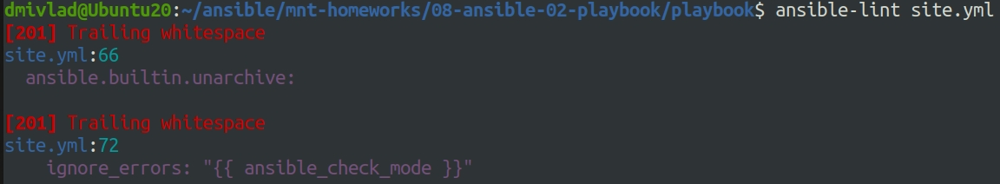
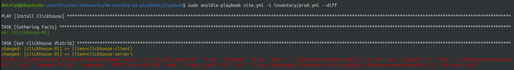

# Ответы на задания 08-ansible-02-playbook  
### Задания  
1. Подготовьте свой inventory-файл `prod.yml`.
2. Допишите playbook: нужно сделать ещё один play, который устанавливает и настраивает [vector](https://vector.dev).
3. При создании tasks рекомендую использовать модули: `get_url`, `template`, `unarchive`, `file`.
4. Tasks должны: скачать дистрибутив нужной версии, выполнить распаковку в выбранную директорию, установить vector.
5. Запустите `ansible-lint site.yml` и исправьте ошибки, если они есть.
6. Попробуйте запустить playbook на этом окружении с флагом `--check`.
7. Запустите playbook на `prod.yml` окружении с флагом `--diff`. Убедитесь, что изменения на системе произведены.
8. Повторно запустите playbook с флагом `--diff` и убедитесь, что playbook идемпотентен.
9. Подготовьте README.md-файл по своему playbook. В нём должно быть описано: что делает playbook, какие у него есть параметры и теги.
10. Готовый playbook выложите в свой репозиторий, поставьте тег `08-ansible-02-playbook` на фиксирующий коммит, в ответ предоставьте ссылку на него.

### Решения  
Готовим файл docker-compose для подняния необходимых хостов:  
```
version: '3'
services:
  clickhouse:
    image: pycontribs/centos:7
    container_name: clickhouse-01
    restart: unless-stopped
    entrypoint: "sleep infinity"

  vector:
    image: pycontribs/ubuntu
    container_name: vector-01
    restart: unless-stopped
    entrypoint: "sleep infinity"

```
1. Собственный prod.yml будет выглядеть следующим образом:  

```
---
clickhouse:
  hosts:
    clickhouse-01:
      ansible_connection: docker

vector:
  hosts:
    vector-01:
      ansible_connection: docker
```

2. Playbook дописан и имеет следующий вид:

```
---
- name: Install Clickhouse
  hosts: clickhouse
  handlers:
    - name: Start clickhouse service
      become: true
      ansible.builtin.service:
        name: clickhouse-server
        state: restarted
  tasks:
    - block:
        - name: Get clickhouse distrib
          ansible.builtin.get_url:
            url: "https://packages.clickhouse.com/rpm/stable/{{ item }}-{{ clickhouse_version }}.noarch.rpm"
            dest: "./{{ item }}-{{ clickhouse_version }}.rpm"
          with_items: "{{ clickhouse_packages }}"
      rescue:
        - name: Get clickhouse distrib
          ansible.builtin.get_url:
            url: "https://packages.clickhouse.com/rpm/stable/clickhouse-common-static-{{ clickhouse_version }}.x86_64.rpm"
            dest: "./clickhouse-common-static-{{ clickhouse_version }}.rpm"
    - name: Install clickhouse packages
      become: true
      ansible.builtin.yum:
        name:
          - clickhouse-common-static-{{ clickhouse_version }}.rpm
          - clickhouse-client-{{ clickhouse_version }}.rpm
          - clickhouse-server-{{ clickhouse_version }}.rpm
      notify: Start clickhouse service
    - name: Flush handlers
      meta: flush_handlers
    - name: Create database
      ansible.builtin.command: "clickhouse-client -q 'create database logs;'"
      register: create_db
      failed_when: create_db.rc != 0 and create_db.rc !=82
      changed_when: create_db.rc == 0
# Play vector installation
- name: Install vector
  hosts: vector
  handlers:
          # - name: Start vector service
          # become: true
          #become_method: sudo
      #      ansible.builtin.service:
      #  name: vector
      #  state: restarted

  tasks:
    - name: Vector | Install package
      become: true
      become_method: sudo
      ansible.builtin.apt:
        deb: "https://packages.timber.io/vector/{{ vector_version }}/{{ vector_package }}_{{ vector_version }}-1_{{ vector_architecture }}.deb"
        state: present
      tags:
        - install_vector

    - name: Vector | Generate config
      become: true
      become_method: sudo
      ansible.builtin.template:
        src: vector.yml.j2
        mode: 0644
        dest: "{{ vector_config_dir }}/vector.yml"
      tags:
        - configure_vector
      changed_when: true
      #notify: Start vector service

    - name: Vector | Configure service
      become: true
      become_method: sudo
      ansible.builtin.template:
        src: vector.service.j2
        dest: /lib/systemd/system/vector.service
        mode: 0644
        backup: true
      tags:
        - configure_vector

          #    - name: Flush handlers
          #ansible.builtin.meta: flush_handlers
          #tags:
          #- configure_vector

```

3. Требования выполнены.
4. Требования выполнены.
5. Возникшие ошибки на скриншоте, все они исправлены.  

  

6. Запуск с флагом *--check*  

Пропущено создание БД - является нормальным повдеением, также сваливается в ошибку из-за невозможности найти необходимую версию пакета.  

  

7. Команда *sudo ansible-playbook site.yml -i inventory/prod.yml --diff* отрабатывает, устанавливая пакеты и производя настройки.

8. Повторный запуск показал, что playbook идемпотентен.  

9. Файл README.md по данному playbook составлен.

10. Задание выложено в репозиторий.

P.S. По всей видимости, решение делать данное задание с применением контейнеров было ошибочным выбором, так как существует ряд ограничений, например: для запуска служб нужен systemd, а в контейнерах его нет. 
