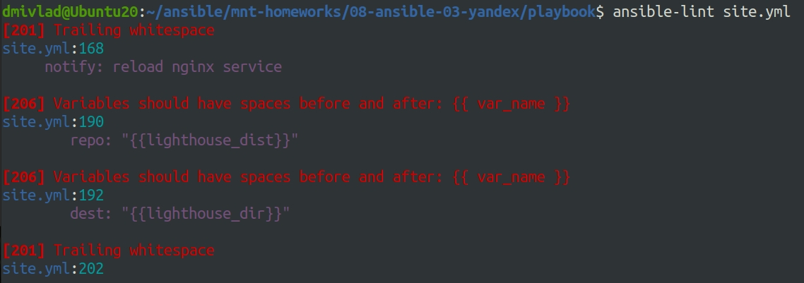
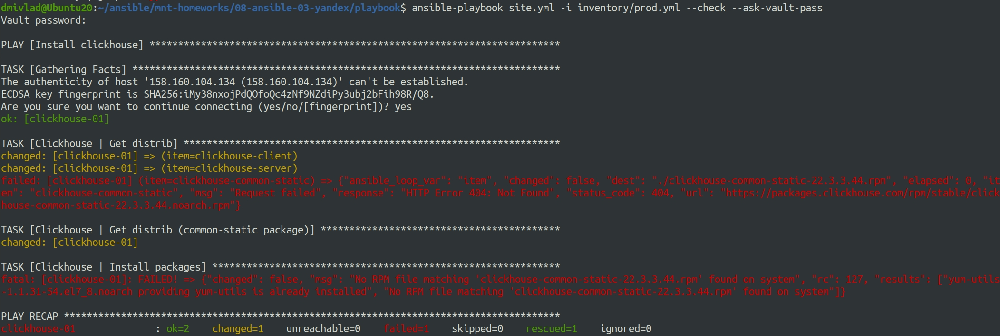

# Ответы на задания 08-ansible-03-yandex  
### Задания  
1. Допишите playbook: нужно сделать ещё один play, который устанавливает и настраивает LightHouse.
2. При создании tasks рекомендую использовать модули: `get_url`, `template`, `yum`, `apt`.
3. Tasks должны: скачать статику LightHouse, установить Nginx или любой другой веб-сервер, настроить его конфиг для открытия LightHouse, запустить веб-сервер.
4. Подготовьте свой inventory-файл `prod.yml`.
5. Запустите `ansible-lint site.yml` и исправьте ошибки, если они есть.
6. Попробуйте запустить playbook на этом окружении с флагом `--check`.
7. Запустите playbook на `prod.yml` окружении с флагом `--diff`. Убедитесь, что изменения на системе произведены.
8. Повторно запустите playbook с флагом `--diff` и убедитесь, что playbook идемпотентен.
9. Подготовьте README.md-файл по своему playbook. В нём должно быть описано: что делает playbook, какие у него есть параметры и теги.
10. Готовый playbook выложите в свой репозиторий, поставьте тег `08-ansible-03-yandex` на фиксирующий коммит, в ответ предоставьте ссылку на него.

### Решения  
1. Playbook дописан (дополнительно устанавливается nginx и Lighthouse)и имеет следующий вид:  
```
---
# Play clickhouse installation
- name: Install clickhouse
  hosts: clickhouse
  handlers:
    - name: Start clickhouse service
      become: true
      ansible.builtin.service:
        name: clickhouse-server
        state: restarted

  tasks:
    - name: Clickhouse | Get distrib
      block:
        - name: Clickhouse | Get distrib
          ansible.builtin.get_url:
            url: "https://packages.clickhouse.com/rpm/stable/{{ item }}-{{ clickhouse_version }}.noarch.rpm"
            dest: "./{{ item }}-{{ clickhouse_version }}.rpm"
            mode: '0776'
          with_items: "{{ clickhouse_packages }}"
          tags:
            - get_clickhouse
      rescue:
        - name: Clickhouse | Get distrib (common-static package)
          ansible.builtin.get_url:
            url: "https://packages.clickhouse.com/rpm/stable/clickhouse-common-static-{{ clickhouse_version }}.x86_64.rpm"
            dest: "./clickhouse-common-static-{{ clickhouse_version }}.rpm"
            mode: '0776'
          tags:
            - get_clickhouse

    - name: Clickhouse | Install packages
      become: true
      ansible.builtin.yum:
        name:
          - yum-utils
          - clickhouse-common-static-{{ clickhouse_version }}.rpm
          - clickhouse-client-{{ clickhouse_version }}.rpm
          - clickhouse-server-{{ clickhouse_version }}.rpm
      tags:
        - install_clickhouse
      notify: Start clickhouse service

    - name: Clickhouse | Generate users config
      ansible.builtin.template:
        src: clickhouse.users.j2
        dest: "{{ clickhouse_path_configdir }}/users.d/users.xml"
        owner: "clickhouse"
        group: "clickhouse"
        mode: "0775"
      become: true
      tags:
        - configure_clickhouse

    - name: Clickhouse | Generate server config
      ansible.builtin.template:
        src: clickhouse.config.j2
        dest: "{{ clickhouse_path_configdir }}/config.d/config.xml"
        owner: "clickhouse"
        group: "clickhouse"
        mode: "0775"
      become: true
      tags:
        - configure_clickhouse

    - name: Flush handlers
      ansible.builtin.meta: flush_handlers
      tags:
        - install_clickhouse

    - name: Clickhouse | Create database and table
      ansible.builtin.shell: |
        clickhouse-client -q "create user vector identified with sha256_password by 'vector';"
        clickhouse-client -q 'create database if not exists logs;'
        clickhouse-client -q 'grant all on logs.* to vector with grant option;'
        clickhouse-client -q 'create table if not exists logs.vector_logs ("file" String, "host" String, "message" String, "date" DateTime) Engine=Log;'
        exit 0
      register: create_db
      failed_when: create_db.rc != 0 and create_db.rc !=82
      changed_when: create_db.rc == 0
      tags:
        - configure_clickhouse

# Play vector installation
- name: Install vector
  hosts: vector
  handlers:
    - name: Start vector service
      become: true
      become_method: sudo
      ansible.builtin.service:
        name: vector
        state: restarted

  tasks:
    - name: Vector | Install package
      become: true
      become_method: sudo
      ansible.builtin.apt:
        deb: "https://packages.timber.io/vector/{{ vector_version }}/{{ vector_package }}_{{ vector_version }}-1_{{ vector_architecture }}.deb"
        state: present
      tags:
        - install_vector

    - name: Vector | Generate config
      become: true
      become_method: sudo
      ansible.builtin.template:
        src: vector.yml.j2
        mode: 0644
        dest: "{{ vector_config_dir }}/vector.yml"
      tags:
        - configure_vector
      changed_when: true
      notify: Start vector service

    - name: Vector | Configure service
      become: true
      become_method: sudo
      ansible.builtin.template:
        src: vector.service.j2
        dest: /usr/lib/systemd/system/vector.service
        mode: 0644
        backup: true
      tags:
        - configure_vector

    - name: Flush handlers
      ansible.builtin.meta: flush_handlers
      tags:
        - configure_vector
# Play nginx install
- name: Install nginx
  hosts: lighthouse
  handlers:
    - name: start nginx service
      become: true
      ansible.builtin.service:
        name: nginx
        state: started
    - name: reload nginx service
      become: true
      ansible.builtin.service:
        name: nginx
        state: reloaded
  tasks:
   - name: Install epel-release
     become: true
     ansible.builtin.yum:
       name: epel-release
       state: present
   - name: Install nginx
     become: true
     ansible.builtin.yum:
       name: nginx
       state: present
     notify: start nginx service
   - name: create nginx config
     become: true
     become_method: sudo
     ansible.builtin.template:
       src: templates/nginx.config.j2
       dest: /etc/nginx/nginx.conf
       owner: root
       group: root
       mode: 0644
       force: true
     notify: reload nginx service 

# Play lighthouse install
- name: Install lighthouse
  hosts: lighthouse
  handlers:
    - name: reload nginx service
      become: true
      ansible.builtin.service:
        name: nginx
        state: reloaded
  pre_tasks:
    - name: install lighthouse dependencies
      become: true
      ansible.builtin.yum:
        name: git
        state: present
  tasks:
    - name: download lighthouse from git
      become: true
      become_method: sudo
      ansible.builtin.git:
        repo: "{{ lighthouse_dist }}"
        version: master
        dest: "{{ lighthouse_dir }}"
    - name: create lighthouse config
      become: true
      become_method: sudo
      ansible.builtin.template:
        src: templates/lighthouse.config.j2
        dest: /etc/nginx/conf.d/lighthouse.conf
        mode: 0644
      notify: reload nginx service
```
2. Рекомендации применены.
3. Требования выполнены.
4. Файл *prod.yml* подготовлен и имеет слеюующий вид:  
```
---
# lighthouse host (YC)
lighthouse:
  hosts:
    lighthouse-01:
      ansible_connection: ssh
      ansible_host:
      ansible_port: "{{ssh_port}}"
      ansible_ssh_private_key_file: "{{ssh_pkey_file}}"
      ansible_user: "{{sudo_user}}"
      ansible_sudo_pass: "{{sudo_pass}}"
# clickhouse host (YC)
clickhouse:
  hosts:
    clickhouse-01:
      ansible_connection: ssh
      ansible_host:
      ansible_port: "{{ssh_port}}"
      ansible_ssh_private_key_file: "{{ssh_pkey_file}}"
      ansible_user: "{{sudo_user}}"
      ansible_sudo_pass: "{{sudo_pass}}"
# vector host (YC)
vector:
  hosts:
    vector-01:
      ansible_connection: ssh
      ansible_host:
      ansible_port: "{{ssh_port}}"
      ansible_ssh_private_key_file: "{{ssh_pkey_file}}"
      ansible_user: "{{sudo_user}}"
      ansible_sudo_pass: "{{sudo_pass}}"
```
5. Ошибки представлены на скриншоте. Все они носят синтаксический характер - либо лишние, либо недостаточно пробелов. Ошибки успешно исправлены:    
  
6. Запуск команды *ansible-playbook site.yml -i inventory/prod.yml --check --ask-vault-pass* вываливается с ошибкой, продемонстрированной на скриншоте. Предполагаю, что из-за того, что запуск с флагом *--check* не предполагает установку пакетов.
  
7. Playbook запущен командой *ansible-playbook site.yml -i inventory/prod.yml --diff --ask-vault-pass*. Исправлены некоторые ошибки в файлах шаблонов, изменения в системе произведены, примененные конфиги выводятся в терминале.
8. Playbook запущен повторной той же командой, идемпотентность потверждена. Вывод следующий:  
```
PLAY RECAP ***********************************************************************************************************************************************************************************************
clickhouse-01              : ok=6    changed=1    unreachable=0    failed=0    skipped=0    rescued=1    ignored=0   
lighthouse-01              : ok=8    changed=0    unreachable=0    failed=0    skipped=0    rescued=0    ignored=0   
vector-01                  : ok=5    changed=2    unreachable=0    failed=0    skipped=0    rescued=0    ignored=0 
```
9. Файл подготовлен и выложен в директорию playbook [README.md](playbook/README.md).  
10. Ответы на задания загружены в репозиторий. 