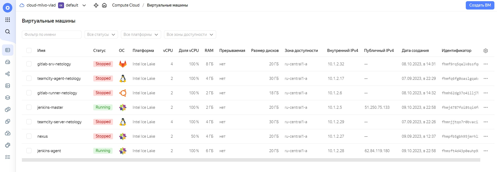
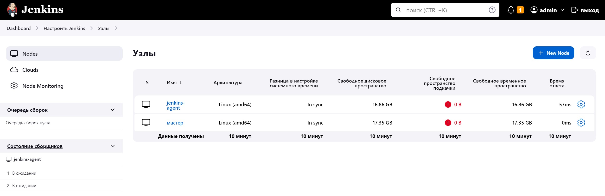
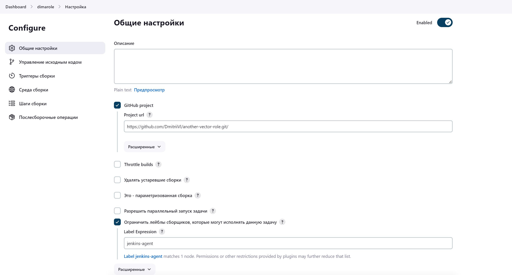
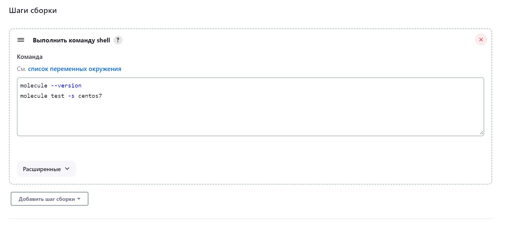
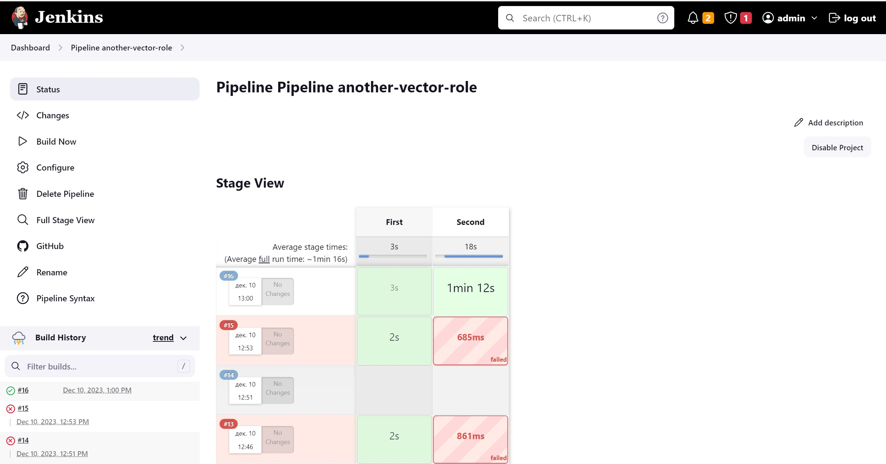

# Ответы на задания 09-ci-04-jenkins

### Задания  

## Подготовка к выполнению

1. Создать два VM: для jenkins-master и jenkins-agent.
2. Установить Jenkins при помощи playbook.
3. Запустить и проверить работоспособность.
4. Сделать первоначальную настройку.

## Основная часть

1. Сделать Freestyle Job, который будет запускать `molecule test` из любого вашего репозитория с ролью.
2. Сделать Declarative Pipeline Job, который будет запускать `molecule test` из любого вашего репозитория с ролью.
3. Перенести Declarative Pipeline в репозиторий в файл `Jenkinsfile`.
4. Создать Multibranch Pipeline на запуск `Jenkinsfile` из репозитория.
5. Создать Scripted Pipeline, наполнить его скриптом из [pipeline](./pipeline).
6. Внести необходимые изменения, чтобы Pipeline запускал `ansible-playbook` без флагов `--check --diff`, если не установлен параметр при запуске джобы (prod_run = True). По умолчанию параметр имеет значение False и запускает прогон с флагами `--check --diff`.
7. Проверить работоспособность, исправить ошибки, исправленный Pipeline вложить в репозиторий в файл `ScriptedJenkinsfile`.
8. Отправить ссылку на репозиторий с ролью и Declarative Pipeline и Scripted Pipeline.

------

## Ответ  

Инфраструктура подготовлена, виртуальные машины подняты:  

  

Jenkins развернут с помощью playbook, настроен агент на соединениес с мастером:  

  

Создана Freestyle Job со следующими настройками:  

  

Тест molecule запускается со следующими параметрами:  

  

Тест запускается и проходит успешно:  

Freestyle Job

Started by user admin
Running as SYSTEM
Building remotely on jenkins-agent (linux ansible) in workspace /opt/jenkins_agent/workspace/another-vector-role
The recommended git tool is: NONE
No credentials specified
 > git rev-parse --resolve-git-dir /opt/jenkins_agent/workspace/another-vector-role/.git # timeout=10
Fetching changes from the remote Git repository
 > git config remote.origin.url https://github.com/DmitriiVl/another-vector-role.git # timeout=10
Fetching upstream changes from https://github.com/DmitriiVl/another-vector-role.git
 > git --version # timeout=10
 > git --version # 'git version 1.8.3.1'
 > git fetch --tags --progress https://github.com/DmitriiVl/another-vector-role.git +refs/heads/*:refs/remotes/origin/* # timeout=10
 > git rev-parse refs/remotes/origin/main^{commit} # timeout=10
Checking out Revision 2d55f70d05ce272d6709a3f07a2662eb38cc4c7c (refs/remotes/origin/main)
 > git config core.sparsecheckout # timeout=10
 > git checkout -f 2d55f70d05ce272d6709a3f07a2662eb38cc4c7c # timeout=10
Commit message: "Modify avr"
 > git rev-list --no-walk 4b3565d9cc9b59439c1755635e9c250176aa0084 # timeout=10
[another-vector-role] $ /bin/sh -xe /tmp/jenkins8882551546374690496.sh
+ molecule --version
/usr/local/lib/python3.6/site-packages/requests/__init__.py:104: RequestsDependencyWarning: urllib3 (1.26.18) or chardet (5.0.0)/charset_normalizer (2.0.12) doesn't match a supported version!
  RequestsDependencyWarning)
[DEPRECATION WARNING]: Ansible will require Python 3.8 or newer on the 
controller starting with Ansible 2.12. Current version: 3.6.8 (default, Nov 14 
2023, 16:29:52) [GCC 4.8.5 20150623 (Red Hat 4.8.5-44)]. This feature will be 
removed from ansible-core in version 2.12. Deprecation warnings can be disabled
 by setting deprecation_warnings=False in ansible.cfg.
/usr/local/lib/python3.6/site-packages/ansible/parsing/vault/__init__.py:44: CryptographyDeprecationWarning: Python 3.6 is no longer supported by the Python core team. Therefore, support for it is deprecated in cryptography. The next release of cryptography will remove support for Python 3.6.
  from cryptography.exceptions import InvalidSignature
molecule 3.5.2 using python 3.6 
    ansible:2.11.12
    delegated:3.5.2 from molecule
    docker:1.1.0 from molecule_docker requiring collections: community.docker>=1.9.1
+ molecule test -s centos7
/usr/local/lib/python3.6/site-packages/requests/__init__.py:104: RequestsDependencyWarning: urllib3 (1.26.18) or chardet (5.0.0)/charset_normalizer (2.0.12) doesn't match a supported version!
  RequestsDependencyWarning)
[DEPRECATION WARNING]: Ansible will require Python 3.8 or newer on the 
controller starting with Ansible 2.12. Current version: 3.6.8 (default, Nov 14 
2023, 16:29:52) [GCC 4.8.5 20150623 (Red Hat 4.8.5-44)]. This feature will be 
removed from ansible-core in version 2.12. Deprecation warnings can be disabled
 by setting deprecation_warnings=False in ansible.cfg.
/usr/local/lib/python3.6/site-packages/ansible/parsing/vault/__init__.py:44: CryptographyDeprecationWarning: Python 3.6 is no longer supported by the Python core team. Therefore, support for it is deprecated in cryptography. The next release of cryptography will remove support for Python 3.6.
  from cryptography.exceptions import InvalidSignature
INFO     centos7 scenario test matrix: dependency, lint, cleanup, destroy, syntax, create, prepare, converge, idempotence, side_effect, verify, cleanup, destroy
INFO     Performing prerun...
INFO     Set ANSIBLE_LIBRARY=/home/jenkins/.cache/ansible-compat/600404/modules:/home/jenkins/.ansible/plugins/modules:/usr/share/ansible/plugins/modules
INFO     Set ANSIBLE_COLLECTIONS_PATH=/home/jenkins/.cache/ansible-compat/600404/collections:/home/jenkins/.ansible/collections:/usr/share/ansible/collections
INFO     Set ANSIBLE_ROLES_PATH=/home/jenkins/.cache/ansible-compat/600404/roles:/home/jenkins/.ansible/roles:/usr/share/ansible/roles:/etc/ansible/roles
INFO     Running centos7 > dependency
WARNING  Skipping, missing the requirements file.
WARNING  Skipping, missing the requirements file.
INFO     Running centos7 > lint
INFO     Lint is disabled.
INFO     Running centos7 > cleanup
WARNING  Skipping, cleanup playbook not configured.
INFO     Running centos7 > destroy
INFO     Sanity checks: 'docker'
[DEPRECATION WARNING]: Ansible will require Python 3.8 or newer on the
controller starting with Ansible 2.12. Current version: 3.6.8 (default, Nov 14
2023, 16:29:52) [GCC 4.8.5 20150623 (Red Hat 4.8.5-44)]. This feature will be
removed from ansible-core in version 2.12. Deprecation warnings can be disabled
 by setting deprecation_warnings=False in ansible.cfg.

PLAY [Destroy] *****************************************************************

TASK [Destroy molecule instance(s)] ********************************************
/usr/local/lib/python3.6/site-packages/ansible/parsing/vault/__init__.py:44: CryptographyDeprecationWarning: Python 3.6 is no longer supported by the Python core team. Therefore, support for it is deprecated in cryptography. The next release of cryptography will remove support for Python 3.6.
  from cryptography.exceptions import InvalidSignature
changed: [localhost] => (item=instance)

TASK [Wait for instance(s) deletion to complete] *******************************
FAILED - RETRYING: Wait for instance(s) deletion to complete (300 retries left).
ok: [localhost] => (item=instance)

TASK [Delete docker networks(s)] ***********************************************

PLAY RECAP *********************************************************************
localhost                  : ok=2    changed=1    unreachable=0    failed=0    skipped=1    rescued=0    ignored=0

INFO     Running centos7 > syntax
[DEPRECATION WARNING]: Ansible will require Python 3.8 or newer on the
controller starting with Ansible 2.12. Current version: 3.6.8 (default, Nov 14
2023, 16:29:52) [GCC 4.8.5 20150623 (Red Hat 4.8.5-44)]. This feature will be
removed from ansible-core in version 2.12. Deprecation warnings can be disabled
 by setting deprecation_warnings=False in ansible.cfg.

playbook: /opt/jenkins_agent/workspace/another-vector-role/molecule/centos7/converge.yml
/usr/local/lib/python3.6/site-packages/ansible/parsing/vault/__init__.py:44: CryptographyDeprecationWarning: Python 3.6 is no longer supported by the Python core team. Therefore, support for it is deprecated in cryptography. The next release of cryptography will remove support for Python 3.6.
  from cryptography.exceptions import InvalidSignature
INFO     Running centos7 > create
[DEPRECATION WARNING]: Ansible will require Python 3.8 or newer on the
controller starting with Ansible 2.12. Current version: 3.6.8 (default, Nov 14
2023, 16:29:52) [GCC 4.8.5 20150623 (Red Hat 4.8.5-44)]. This feature will be
removed from ansible-core in version 2.12. Deprecation warnings can be disabled
 by setting deprecation_warnings=False in ansible.cfg.

PLAY [Create] ******************************************************************

TASK [Log into a Docker registry] **********************************************
/usr/local/lib/python3.6/site-packages/ansible/parsing/vault/__init__.py:44: CryptographyDeprecationWarning: Python 3.6 is no longer supported by the Python core team. Therefore, support for it is deprecated in cryptography. The next release of cryptography will remove support for Python 3.6.
  from cryptography.exceptions import InvalidSignature
skipping: [localhost] => (item=None)
skipping: [localhost]

TASK [Check presence of custom Dockerfiles] ************************************
ok: [localhost] => (item={'image': 'docker.io/pycontribs/centos:7', 'name': 'instance', 'pre_build_image': True})

TASK [Create Dockerfiles from image names] *************************************
skipping: [localhost] => (item={'image': 'docker.io/pycontribs/centos:7', 'name': 'instance', 'pre_build_image': True})

TASK [Discover local Docker images] ********************************************
ok: [localhost] => (item={'changed': False, 'skipped': True, 'skip_reason': 'Conditional result was False', 'item': {'image': 'docker.io/pycontribs/centos:7', 'name': 'instance', 'pre_build_image': True}, 'ansible_loop_var': 'item', 'i': 0, 'ansible_index_var': 'i'})

TASK [Build an Ansible compatible image (new)] *********************************
skipping: [localhost] => (item=molecule_local/docker.io/pycontribs/centos:7)

TASK [Create docker network(s)] ************************************************

TASK [Determine the CMD directives] ********************************************
ok: [localhost] => (item={'image': 'docker.io/pycontribs/centos:7', 'name': 'instance', 'pre_build_image': True})

TASK [Create molecule instance(s)] *********************************************
changed: [localhost] => (item=instance)

TASK [Wait for instance(s) creation to complete] *******************************
FAILED - RETRYING: Wait for instance(s) creation to complete (300 retries left).
changed: [localhost] => (item={'started': 1, 'finished': 0, 'ansible_job_id': '38146687822.322', 'results_file': '/home/jenkins/.ansible_async/38146687822.322', 'changed': True, 'failed': False, 'item': {'image': 'docker.io/pycontribs/centos:7', 'name': 'instance', 'pre_build_image': True}, 'ansible_loop_var': 'item'})

PLAY RECAP *********************************************************************
localhost                  : ok=5    changed=2    unreachable=0    failed=0    skipped=4    rescued=0    ignored=0

INFO     Running centos7 > prepare
WARNING  Skipping, prepare playbook not configured.
INFO     Running centos7 > converge
[DEPRECATION WARNING]: Ansible will require Python 3.8 or newer on the
controller starting with Ansible 2.12. Current version: 3.6.8 (default, Nov 14
2023, 16:29:52) [GCC 4.8.5 20150623 (Red Hat 4.8.5-44)]. This feature will be
removed from ansible-core in version 2.12. Deprecation warnings can be disabled
 by setting deprecation_warnings=False in ansible.cfg.

PLAY [Converge] ****************************************************************

TASK [Gathering Facts] *********************************************************
/usr/local/lib/python3.6/site-packages/ansible/parsing/vault/__init__.py:44: CryptographyDeprecationWarning: Python 3.6 is no longer supported by the Python core team. Therefore, support for it is deprecated in cryptography. The next release of cryptography will remove support for Python 3.6.
  from cryptography.exceptions import InvalidSignature
ok: [instance]

TASK [Include another-vector-role] *********************************************

TASK [another-vector-role : Install vector] ************************************
included: /opt/jenkins_agent/workspace/another-vector-role/tasks/install_vector_docker.yml for instance

TASK [another-vector-role : VECTOR | Install rpm] ******************************
changed: [instance]

TASK [another-vector-role : VECTOR | Template config] **************************
changed: [instance]

TASK [another-vector-role : Put docker package on hold] ************************
ok: [instance]

TASK [another-vector-role : Install vector] ************************************
skipping: [instance]

PLAY RECAP *********************************************************************
instance                   : ok=5    changed=2    unreachable=0    failed=0    skipped=1    rescued=0    ignored=0

INFO     Running centos7 > idempotence
[DEPRECATION WARNING]: Ansible will require Python 3.8 or newer on the
controller starting with Ansible 2.12. Current version: 3.6.8 (default, Nov 14
2023, 16:29:52) [GCC 4.8.5 20150623 (Red Hat 4.8.5-44)]. This feature will be
removed from ansible-core in version 2.12. Deprecation warnings can be disabled
 by setting deprecation_warnings=False in ansible.cfg.

PLAY [Converge] ****************************************************************

TASK [Gathering Facts] *********************************************************
/usr/local/lib/python3.6/site-packages/ansible/parsing/vault/__init__.py:44: CryptographyDeprecationWarning: Python 3.6 is no longer supported by the Python core team. Therefore, support for it is deprecated in cryptography. The next release of cryptography will remove support for Python 3.6.
  from cryptography.exceptions import InvalidSignature
ok: [instance]

TASK [Include another-vector-role] *********************************************

TASK [another-vector-role : Install vector] ************************************
included: /opt/jenkins_agent/workspace/another-vector-role/tasks/install_vector_docker.yml for instance

TASK [another-vector-role : VECTOR | Install rpm] ******************************
ok: [instance]

TASK [another-vector-role : VECTOR | Template config] **************************
ok: [instance]

TASK [another-vector-role : Put docker package on hold] ************************
ok: [instance]

TASK [another-vector-role : Install vector] ************************************
skipping: [instance]

PLAY RECAP *********************************************************************
instance                   : ok=5    changed=0    unreachable=0    failed=0    skipped=1    rescued=0    ignored=0

INFO     Idempotence completed successfully.
INFO     Running centos7 > side_effect
WARNING  Skipping, side effect playbook not configured.
INFO     Running centos7 > verify
INFO     Running Ansible Verifier
[DEPRECATION WARNING]: Ansible will require Python 3.8 or newer on the
controller starting with Ansible 2.12. Current version: 3.6.8 (default, Nov 14
2023, 16:29:52) [GCC 4.8.5 20150623 (Red Hat 4.8.5-44)]. This feature will be
removed from ansible-core in version 2.12. Deprecation warnings can be disabled
 by setting deprecation_warnings=False in ansible.cfg.

PLAY [Verify] ******************************************************************

TASK [Example assertion] *******************************************************
/usr/local/lib/python3.6/site-packages/ansible/parsing/vault/__init__.py:44: CryptographyDeprecationWarning: Python 3.6 is no longer supported by the Python core team. Therefore, support for it is deprecated in cryptography. The next release of cryptography will remove support for Python 3.6.
  from cryptography.exceptions import InvalidSignature
ok: [instance] => {
    "changed": false,
    "msg": "All assertions passed"
}

TASK [Check Vector configs] ****************************************************
changed: [instance]

TASK [Check Vector status] *****************************************************
changed: [instance]

PLAY RECAP *********************************************************************
instance                   : ok=3    changed=2    unreachable=0    failed=0    skipped=0    rescued=0    ignored=0

INFO     Verifier completed successfully.
INFO     Running centos7 > cleanup
WARNING  Skipping, cleanup playbook not configured.
INFO     Running centos7 > destroy
[DEPRECATION WARNING]: Ansible will require Python 3.8 or newer on the
controller starting with Ansible 2.12. Current version: 3.6.8 (default, Nov 14
2023, 16:29:52) [GCC 4.8.5 20150623 (Red Hat 4.8.5-44)]. This feature will be
removed from ansible-core in version 2.12. Deprecation warnings can be disabled
 by setting deprecation_warnings=False in ansible.cfg.

PLAY [Destroy] *****************************************************************

TASK [Destroy molecule instance(s)] ********************************************
/usr/local/lib/python3.6/site-packages/ansible/parsing/vault/__init__.py:44: CryptographyDeprecationWarning: Python 3.6 is no longer supported by the Python core team. Therefore, support for it is deprecated in cryptography. The next release of cryptography will remove support for Python 3.6.
  from cryptography.exceptions import InvalidSignature
changed: [localhost] => (item=instance)

TASK [Wait for instance(s) deletion to complete] *******************************
FAILED - RETRYING: Wait for instance(s) deletion to complete (300 retries left).
changed: [localhost] => (item=instance)

TASK [Delete docker networks(s)] ***********************************************

PLAY RECAP *********************************************************************
localhost                  : ok=2    changed=2    unreachable=0    failed=0    skipped=1    rescued=0    ignored=0

INFO     Pruning extra files from scenario ephemeral directory
Finished: SUCCESS

Создаем и запускаем следующую Job:

Declarative Pipeline Job сделана, сборка проходит успешно:

Started by user admin
[Pipeline] Start of Pipeline
[Pipeline] node
Running on jenkins-agent in /opt/jenkins_agent/workspace/Pipeline another-vector-role
[Pipeline] {
[Pipeline] stage
[Pipeline] { (First)
[Pipeline] sh
+ git clone https://github.com/DmitriiVl/another-vector-role.git .
Cloning into '.'...
[Pipeline] sh
+ molecule --version
/usr/local/lib/python3.6/site-packages/requests/__init__.py:104: RequestsDependencyWarning: urllib3 (1.26.18) or chardet (5.0.0)/charset_normalizer (2.0.12) doesn't match a supported version!
  RequestsDependencyWarning)
[DEPRECATION WARNING]: Ansible will require Python 3.8 or newer on the 
controller starting with Ansible 2.12. Current version: 3.6.8 (default, Nov 14 
2023, 16:29:52) [GCC 4.8.5 20150623 (Red Hat 4.8.5-44)]. This feature will be 
removed from ansible-core in version 2.12. Deprecation warnings can be disabled
 by setting deprecation_warnings=False in ansible.cfg.
/usr/local/lib/python3.6/site-packages/ansible/parsing/vault/__init__.py:44: CryptographyDeprecationWarning: Python 3.6 is no longer supported by the Python core team. Therefore, support for it is deprecated in cryptography. The next release of cryptography will remove support for Python 3.6.
  from cryptography.exceptions import InvalidSignature
molecule 3.5.2 using python 3.6 
    ansible:2.11.12
    delegated:3.5.2 from molecule
    docker:1.1.0 from molecule_docker requiring collections: community.docker>=1.9.1
[Pipeline] }
[Pipeline] // stage
[Pipeline] stage
[Pipeline] { (Second)
[Pipeline] sh
+ molecule test -s centos7
/usr/local/lib/python3.6/site-packages/requests/__init__.py:104: RequestsDependencyWarning: urllib3 (1.26.18) or chardet (5.0.0)/charset_normalizer (2.0.12) doesn't match a supported version!
  RequestsDependencyWarning)
[DEPRECATION WARNING]: Ansible will require Python 3.8 or newer on the 
controller starting with Ansible 2.12. Current version: 3.6.8 (default, Nov 14 
2023, 16:29:52) [GCC 4.8.5 20150623 (Red Hat 4.8.5-44)]. This feature will be 
removed from ansible-core in version 2.12. Deprecation warnings can be disabled
 by setting deprecation_warnings=False in ansible.cfg.
/usr/local/lib/python3.6/site-packages/ansible/parsing/vault/__init__.py:44: CryptographyDeprecationWarning: Python 3.6 is no longer supported by the Python core team. Therefore, support for it is deprecated in cryptography. The next release of cryptography will remove support for Python 3.6.
  from cryptography.exceptions import InvalidSignature
INFO     centos7 scenario test matrix: dependency, lint, cleanup, destroy, syntax, create, prepare, converge, idempotence, side_effect, verify, cleanup, destroy
INFO     Performing prerun...
INFO     Set ANSIBLE_LIBRARY=/home/jenkins/.cache/ansible-compat/7d8936/modules:/home/jenkins/.ansible/plugins/modules:/usr/share/ansible/plugins/modules
INFO     Set ANSIBLE_COLLECTIONS_PATH=/home/jenkins/.cache/ansible-compat/7d8936/collections:/home/jenkins/.ansible/collections:/usr/share/ansible/collections
INFO     Set ANSIBLE_ROLES_PATH=/home/jenkins/.cache/ansible-compat/7d8936/roles:/home/jenkins/.ansible/roles:/usr/share/ansible/roles:/etc/ansible/roles
INFO     Running centos7 > dependency
INFO     Running ansible-galaxy collection install -v community.docker:>=1.9.1
WARNING  Skipping, missing the requirements file.
WARNING  Skipping, missing the requirements file.
INFO     Running centos7 > lint
INFO     Lint is disabled.
INFO     Running centos7 > cleanup
WARNING  Skipping, cleanup playbook not configured.
INFO     Running centos7 > destroy
INFO     Sanity checks: 'docker'
[DEPRECATION WARNING]: Ansible will require Python 3.8 or newer on the
controller starting with Ansible 2.12. Current version: 3.6.8 (default, Nov 14
2023, 16:29:52) [GCC 4.8.5 20150623 (Red Hat 4.8.5-44)]. This feature will be
removed from ansible-core in version 2.12. Deprecation warnings can be disabled
 by setting deprecation_warnings=False in ansible.cfg.

PLAY [Destroy] *****************************************************************

TASK [Destroy molecule instance(s)] ********************************************
/usr/local/lib/python3.6/site-packages/ansible/parsing/vault/__init__.py:44: CryptographyDeprecationWarning: Python 3.6 is no longer supported by the Python core team. Therefore, support for it is deprecated in cryptography. The next release of cryptography will remove support for Python 3.6.
  from cryptography.exceptions import InvalidSignature
changed: [localhost] => (item=instance)

TASK [Wait for instance(s) deletion to complete] *******************************
FAILED - RETRYING: Wait for instance(s) deletion to complete (300 retries left).
ok: [localhost] => (item=instance)

TASK [Delete docker networks(s)] ***********************************************

PLAY RECAP *********************************************************************
localhost                  : ok=2    changed=1    unreachable=0    failed=0    skipped=1    rescued=0    ignored=0

INFO     Running centos7 > syntax
[DEPRECATION WARNING]: Ansible will require Python 3.8 or newer on the
controller starting with Ansible 2.12. Current version: 3.6.8 (default, Nov 14
2023, 16:29:52) [GCC 4.8.5 20150623 (Red Hat 4.8.5-44)]. This feature will be
removed from ansible-core in version 2.12. Deprecation warnings can be disabled
 by setting deprecation_warnings=False in ansible.cfg.

playbook: /opt/jenkins_agent/workspace/Pipeline another-vector-role/molecule/centos7/converge.yml
/usr/local/lib/python3.6/site-packages/ansible/parsing/vault/__init__.py:44: CryptographyDeprecationWarning: Python 3.6 is no longer supported by the Python core team. Therefore, support for it is deprecated in cryptography. The next release of cryptography will remove support for Python 3.6.
  from cryptography.exceptions import InvalidSignature
INFO     Running centos7 > create
[DEPRECATION WARNING]: Ansible will require Python 3.8 or newer on the
controller starting with Ansible 2.12. Current version: 3.6.8 (default, Nov 14
2023, 16:29:52) [GCC 4.8.5 20150623 (Red Hat 4.8.5-44)]. This feature will be
removed from ansible-core in version 2.12. Deprecation warnings can be disabled
 by setting deprecation_warnings=False in ansible.cfg.

PLAY [Create] ******************************************************************

TASK [Log into a Docker registry] **********************************************
/usr/local/lib/python3.6/site-packages/ansible/parsing/vault/__init__.py:44: CryptographyDeprecationWarning: Python 3.6 is no longer supported by the Python core team. Therefore, support for it is deprecated in cryptography. The next release of cryptography will remove support for Python 3.6.
  from cryptography.exceptions import InvalidSignature
skipping: [localhost] => (item=None)
skipping: [localhost]

TASK [Check presence of custom Dockerfiles] ************************************
ok: [localhost] => (item={'image': 'docker.io/pycontribs/centos:7', 'name': 'instance', 'pre_build_image': True})

TASK [Create Dockerfiles from image names] *************************************
skipping: [localhost] => (item={'image': 'docker.io/pycontribs/centos:7', 'name': 'instance', 'pre_build_image': True})

TASK [Discover local Docker images] ********************************************
ok: [localhost] => (item={'changed': False, 'skipped': True, 'skip_reason': 'Conditional result was False', 'item': {'image': 'docker.io/pycontribs/centos:7', 'name': 'instance', 'pre_build_image': True}, 'ansible_loop_var': 'item', 'i': 0, 'ansible_index_var': 'i'})

TASK [Build an Ansible compatible image (new)] *********************************
skipping: [localhost] => (item=molecule_local/docker.io/pycontribs/centos:7)

TASK [Create docker network(s)] ************************************************

TASK [Determine the CMD directives] ********************************************
ok: [localhost] => (item={'image': 'docker.io/pycontribs/centos:7', 'name': 'instance', 'pre_build_image': True})

TASK [Create molecule instance(s)] *********************************************
changed: [localhost] => (item=instance)

TASK [Wait for instance(s) creation to complete] *******************************
FAILED - RETRYING: Wait for instance(s) creation to complete (300 retries left).
changed: [localhost] => (item={'started': 1, 'finished': 0, 'ansible_job_id': '449851742403.14666', 'results_file': '/home/jenkins/.ansible_async/449851742403.14666', 'changed': True, 'failed': False, 'item': {'image': 'docker.io/pycontribs/centos:7', 'name': 'instance', 'pre_build_image': True}, 'ansible_loop_var': 'item'})

PLAY RECAP *********************************************************************
localhost                  : ok=5    changed=2    unreachable=0    failed=0    skipped=4    rescued=0    ignored=0

INFO     Running centos7 > prepare
WARNING  Skipping, prepare playbook not configured.
INFO     Running centos7 > converge
[DEPRECATION WARNING]: Ansible will require Python 3.8 or newer on the
controller starting with Ansible 2.12. Current version: 3.6.8 (default, Nov 14
2023, 16:29:52) [GCC 4.8.5 20150623 (Red Hat 4.8.5-44)]. This feature will be
removed from ansible-core in version 2.12. Deprecation warnings can be disabled
 by setting deprecation_warnings=False in ansible.cfg.

PLAY [Converge] ****************************************************************

TASK [Gathering Facts] *********************************************************
/usr/local/lib/python3.6/site-packages/ansible/parsing/vault/__init__.py:44: CryptographyDeprecationWarning: Python 3.6 is no longer supported by the Python core team. Therefore, support for it is deprecated in cryptography. The next release of cryptography will remove support for Python 3.6.
  from cryptography.exceptions import InvalidSignature
ok: [instance]

TASK [Include another-vector-role] *********************************************

TASK [another-vector-role : Install vector] ************************************
included: /opt/jenkins_agent/workspace/another-vector-role/tasks/install_vector_docker.yml for instance

TASK [another-vector-role : VECTOR | Install rpm] ******************************
changed: [instance]

TASK [another-vector-role : VECTOR | Template config] **************************
changed: [instance]

TASK [another-vector-role : Put docker package on hold] ************************
ok: [instance]

TASK [another-vector-role : Install vector] ************************************
skipping: [instance]

PLAY RECAP *********************************************************************
instance                   : ok=5    changed=2    unreachable=0    failed=0    skipped=1    rescued=0    ignored=0

INFO     Running centos7 > idempotence
[DEPRECATION WARNING]: Ansible will require Python 3.8 or newer on the
controller starting with Ansible 2.12. Current version: 3.6.8 (default, Nov 14
2023, 16:29:52) [GCC 4.8.5 20150623 (Red Hat 4.8.5-44)]. This feature will be
removed from ansible-core in version 2.12. Deprecation warnings can be disabled
 by setting deprecation_warnings=False in ansible.cfg.

PLAY [Converge] ****************************************************************

TASK [Gathering Facts] *********************************************************
/usr/local/lib/python3.6/site-packages/ansible/parsing/vault/__init__.py:44: CryptographyDeprecationWarning: Python 3.6 is no longer supported by the Python core team. Therefore, support for it is deprecated in cryptography. The next release of cryptography will remove support for Python 3.6.
  from cryptography.exceptions import InvalidSignature
ok: [instance]

TASK [Include another-vector-role] *********************************************

TASK [another-vector-role : Install vector] ************************************
included: /opt/jenkins_agent/workspace/another-vector-role/tasks/install_vector_docker.yml for instance

TASK [another-vector-role : VECTOR | Install rpm] ******************************
ok: [instance]

TASK [another-vector-role : VECTOR | Template config] **************************
ok: [instance]

TASK [another-vector-role : Put docker package on hold] ************************
ok: [instance]

TASK [another-vector-role : Install vector] ************************************
skipping: [instance]

PLAY RECAP *********************************************************************
instance                   : ok=5    changed=0    unreachable=0    failed=0    skipped=1    rescued=0    ignored=0

INFO     Idempotence completed successfully.
INFO     Running centos7 > side_effect
WARNING  Skipping, side effect playbook not configured.
INFO     Running centos7 > verify
INFO     Running Ansible Verifier
[DEPRECATION WARNING]: Ansible will require Python 3.8 or newer on the
controller starting with Ansible 2.12. Current version: 3.6.8 (default, Nov 14
2023, 16:29:52) [GCC 4.8.5 20150623 (Red Hat 4.8.5-44)]. This feature will be
removed from ansible-core in version 2.12. Deprecation warnings can be disabled
 by setting deprecation_warnings=False in ansible.cfg.

PLAY [Verify] ******************************************************************

TASK [Example assertion] *******************************************************
/usr/local/lib/python3.6/site-packages/ansible/parsing/vault/__init__.py:44: CryptographyDeprecationWarning: Python 3.6 is no longer supported by the Python core team. Therefore, support for it is deprecated in cryptography. The next release of cryptography will remove support for Python 3.6.
  from cryptography.exceptions import InvalidSignature
ok: [instance] => {
    "changed": false,
    "msg": "All assertions passed"
}

TASK [Check Vector configs] ****************************************************
changed: [instance]

TASK [Check Vector status] *****************************************************
changed: [instance]

PLAY RECAP *********************************************************************
instance                   : ok=3    changed=2    unreachable=0    failed=0    skipped=0    rescued=0    ignored=0

INFO     Verifier completed successfully.
INFO     Running centos7 > cleanup
WARNING  Skipping, cleanup playbook not configured.
INFO     Running centos7 > destroy
[DEPRECATION WARNING]: Ansible will require Python 3.8 or newer on the
controller starting with Ansible 2.12. Current version: 3.6.8 (default, Nov 14
2023, 16:29:52) [GCC 4.8.5 20150623 (Red Hat 4.8.5-44)]. This feature will be
removed from ansible-core in version 2.12. Deprecation warnings can be disabled
 by setting deprecation_warnings=False in ansible.cfg.

PLAY [Destroy] *****************************************************************

TASK [Destroy molecule instance(s)] ********************************************
/usr/local/lib/python3.6/site-packages/ansible/parsing/vault/__init__.py:44: CryptographyDeprecationWarning: Python 3.6 is no longer supported by the Python core team. Therefore, support for it is deprecated in cryptography. The next release of cryptography will remove support for Python 3.6.
  from cryptography.exceptions import InvalidSignature
changed: [localhost] => (item=instance)

TASK [Wait for instance(s) deletion to complete] *******************************
FAILED - RETRYING: Wait for instance(s) deletion to complete (300 retries left).
changed: [localhost] => (item=instance)

TASK [Delete docker networks(s)] ***********************************************

PLAY RECAP *********************************************************************
localhost                  : ok=2    changed=2    unreachable=0    failed=0    skipped=1    rescued=0    ignored=0

INFO     Pruning extra files from scenario ephemeral directory
[Pipeline] }
[Pipeline] // stage
[Pipeline] }
[Pipeline] // node
[Pipeline] End of Pipeline
Finished: SUCCESS

В интерфейсе Jenkins выглядит следующим образом:  

  

Pipeline перенесен в JenkinsFile в репозиторий:  

[Declarative pipeline]<https://github.com/DmitriiVl/devops-netology/blob/main/homeworks-netology/09-ci-04-jenkins/assets/Jenkinsfile>  

Multibranch Pipeline Job сделана, JenkinsFile в репозитории виден:

Started by user admin
[Mon Dec 11 18:10:58 MSK 2023] Starting branch indexing...
18:10:58 Connecting to https://api.github.com using git/******
Examining DmitriiVl/another-vector-role

  Checking branches...

  Getting remote branches...

    Checking branch main

  Getting remote pull requests...
      ‘Jenkinsfile’ found
    Met criteria
No changes detected: main (still at 21af0ddb2d6f82609afa0f9ef326afe1eaebddfa)

  1 branches were processed

  Checking pull-requests...

  0 pull requests were processed

Finished examining DmitriiVl/another-vector-role

[Mon Dec 11 18:10:59 MSK 2023] Finished branch indexing. Indexing took 1.2 sec
Finished: SUCCESS

Scripted Pipeline создан, коррективы, необходимые из условий задания, внесены:

node("jenkins-agent"){
    parameters {
        booleanParam(name: "prod_run", defaultValue: false)
    }
    stage("Git checkout"){
        git credentialsId: 'cb27fe9f-c125-441e-b6ee-2b783b5c882f', url: 'https://github.com/aragastmatb/example-playbook.git'
    }
    stage("Run playbook"){
        if (params.prod_run){
            sh 'ansible-playbook site.yml -i inventory/prod.yml'
        }
        else{
            sh 'ansible-playbook site.yml -i inventory/prod.yml --check --diff'
        }

    }
}

При параметризации в интерфейсе появился следующих checkbox:  

  

Scripted Pipeline перенесен в ScrJenkinsFile в репозиторий:  

[Scripted pipeline]<https://github.com/DmitriiVl/devops-netology/blob/main/homeworks-netology/09-ci-04-jenkins/assets/ScrJenkinsfile>  

