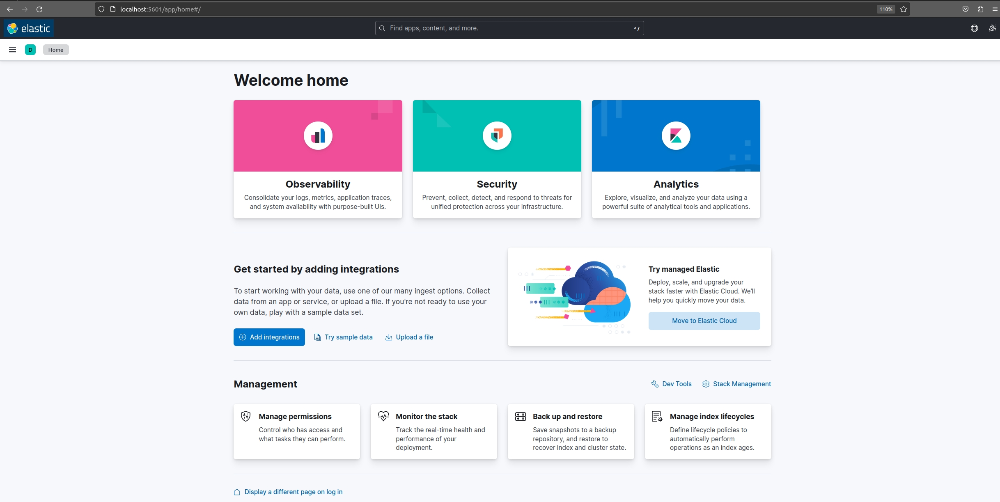
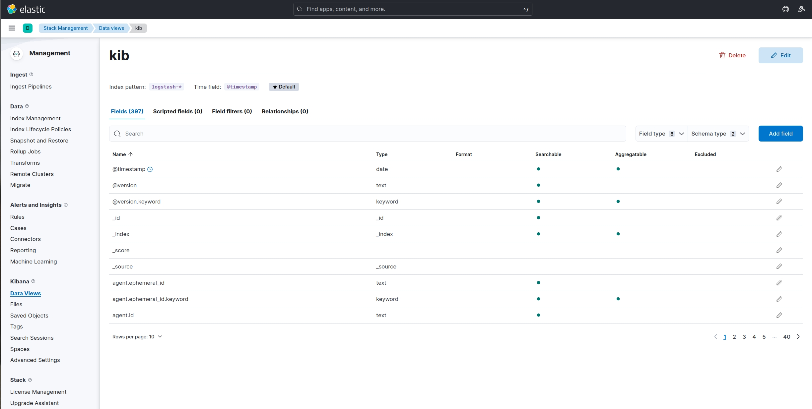
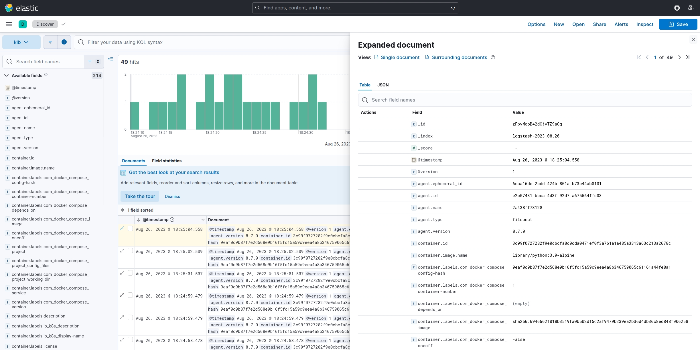

# Ответы на задания 10-monitoring-04-elk  

## Задание 1

Вам необходимо поднять в докере и связать между собой:

- elasticsearch (hot и warm ноды);
- logstash;
- kibana;
- filebeat.

Logstash следует сконфигурировать для приёма по tcp json-сообщений.

Filebeat следует сконфигурировать для отправки логов docker вашей системы в logstash.

В директории [help](./help) находится манифест docker-compose и конфигурации filebeat/logstash для быстрого 
выполнения этого задания.

Результатом выполнения задания должны быть:

- скриншот `docker ps` через 5 минут после старта всех контейнеров (их должно быть 5);
- скриншот интерфейса kibana;
- docker-compose манифест (если вы не использовали директорию help);
- ваши yml-конфигурации для стека (если вы не использовали директорию help).

### Решение 1 

Монифест файл запущен, сервисы подниты. Пришло увеличивать объем RAM на VM, т.к. 2Gb было мало - сервисы не взлетали. 

Для выполнения условий задания внесены правки в файл *logstash.conf*, выглядит он следующим образом:  

```
input {
  beats {
    port => 5046
    codec => json
  }
}

filter{
    json{
        source => "json"
   }
}

output {
  elasticsearch { 
    hosts => ["es-hot:9200"] 
    index => "logstash-%{+YYYY.MM.dd}"
  }
  stdout { codec => rubydebug}
}
```

Скриншот поднятых контейнеров ниже:  

  

Скриншот Kibana:  

  


## Задание 2

Перейдите в меню [создания index-patterns в kibana](http://localhost:5601/app/management/kibana/indexPatterns/create) и создайте несколько index-patterns из имеющихся.

Перейдите в меню просмотра логов в kibana (Discover) и самостоятельно изучите, как отображаются логи и как производить поиск по логам.

В манифесте директории help также приведенно dummy-приложение, которое генерирует рандомные события в stdout-контейнера.
Эти логи должны порождать индекс logstash-* в elasticsearch. Если этого индекса нет — воспользуйтесь советами и источниками из раздела «Дополнительные ссылки» этого задания.
 
### Решение 2

Index pattern создан:  



Мониторинг ведется, индексы создаются:  



--- 

