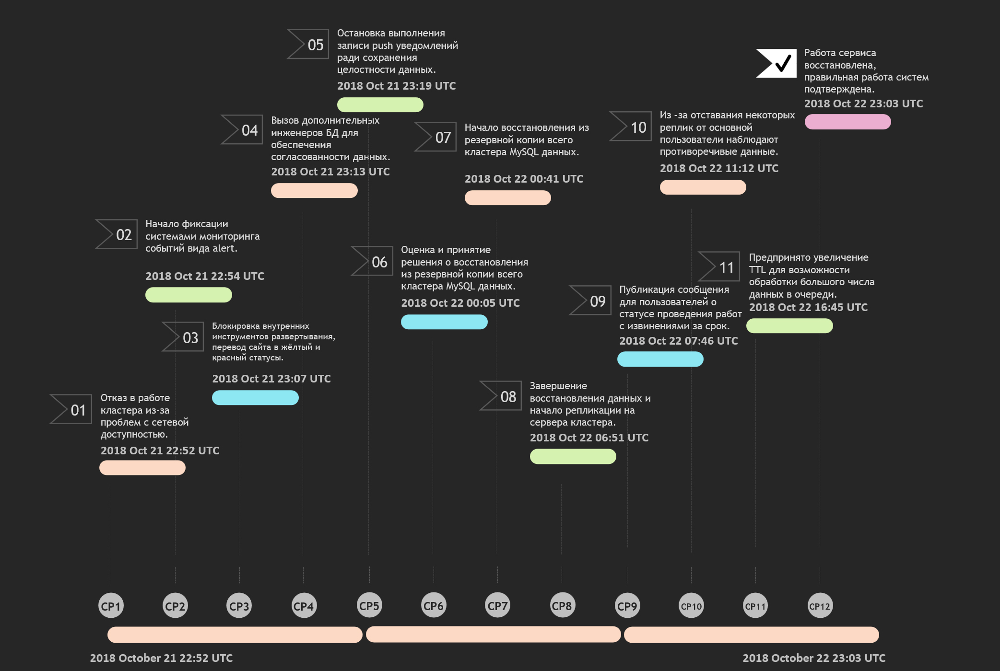

# Ответы на задания 10-monitoring-06-incident-management    

## Постмортем

| **Краткое описание инцидента** | 21 октября 2018 года, около 23:00 случился сбой баз данных в результате чего фиксировалось появление непоследовательной информации на сайте [https://github.com/](https://github.com/)  |
|:---|:---|
| **Что было предпринято** | Для обеспечения целостности данных пользователей были приостановлены работа событий (hooks) и других внутренних систем обработки|
| **Причина инцидента** | Ошибка репликации из-за разрыва сетевого соединения |
| **Воздействие инцидента** | Записи/комментарии пользователей визуально отображаются, а после перезагрузки — пропадают |
| **Обнаружение** | Система мониторинга зафиксировала генерировала большое количество уведомлений (alerts), свидетельствующих о нарушениях в работе кластеров баз данных |
| **Реакция** | После обнаружения инцидента было опубликовано уведомление для пользователей, размещенное на странице [https://www.githubstatus.com/messages](https://www.githubstatus.com/messages), на котором в реальном времени можно было видеть статус и приблизительное время до разрешения проблемы |
| **Восстановление** | Через 24 часа и 11 минут работа сервиса была полностью восстановлена  |
| **Последующие действия** | Анализ журналов MySQL на предмет нереплицированных данных, сделаны выводы о неполноте и некорректности информации, доносимой до пользователей сервиса, изменен механизм отчетности о статусе работы сервиса, определена цель - выдержать полных отказ одного из центров обработки данных |  

## Timeline по инциденту

  

