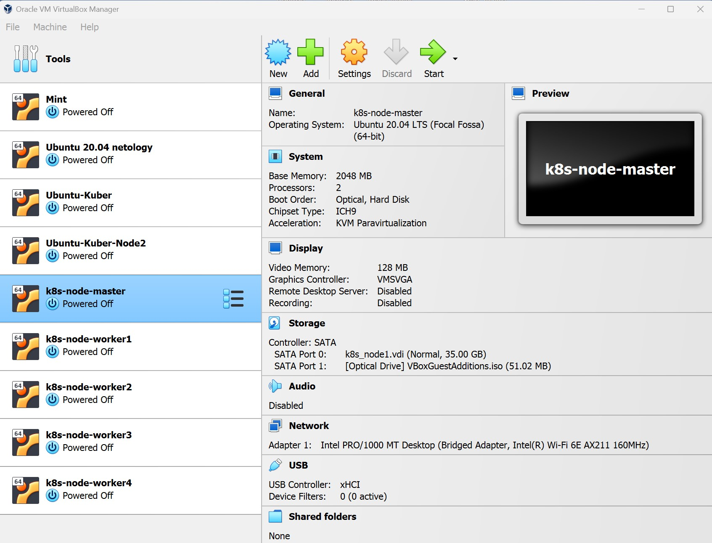
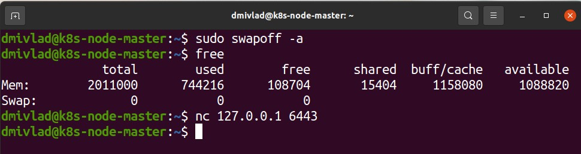
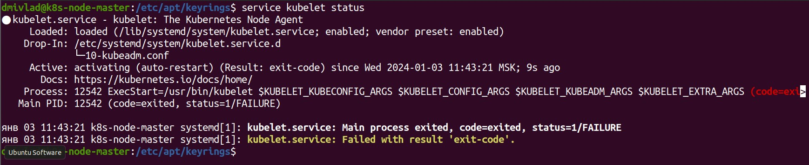
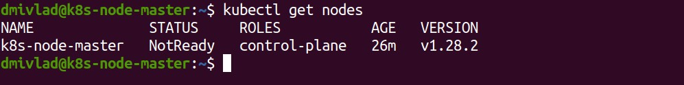

# Ответы на задания 13-kubenet-02-k8sinstall

### Цель задания

Установить кластер K8s.

### Чеклист готовности к домашнему заданию

1. Развёрнутые ВМ с ОС Ubuntu 20.04-lts.


### Инструменты и дополнительные материалы, которые пригодятся для выполнения задания

1. [Инструкция по установке kubeadm](https://kubernetes.io/docs/setup/production-environment/tools/kubeadm/create-cluster-kubeadm/).
2. [Документация kubespray](https://kubespray.io/).

-----

### Задание 1. Установить кластер k8s с 1 master node

1. Подготовка работы кластера из 5 нод: 1 мастер и 4 рабочие ноды.
2. В качестве CRI — containerd.
3. Запуск etcd производить на мастере.
4. Способ установки выбрать самостоятельно.  

### Ответ к заданию    

Инфраструктура подготовлена в Virtual Box. Создано 5 ВМ с образами Ubuntu 20.04 LTS с характеристиками 2 CPU, 2 Gb RAM, 35 Gb SSD:  

  

<details>
<summary>Prepair nodes (необходимо делать на мастер ноде и на каждой worker ноде)</summary>

Отключаем файл подкачки и убеждаемся в доступности порта 6443:  

  

Создаем папку, согласно [инструкции](https://kubernetes.io/docs/setup/production-environment/tools/kubeadm/install-kubeadm/), и устанавливаем необходимые пакеты:  

```
sudo mkdir -p 0755 /etc/apt/keyrings
sudo apt update
sudo apt install apt-transport-https ca-certificates curl
```

Добавляем Kubernetes репозиторий, загружаем публичный ключ подписи для репозиториев пакетов Kubernetes:  

```
curl -fsSL https://packages.cloud.google.com/apt/doc/apt-key.gpg | sudo gpg --dearmor -o /etc/apt/keyrings/kubernetes-archive-keyring.gpg

echo "deb [signed-by=/etc/apt/keyrings/kubernetes-archive-keyring.gpg] https://apt.kubernetes.io/ kubernetes-xenial main" | sudo tee /etc/apt/sources.list.d/kubernetes.list
```

Устанавливаем необходимые пакеты (kubelet, kubeadm, kubectl) и закрепляем их версии:  

```
sudo apt update
sudo apt install kubelet kubeadm kubectl containerd
sudo apt-mark hold kubelet kubeadm kubectl
```

После установки имеем следующий статус Kubelet:  

  

Активируем IPv4 и IPv6 Forwarding, операцию проводим под суперпользователем:  

```
modprobe br_netfilter
echo "net.ipv4.ip_forward=1" >> /etc/sysctl.conf
echo "net.bridge.bridge-nf-call-iptables=1" >> /etc/sysctl.conf
echo "net.bridge.bridge-nf-call-arptables=1" >> /etc/sysctl.conf
echo "net.bridge.bridge-nf-call-ip6tables=1" >> /etc/sysctl.conf
echo 1 > /proc/sys/net/ipv4/ip_forward
```

Проверить результат можно командой *sysctl -p /etc/sysctl.conf*

</details>

Инициализируем Kubeadm на мастер ноде:  

```
sudo kubeadm init \
--apiserver-advertise-address=192.168.155.28 \
--pod-network-cidr 10.244.0.0/16 \
--apiserver-cert-extra-sans=192.168.155.28
```

Получаем сообщение об успешном завершении инициализации:  

<details>
<summary>Successfull Init</summary>

Your Kubernetes control-plane has initialized successfully!

To start using your cluster, you need to run the following as a regular user:

  mkdir -p $HOME/.kube
  sudo cp -i /etc/kubernetes/admin.conf $HOME/.kube/config
  sudo chown $(id -u):$(id -g) $HOME/.kube/config

Alternatively, if you are the root user, you can run:

  export KUBECONFIG=/etc/kubernetes/admin.conf

You should now deploy a pod network to the cluster.
Run "kubectl apply -f [podnetwork].yaml" with one of the options listed at:
  https://kubernetes.io/docs/concepts/cluster-administration/addons/

Then you can join any number of worker nodes by running the following on each as root:

kubeadm join 192.168.155.28:6443 --token 26ehz7.sqdub2s0axh79od4 \
	--discovery-token-ca-cert-hash sha256:d044ad4186832a97ef6e1ca9a1a52e3b6c3b514ec16bd8ea9cf07c0e1e057150 

</details>  

Копируем конфиг файл в директорию non root пользователя:  

```
mkdir -p $HOME/.kube
sudo cp -i /etc/kubernetes/admin.conf $HOME/.kube/config
sudo chown $(id -u):$(id -g) $HOME/.kube/config
```

Проверяем мастер ноду:  

  

Далее устанавливаем плагин сети Flannel:  

```
kubectl apply -f https://raw.githubusercontent.com/coreos/flannel/master/Documentation/kube-flannel.yml
```

Проделываем на каждой worker ноде операции из раздела *Prepair nodes*, далее присоединяем ноды к кластеру командой:  

```
kubeadm join 192.168.155.28:6443 --token 26ehz7.sqdub2s0axh79od4 \
	--discovery-token-ca-cert-hash sha256:d044ad4186832a97ef6e1ca9a1a52e3b6c3b514ec16bd8ea9cf07c0e1e057150 
```

Получаем результат:  

```
dmivlad@k8s-node-master:~$ kubectl get nodes
NAME               STATUS   ROLES           AGE     VERSION
k8s-node-master    Ready    control-plane   11h     v1.28.2
k8s-node-worker1   Ready    <none>          35m     v1.28.2
k8s-node-worker2   Ready    <none>          27m     v1.28.2
k8s-node-worker3   Ready    <none>          16m     v1.28.2
k8s-node-worker4   Ready    <none>          4m13s   v1.28.2
```
