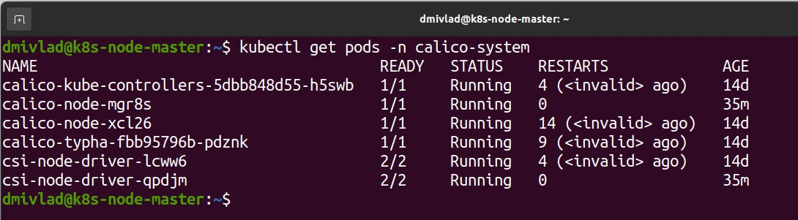
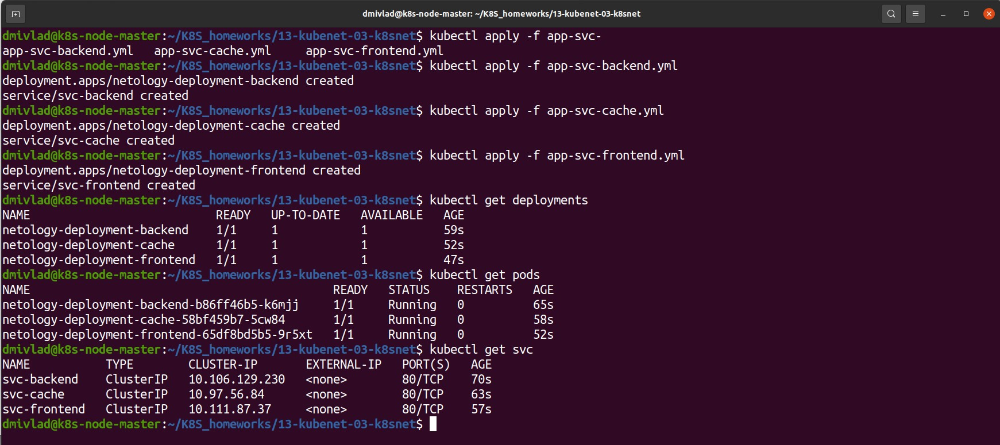
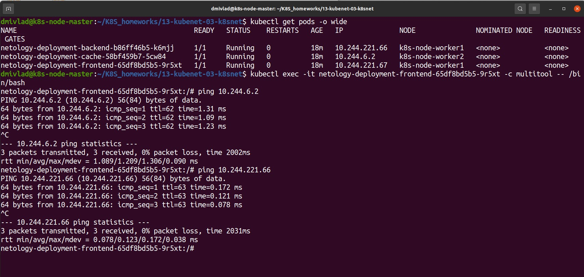
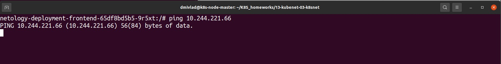

# Ответы на задания 13-kubenet-03-k8snet  

### Цель задания

Настроить сетевую политику доступа к подам.

### Чеклист готовности к домашнему заданию

1. Кластер K8s с установленным сетевым плагином Calico.

### Инструменты и дополнительные материалы, которые пригодятся для выполнения задания

1. [Документация Calico](https://www.tigera.io/project-calico/).
2. [Network Policy](https://kubernetes.io/docs/concepts/services-networking/network-policies/).
3. [About Network Policy](https://docs.projectcalico.org/about/about-network-policy).

-----

### Задание 1. Создать сетевую политику или несколько политик для обеспечения доступа

1. Создать deployment'ы приложений frontend, backend и cache и соответсвующие сервисы.
2. В качестве образа использовать network-multitool.
3. Разместить поды в namespace App.
4. Создать политики, чтобы обеспечить доступ frontend -> backend -> cache. Другие виды подключений должны быть запрещены.
5. Продемонстрировать, что трафик разрешён и запрещён.

---  

### Ответ к заданию    

Вся виртуальная инфраструктура используется из предыдущего задания. На мастер-ноду Calico был установлен по инструкции: https://docs.tigera.io/calico/latest/getting-started/kubernetes/quickstart

Скачиваем yaml конфиги calico:

```bash
wget https://raw.githubusercontent.com/projectcalico/calico/v3.27.0/manifests/tigera-operator.yaml
wget https://raw.githubusercontent.com/projectcalico/calico/v3.27.0/manifests/custom-resources.yaml
```

Правим файл `custom-resources.yaml` меняем значение `cidr` на `10.244.0.0/16`, так как kubeadm инициировали с параметром подсети `--pod-network-cidr 10.244.0.0/16`.

Применяем конфиги, все операции проделываем на мастер-ноде:

```bash
kubectl create -f tigera-operator.yaml
kubectl create -f custom-resources.yaml
```

Проверяем на мастер-ноде командой *kubectl get pods -n calico-system*, получаем вывод:  

  

Далее была предпринята попытка присоединения worker ноды, однако была получена ошибка: 

```bash
[preflight] Running pre-flight checks
error execution phase preflight: [preflight] Some fatal errors occurred:
	[ERROR FileContent--proc-sys-net-bridge-bridge-nf-call-iptables]: /proc/sys/net/bridge/bridge-nf-call-iptables does not exist
[preflight] If you know what you are doing, you can make a check non-fatal with `--ignore-preflight-errors=...`
To see the stack trace of this error execute with --v=5 or higher

```

Ошибку удалось пофиксить следующим набором команд, введенным на worker ноде:  

```bash
kubeadm reset
modprobe br_netfilter
echo 1 > /proc/sys/net/bridge/bridge-nf-call-iptables
```

Далее на мастер ноде был сгенерирован токен для подключения следующей командой:  

```bash
kubeadm token create --print-join-command
```

В результате ее выполнения получена команда для присоединения worker ноды к мастеру:  

```bash
kubeadm join 192.168.155.28:6443 --token x9c0wu.iljkn4sxtzhlxxz9 --discovery-token-ca-cert-hash sha256:418d7e889cb72f81f24221cf35615be463e39c39d6416176ece9755873b39a80
```

После проделанных манипуляций worker ноду удалось присоединить к мастеру, вводим команду для проверки получаем следующий вывод:  

```bash
dmivlad@k8s-node-master:~$ kubectl get nodes
NAME               STATUS   ROLES           AGE   VERSION
k8s-node-master    Ready    control-plane   14d   v1.28.2
k8s-node-worker4   Ready    <none>          47m   v1.28.2

```  

Проделываем то же самое на остальных worker нодах и просоединяем каждую из них к кластеру, получаем на мастере следующий результат:  

```bash
dmivlad@k8s-node-master:~/K8S_homeworks/13-kubenet-03-k8snet$ kubectl get nodes
NAME               STATUS   ROLES           AGE   VERSION
k8s-node-master    Ready    control-plane   15d   v1.28.2
k8s-node-worker1   Ready    <none>          23h   v1.28.2
k8s-node-worker2   Ready    <none>          23h   v1.28.2
k8s-node-worker3   Ready    <none>          23h   v1.28.2
k8s-node-worker4   Ready    <none>          24h   v1.28.2

```

Далее создаем новый namespace и делаем его контекстом по умолчанию:  

```bash
kubectl create namespace 13-kubenet-03-k8snet
kubectl config set-context --current --namespace=13-kubenet-03-k8snet
```

Запускаем подготовленные манифесты:  

- Манифест [app-svc-backend](assets/app-svc-backend.yml);
- Манифест [app-svc-frontend](assets/app-svc-frontend.yml);
- Манифест [app-svc-cache](assets/app-svc-cache.yml);  

После успешного запуска получаем следующий результат:  

  

Подключаемся к поду с frontent и проверяем доступность двух других подов из двух оставшихся deployment, получаем следующий результат:  

  

Создаем сетевую [политику](assets/np-denyall.yml), запрещающую хождение всего трафика, снова проверяем доступность соседнего пода, видим, что ping не проходит, значит, политика работает:  

  

Создаем политики по заданным критериям:  

- Манифест для [frontend](assets/np-frontend.yml); 
- Манифест для [backend](assets/np-backend.yml); 
- Манифест для [cache](assets/np-cache.yml);

Проверяем, что все сетевые политики применились:  

```bash
dmivlad@k8s-node-master:~/K8S_homeworks/13-kubenet-03-k8snet$ kubectl get networkpolicy
NAME          POD-SELECTOR       AGE
np-backend    app=app-backend    29s
np-cache      app=app-cache      14s
np-deny-all   <none>             40m
np-frontend   app=app-frontend   20s

```


