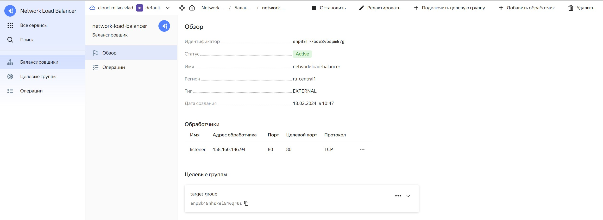

# Ответы на задания «Вычислительные мощности. Балансировщики нагрузки» 15.2-clopro-homeworks  

### Подготовка к выполнению задания

1. Домашнее задание состоит из обязательной части, которую нужно выполнить на провайдере Yandex Cloud, и дополнительной части в AWS (выполняется по желанию). 
2. Все домашние задания в блоке 15 связаны друг с другом и в конце представляют пример законченной инфраструктуры.  
3. Все задания нужно выполнить с помощью Terraform. Результатом выполненного домашнего задания будет код в репозитории. 
4. Перед началом работы настройте доступ к облачным ресурсам из Terraform, используя материалы прошлых лекций и домашних заданий.

---
## Задание 1. Yandex Cloud 

**Что нужно сделать**

1. Создать бакет Object Storage и разместить в нём файл с картинкой:

 - Создать бакет в Object Storage с произвольным именем (например, _имя_студента_дата_).
 - Положить в бакет файл с картинкой.
 - Сделать файл доступным из интернета.
 
2. Создать группу ВМ в public подсети фиксированного размера с шаблоном LAMP и веб-страницей, содержащей ссылку на картинку из бакета:

 - Создать Instance Group с тремя ВМ и шаблоном LAMP. Для LAMP рекомендуется использовать `image_id = fd827b91d99psvq5fjit`.
 - Для создания стартовой веб-страницы рекомендуется использовать раздел `user_data` в [meta_data](https://cloud.yandex.ru/docs/compute/concepts/vm-metadata).
 - Разместить в стартовой веб-странице шаблонной ВМ ссылку на картинку из бакета.
 - Настроить проверку состояния ВМ.
 
3. Подключить группу к сетевому балансировщику:

 - Создать сетевой балансировщик.
 - Проверить работоспособность, удалив одну или несколько ВМ.

Полезные документы:

- [Compute instance group](https://registry.terraform.io/providers/yandex-cloud/yandex/latest/docs/resources/compute_instance_group).
- [Network Load Balancer](https://registry.terraform.io/providers/yandex-cloud/yandex/latest/docs/resources/lb_network_load_balancer).
- [Группа ВМ с сетевым балансировщиком](https://cloud.yandex.ru/docs/compute/operations/instance-groups/create-with-balancer).

---

### Ответ к заданию 1  

Пишем манифест terraform файла для создания бакета и загрузки в него файла с картинкой. Получаем следующий результат:  

```bash
// Создание сети
resource "yandex_vpc_network" "netology" {
  name = var.vpc_name
}

// Создание публичной подсети
resource "yandex_vpc_subnet" "public" {
  name           = var.vpc_name_public
  zone           = var.default_zone
  network_id     = yandex_vpc_network.netology.id
  v4_cidr_blocks = var.default_cidr_public
}

// Создание частной подсети
resource "yandex_vpc_subnet" "private" {
  name           = var.vpc_name_private
  zone           = var.default_zone
  network_id     = yandex_vpc_network.netology.id
  v4_cidr_blocks = var.default_cidr_private
}

// Создание сервисного аккаунта
resource "yandex_iam_service_account" "bucket-sa" {
  name = "bucket-sa"
}

// Назначение роли сервисному аккаунту
resource "yandex_resourcemanager_folder_iam_member" "sa-editor" {
  folder_id = var.folder_id
  role      = "storage.editor"
  member    = "serviceAccount:${yandex_iam_service_account.bucket-sa.id}"
}

// Создание статического ключа доступа
resource "yandex_iam_service_account_static_access_key" "sa-static-key" {
  service_account_id = yandex_iam_service_account.bucket-sa.id
  description        = "static access key for object storage"
}

// Создание бакета с использованием ключа
resource "yandex_storage_bucket" "dmivlad-bucket" {
  access_key = yandex_iam_service_account_static_access_key.sa-static-key.access_key
  secret_key = yandex_iam_service_account_static_access_key.sa-static-key.secret_key
  bucket     = "dmivlad-bucket"
}

// Добавление файла-картинки в бакет
resource "yandex_storage_object" "img-mountains" {
    access_key = yandex_iam_service_account_static_access_key.sa-static-key.access_key
    secret_key = yandex_iam_service_account_static_access_key.sa-static-key.secret_key
    bucket = yandex_storage_bucket.dmivlad-bucket.bucket
    key = "mountains.jpg"
    source = "~/clopro-homeworks/15.2/infrastructure/mountains.jpg"
    acl    = "public-read"
    depends_on = [yandex_storage_bucket.dmivlad-bucket]
}
```

Проверяем получившийся результат, бакет создан, файл в него загружен и доступен для чтения публично:  

  

### Ответ к заданию 2  

Пишем манифест для создания Instance Group, используем указанный в задании образ, получаем следующий файл:  

```bash
// Создание сервисного аккаунта
resource "yandex_iam_service_account" "sa-ig" {
    name      = "sa-ig"
}

// Назначение роли сервисному аккаунту
resource "yandex_resourcemanager_folder_iam_member" "ig-editor" {
    folder_id = var.folder_id
    role      = "editor"
    member    = "serviceAccount:${yandex_iam_service_account.sa-ig.id}"
}

// Создание instance group
resource "yandex_compute_instance_group" "ig-netology" {
    name               = "instance-group-netology"
    folder_id          = var.folder_id
    service_account_id = yandex_iam_service_account.sa-ig.id

    instance_template {
        resources {
            cores  = 2
            memory = 1
            core_fraction = 20
        }
        boot_disk {
            initialize_params {
                image_id = "fd827b91d99psvq5fjit"
            }
        }
        network_interface {
            network_id  = yandex_vpc_network.netology.id
            subnet_ids  = [yandex_vpc_subnet.public.id]
            nat         = true
        }
// Указываем на прерываемость ВМ для экономии средств        
        scheduling_policy {
            preemptible = true
        }
        metadata = {
            ssh-keys   = "ubuntu:ssh-rsa AAAAB3NzaC1yc2EAAAADAQABAAABgQC9mi/8PO7m2/yrKy7ZnFr15bvdUrC6DUmqn/5DVKiHAO7hy9e9b+ktQ5WaejyCyrPr4pn474suPPLL2s6ZY71041pwKD2kQ1QeYNL0woHqOFCjlxeXpDAGVwUkwFekyUwCwmM1WWpZ9IqhPB50kN2FHnbzMONFti6nGJ/hl7sS9MH4+lKjf/eKQFBn/0u7Dm07RyFRCxc2ui8H1CSXJk84fWcmEftuJlQ9BrGuG2BWXtlCBgRbzb0Fg/AP+3LHi5N9CrxsN1YWdxPj80k9omrlKA5pEO5iuEWIJDjuNRTZnniLV6NgaDAsJuekLy9CzburqpAIycI6EK86KDUHr1sqRMnqjNVwdjbZ8z8W8PYlwpi3skmY9mNyGyGJcdLKgeno5S9NMmbcNNWGixdf6AdEvNL/pnLf/JHnEiO0S2WvCf8zMC6PKC65cneMtNTHfBMAxryFzr1HGJ7h4bQoL/X5uor1gbh5UwBYntSaAgKwl7aRi8dbeJaNg4eN2PC0E5U= dmivlad@Ubuntu20"
            user-data  = <<EOF
#!/bin/bash
apt install httpd -y
cd /var/www/html
echo '<html></html>' > index.html
service httpd start
EOF
      }
   }

    scale_policy {
        fixed_scale {
            size = 3
        }
    }

    allocation_policy {
        zones = [var.default_zone]
    }

    deploy_policy {
        max_unavailable  = 1
        max_creating     = 3
        max_expansion    = 1
        max_deleting     = 1
        startup_duration = 3
    }

     health_check {
        http_options {
            port    = 80
            path    = "/"
        }
    }

    depends_on = [
        yandex_storage_bucket.dmivlad-bucket
    ]

    load_balancer {
        target_group_name = "target-group"
    }
}
```

Проверяем получившийся результат, Instance Group создана, Target Group создана:  

  

Картина из бакета доступна из корня веб сервера:

  

### Ответ к заданию 3  

Пишем манифест Network Load Balancer и применяем его:  

```bash
// Создание сетевого балансировщика  
resource "yandex_lb_network_load_balancer" "network-load-balancer" {
  name = "network-load-balancer"
  deletion_protection = "false"
  listener {
    name = "listener"
    port = 80
    external_address_spec {
      ip_version = "ipv4"
    }
  }
  attached_target_group {
    target_group_id = yandex_compute_instance_group.ig-netology.load_balancer[0].target_group_id
    healthcheck {
      name = "healthchecker"
      http_options {
        port = 80
        path = "/"
      }
    }
  }
}
```

После применения смотрим, что балансировщик создан и работает:  

  

Весь объем файлов для построения инфраструктуры, используемой в рамках задания (кроме информации, не подлежащей раскрытию и хранящейся в файле personal.auto.tfvars), можно посмотреть по [ссылке.](https://github.com/DmitriiVl/devops-netology/tree/main/homeworks-netology/15.2-clopro-homeworks/infrastructure/)


