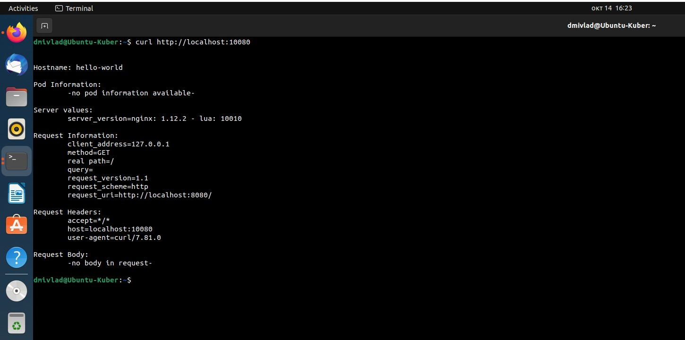
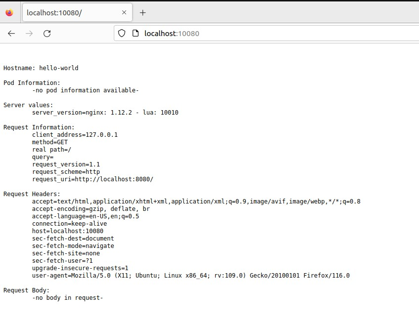
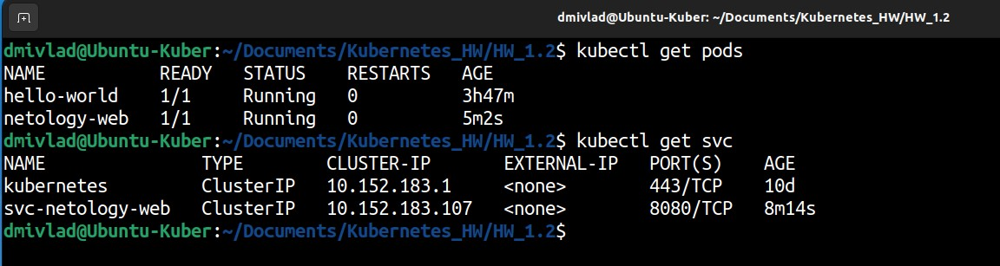
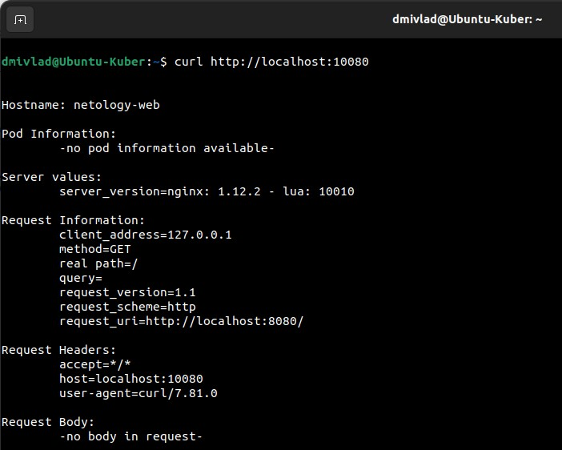

# Ответы на задания kuber-homeworks-1.2  

### Цель задания

В тестовой среде для работы с Kubernetes, установленной в предыдущем ДЗ, необходимо развернуть Pod с приложением и подключиться к нему со своего локального компьютера. 

------

### Чеклист готовности к домашнему заданию

1. Установленное k8s-решение (например, MicroK8S).
2. Установленный локальный kubectl.
3. Редактор YAML-файлов с подключенным Git-репозиторием.

------

### Инструменты и дополнительные материалы, которые пригодятся для выполнения задания

1. Описание [Pod](https://kubernetes.io/docs/concepts/workloads/pods/) и примеры манифестов.
2. Описание [Service](https://kubernetes.io/docs/concepts/services-networking/service/).

------

### Задание 1. Создать Pod с именем hello-world

1. Создать манифест (yaml-конфигурацию) Pod.
2. Использовать image - gcr.io/kubernetes-e2e-test-images/echoserver:2.2.
3. Подключиться локально к Pod с помощью `kubectl port-forward` и вывести значение (curl или в браузере).

------

## Ответ к заданию 1  

Манифест создан со следующим кодом:  

```
  apiVersion: v1
  kind: Pod
  metadata:
    name: echoserver
  spec:
    containers: 
    - name: echoserver
      image: gcr.io/kubernetes-e2e-test-images/echoserver:2.2
      ports:
      - containerPort: 8080
```

С помощью следующей команды *sudo microk8s kubectl port-forward pods/hello-world 10080:8080* получаем необходимый результат.  

Вывод утилитой CURL:  

  

Вывод в Firefox:  

  

------

### Задание 2. Создать Service и подключить его к Pod

1. Создать Pod с именем netology-web.
2. Использовать image — gcr.io/kubernetes-e2e-test-images/echoserver:2.2.
3. Создать Service с именем netology-svc и подключить к netology-web.
4. Подключиться локально к Service с помощью `kubectl port-forward` и вывести значение (curl или в браузере).

------

Манифест-файл для создания POD и SVC написан и имеет следующее содержание:  

```
apiVersion: v1
kind: Pod
metadata:
  labels:
    app: netology-web-app
  name: netology-web
spec:
  containers: 
  - name: netology-web
    image: gcr.io/kubernetes-e2e-test-images/echoserver:2.2
    ports:
    - containerPort: 8080
      name: web
      protocol: TCP

---
apiVersion: v1
kind: Service
metadata:
  name: svc-netology-web
spec:
  selector:
    app: netology-web-app
  ports:
  - port: 8080
    name: web
    targetPort: web

```

POD и Service подготовлены и запущены:  

  

С помощью следующей команды *sudo microk8s kubectl port-forward svc/svc-netology-web 10080:8080* получаем необходимый результат.  

Вывод утилитой CURL:  

  