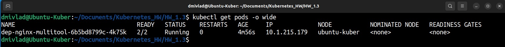
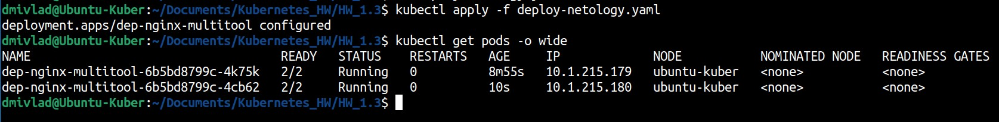
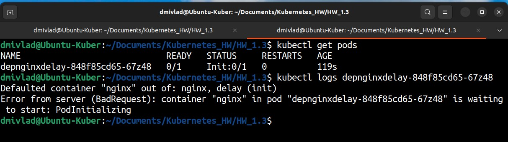
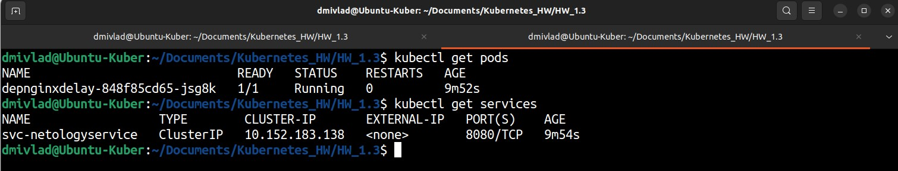

# Ответы на задания kuber-homeworks-1.3

### Цель задания

В тестовой среде для работы с Kubernetes, установленной в предыдущем ДЗ, необходимо развернуть Deployment с приложением, состоящим из нескольких контейнеров, и масштабировать его.

------

### Чеклист готовности к домашнему заданию

1. Установленное k8s-решение (например, MicroK8S).
2. Установленный локальный kubectl.
3. Редактор YAML-файлов с подключённым git-репозиторием.

------

### Инструменты и дополнительные материалы, которые пригодятся для выполнения задания

1. [Описание](https://kubernetes.io/docs/concepts/workloads/controllers/deployment/) Deployment и примеры манифестов.
2. [Описание](https://kubernetes.io/docs/concepts/workloads/pods/init-containers/) Init-контейнеров.
3. [Описание](https://github.com/wbitt/Network-MultiTool) Multitool.

------

### Задание 1. Создать Deployment и обеспечить доступ к репликам приложения из другого Pod

1. Создать Deployment приложения, состоящего из двух контейнеров — nginx и multitool. Решить возникшую ошибку.
2. После запуска увеличить количество реплик работающего приложения до 2.
3. Продемонстрировать количество подов до и после масштабирования.
4. Создать Service, который обеспечит доступ до реплик приложений из п.1.
5. Создать отдельный Pod с приложением multitool и убедиться с помощью `curl`, что из пода есть доступ до приложений из п.1.

------

### Ответ на Задание 1

Deployment-манифест создан (предварительно создан namespace *hw1-3*) согласно требованиям, следующего вида:  

```
apiVersion: apps/v1
kind: Deployment
metadata:
  name: dep-nginx-multitool
  namespace: hw1-3
spec:
  replicas: 1
  selector:
    matchLabels:
      app: nginx-multitool
  template:
    metadata:
      labels:
        app: nginx-multitool
    spec:
      containers:
      - name: nginx
        image: nginx:1.20
        ports:
        - containerPort: 8080
      - name: multitool
        image: wbitt/network-multitool
        ports:
        - containerPort: 10633
```

В данной конфигурации не стартует контейнер multitool. Причина - уже занятый порт 80 контейнером c nginx:  

```
dmivlad@Ubuntu-Kuber:~/Documents/Kubernetes_HW/HW_1.3$ kubectl describe pod dep-nginx-multitool-b857cf5f4-qgrcf -n hw1-3

Name:             dep-nginx-multitool-b857cf5f4-qgrcf

Namespace:        hw1-3

Priority:         0

Service Account:  default

Node:             ubuntu-kuber/10.0.2.15

Start Time:       Sun, 15 Oct 2023 17:51:17 +0300

Labels:           app=nginx-multitool

                  pod-template-hash=b857cf5f4

Annotations:      cni.projectcalico.org/containerID: c1a7cb2411890f6d9c0a9528bb51d77cbc628ebe75aa6e8fdbd38b0d440ab7a5

                  cni.projectcalico.org/podIP: 10.1.215.178/32

                  cni.projectcalico.org/podIPs: 10.1.215.178/32

Status:           Running

IP:               10.1.215.178

IPs:

  IP:           10.1.215.178

Controlled By:  ReplicaSet/dep-nginx-multitool-b857cf5f4

Containers:

  nginx:

    Container ID:   containerd://f5eccec70e4e8a800bffbc78d5368746b727c5da57ad1219a2b9a4b806be5ea2

    Image:          nginx:1.20

    Image ID:       docker.io/library/nginx@sha256:38f8c1d9613f3f42e7969c3b1dd5c3277e635d4576713e6453c6193e66270a6d

    Port:           8080/TCP

    Host Port:      0/TCP

    State:          Running

      Started:      Sun, 15 Oct 2023 17:51:24 +0300

    Ready:          True

    Restart Count:  0

    Environment:    <none>

    Mounts:

      /var/run/secrets/kubernetes.io/serviceaccount from kube-api-access-lwqz8 (ro)

  multitool:

    Container ID:   containerd://95ffbefedf4ecaf7c706850fe8ab5a87a6b65c4174b3ed935144f8bb7b54f768

    Image:          wbitt/network-multitool

    Image ID:       docker.io/wbitt/network-multitool@sha256:d1137e87af76ee15cd0b3d4c7e2fcd111ffbd510ccd0af076fc98dddfc50a735

    Port:           10633/TCP

    Host Port:      0/TCP

    State:          Terminated

      Reason:       Error

      Exit Code:    1

      Started:      Sun, 15 Oct 2023 17:52:37 +0300

      Finished:     Sun, 15 Oct 2023 17:52:40 +0300

    Last State:     Terminated

      Reason:       Error

      Exit Code:    1

      Started:      Sun, 15 Oct 2023 17:51:58 +0300

      Finished:     Sun, 15 Oct 2023 17:52:01 +0300

    Ready:          False

    Restart Count:  3

    Environment:    <none>

    Mounts:

      /var/run/secrets/kubernetes.io/serviceaccount from kube-api-access-lwqz8 (ro)

```

Лог по контейнеру:  

```
dmivlad@Ubuntu-Kuber:~/Documents/Kubernetes_HW/HW_1.3$ kubectl logs dep-nginx-multitool-b857cf5f4-qgrcf -c multitool -n hw1-3

The directory /usr/share/nginx/html is not mounted.

Therefore, over-writing the default index.html file with some useful information:

WBITT Network MultiTool (with NGINX) - dep-nginx-multitool-b857cf5f4-qgrcf - 10.1.215.178 - HTTP: 80 , HTTPS: 443 . (Formerly praqma/network-multitool)

2023/10/15 14:57:48 [emerg] 1#1: bind() to 0.0.0.0:80 failed (98: Address in use)

nginx: [emerg] bind() to 0.0.0.0:80 failed (98: Address in use)

2023/10/15 14:57:48 [emerg] 1#1: bind() to 0.0.0.0:80 failed (98: Address in use)

nginx: [emerg] bind() to 0.0.0.0:80 failed (98: Address in use)

2023/10/15 14:57:48 [emerg] 1#1: bind() to 0.0.0.0:80 failed (98: Address in use)

nginx: [emerg] bind() to 0.0.0.0:80 failed (98: Address in use)

2023/10/15 14:57:48 [emerg] 1#1: bind() to 0.0.0.0:80 failed (98: Address in use)

nginx: [emerg] bind() to 0.0.0.0:80 failed (98: Address in use)

2023/10/15 14:57:48 [emerg] 1#1: bind() to 0.0.0.0:80 failed (98: Address in use)

nginx: [emerg] bind() to 0.0.0.0:80 failed (98: Address in use)

2023/10/15 14:57:48 [emerg] 1#1: still could not bind()

nginx: [emerg] still could not bind()

```

Пробуем исправить ошибку через указание переменной окружения для второго контейнера. Манифест теперь выглядит следующим образом:  

```
apiVersion: apps/v1
kind: Deployment
metadata:
  name: dep-nginx-multitool
  namespace: hw1-3
spec:
  replicas: 1
  selector:
    matchLabels:
      app: nginx-multitool
  template:
    metadata:
      labels:
        app: nginx-multitool
    spec:
      containers:
      - name: nginx
        image: nginx:1.20
        # resources:
        #   limits:
        #     memory: "128Mi"
        #     cpu: "500m"
        ports:
        - containerPort: 8080
      - name: multitool
        image: wbitt/network-multitool
        ports:
        - containerPort: 10633
        env:
          - name: HTTP_PORT
            value: "10633"
```

После внесения правок Deployment стартует без ошибок. Количество PODs на скриншоте:  

  

Правим файл конфигурации и увеличиваем количество реплик до 2, применяем обновленную конфигурацию. Количество PODs увеличилось:  

  


### Задание 2. Создать Deployment и обеспечить старт основного контейнера при выполнении условий

1. Создать Deployment приложения nginx и обеспечить старт контейнера только после того, как будет запущен сервис этого приложения.
2. Убедиться, что nginx не стартует. В качестве Init-контейнера взять busybox.
3. Создать и запустить Service. Убедиться, что Init запустился.
4. Продемонстрировать состояние пода до и после запуска сервиса.

------

### Ответ на Задание 2

Манифест создан, файл выглядит следующим образом:  

```
apiVersion: apps/v1
kind: Deployment
metadata:
  name: depnginxdelay
  namespace: hw1-3
spec:
  replicas: 1
  selector:
    matchLabels:
      app: nginxDelay
  template:
    metadata:
      labels:
        app: nginxDelay
    spec:
      containers:
      - name: nginx
        image: nginx
        ports:
        - containerPort: 8080
      initContainers:
      - name: delay
        image: busybox
        command: ['sh', '-c', "until nslookup svc-netologyservice.hw1-3.svc.cluster.local; do echo waiting for svc-netologyservice; sleep 30; done"]

```

Runtime контейнер не запустился, т.к. отсутствует сервис с указанным именем:  

  

Пишем сервис *svc-netologyservice*, теперь файл-манифест выглядит следующим образом:  

```
apiVersion: apps/v1
kind: Deployment
metadata:
  name: depnginxdelay
  namespace: hw1-3
spec:
  replicas: 1
  selector:
    matchLabels:
      app: nginxDelay
  template:
    metadata:
      labels:
        app: nginxDelay
    spec:
      containers:
      - name: nginx
        image: nginx
        ports:
        - containerPort: 8080
      initContainers:
      - name: delay
        image: busybox
        command: ['sh', '-c', "until nslookup svc-netologyservice.hw1-3.svc.cluster.local; do echo waiting for svc-netologyservice; sleep 30; done"]
---
apiVersion: v1
kind: Service
metadata:
  name: svc-netologyservice
spec:
  selector:
    app: nginxDelay
  ports:
  - name: nginx
    protocol: TCP
    port: 8080
    targetPort: 8080

```  

Под и сервис поднялись после завершения работы Init контейнера: 

  

Состояние подов продемонстрировано ниже:  

```
dmivlad@Ubuntu-Kuber:~/Documents/Kubernetes_HW/HW_1.3$ kubectl describe pods

Name:             depnginxdelay-848f85cd65-jsg8k

Namespace:        hw1-3

Priority:         0

Service Account:  default

Node:             ubuntu-kuber/10.0.2.15

Start Time:       Sun, 22 Oct 2023 21:19:40 +0300

Labels:           app=nginxDelay

                  pod-template-hash=848f85cd65

Annotations:      cni.projectcalico.org/containerID: 2adc1c3c7000a45e8064d4df2827311c0a11ff506452e02db2f531f1bcb91848

                  cni.projectcalico.org/podIP: 10.1.215.155/32

                  cni.projectcalico.org/podIPs: 10.1.215.155/32

Status:           Running

IP:               10.1.215.155

IPs:

  IP:           10.1.215.155

Controlled By:  ReplicaSet/depnginxdelay-848f85cd65

Init Containers:

  delay:

    Container ID:  containerd://3a36c9275a7a006ada631e16c1c9889334113b9439758b847efb6333e22d92e5

    Image:         busybox

    Image ID:      docker.io/library/busybox@sha256:3fbc632167424a6d997e74f52b878d7cc478225cffac6bc977eedfe51c7f4e79

    Port:          <none>

    Host Port:     <none>

    Command:

      sh

      -c

      until nslookup svc-netologyservice.hw1-3.svc.cluster.local; do echo waiting for svc-netologyservice; sleep 30; done

    State:          Terminated

      Reason:       Completed

      Exit Code:    0

      Started:      Sun, 22 Oct 2023 21:19:47 +0300

      Finished:     Sun, 22 Oct 2023 21:19:47 +0300

    Ready:          True

    Restart Count:  0

    Environment:    <none>

    Mounts:

      /var/run/secrets/kubernetes.io/serviceaccount from kube-api-access-st6hk (ro)

Containers:

  nginx:

    Container ID:   containerd://cbed0cb2a97150ab67d442892b71a3513c4108a98b73afb328caafeb8527d34e

    Image:          nginx

    Image ID:       docker.io/library/nginx@sha256:b4af4f8b6470febf45dc10f564551af682a802eda1743055a7dfc8332dffa595

    Port:           8080/TCP

    Host Port:      0/TCP

    State:          Running

      Started:      Sun, 22 Oct 2023 21:19:52 +0300

    Ready:          True

    Restart Count:  0

    Environment:    <none>

    Mounts:

      /var/run/secrets/kubernetes.io/serviceaccount from kube-api-access-st6hk (ro)

Conditions:

  Type              Status

  Initialized       True 

  Ready             True 

  ContainersReady   True 

  PodScheduled      True 

Volumes:

  kube-api-access-st6hk:

    Type:                    Projected (a volume that contains injected data from multiple sources)

    TokenExpirationSeconds:  3607

    ConfigMapName:           kube-root-ca.crt

    ConfigMapOptional:       <nil>

    DownwardAPI:             true

QoS Class:                   BestEffort

Node-Selectors:              <none>

Tolerations:                 node.kubernetes.io/not-ready:NoExecute op=Exists for 300s

                             node.kubernetes.io/unreachable:NoExecute op=Exists for 300s

Events:                      <none>


```


