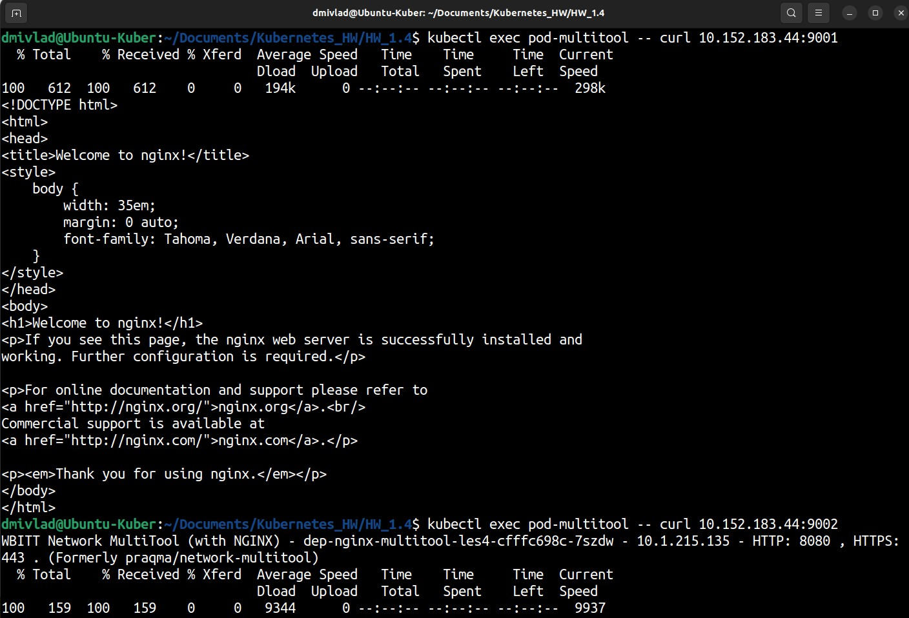
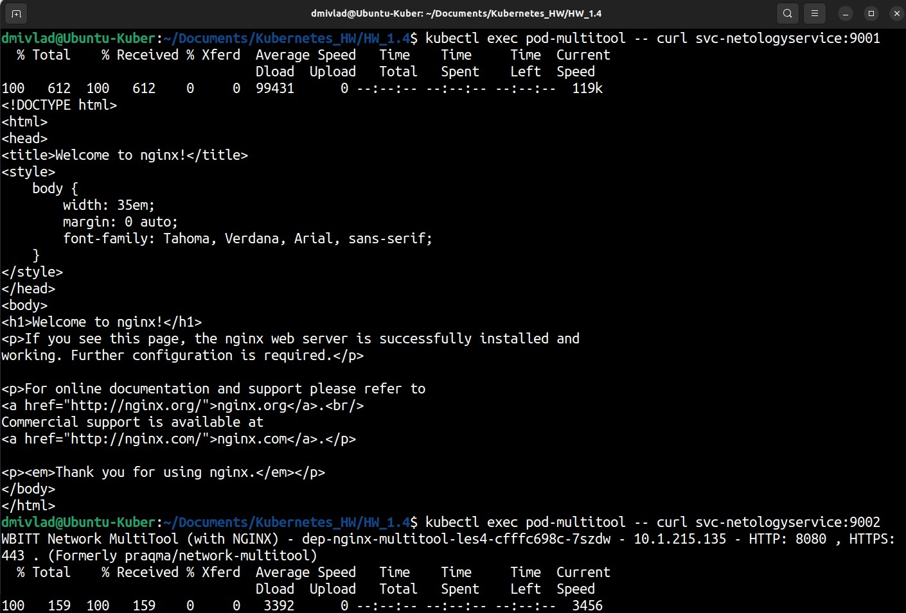
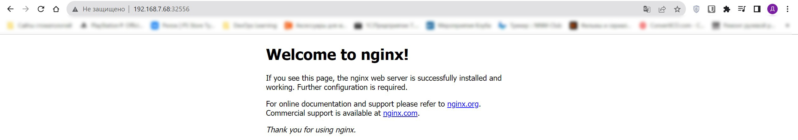

# Ответы на задания kuber-homeworks-1.4

### Цель задания

В тестовой среде Kubernetes необходимо обеспечить доступ к приложению, установленному в предыдущем ДЗ и состоящему из двух контейнеров, по разным портам в разные контейнеры как внутри кластера, так и снаружи.

------

### Чеклист готовности к домашнему заданию

1. Установленное k8s-решение (например, MicroK8S).
2. Установленный локальный kubectl.
3. Редактор YAML-файлов с подключённым Git-репозиторием.

------

### Инструменты и дополнительные материалы, которые пригодятся для выполнения задания

1. [Описание](https://kubernetes.io/docs/concepts/workloads/controllers/deployment/) Deployment и примеры манифестов.
2. [Описание](https://kubernetes.io/docs/concepts/services-networking/service/) Описание Service.
3. [Описание](https://github.com/wbitt/Network-MultiTool) Multitool.

------

### Задание 1. Создать Deployment и обеспечить доступ к контейнерам приложения по разным портам из другого Pod внутри кластера

1. Создать Deployment приложения, состоящего из двух контейнеров (nginx и multitool), с количеством реплик 3 шт.
2. Создать Service, который обеспечит доступ внутри кластера до контейнеров приложения из п.1 по порту 9001 — nginx 80, по 9002 — multitool 8080.
3. Создать отдельный Pod с приложением multitool и убедиться с помощью `curl`, что из пода есть доступ до приложения из п.1 по разным портам в разные контейнеры.
4. Продемонстрировать доступ с помощью `curl` по доменному имени сервиса.
5. Предоставить манифесты Deployment и Service в решении, а также скриншоты или вывод команды п.4.

------

### Ответ на Задание 1

Создаем манифест для Deployment

<details>
<summary>Deployment for nginx and multitool</summary>

```yaml
apiVersion: apps/v1
kind: Deployment
metadata:
  name: dep-nginx-multitool-les4
  namespace: hw1-4
spec:
  replicas: 3
  selector:
    matchLabels:
      app: nginx-multitool
  template:
    metadata:
      labels:
        app: nginx-multitool
    spec:
      containers:
      - name: nginx
        image: nginx:1.20
      - name: multitool
        image: wbitt/network-multitool
        env:
          - name: HTTP_PORT
            value: "8080"

---
apiVersion: v1
kind: Service
metadata:
  name: svc-netologyservice
  namespace: hw1-4
spec:
  selector:
    app: nginx-multitool
  ports:
  - name: nginx
    port: 9001
    targetPort: 80
  - name: miltitool
    port: 9002
    targetPort: 8080
```

</details>

Создаем манифест для PODа, с которого будем производить тестирование:  

<details>
<summary>POD for checking nginx and multitool</summary>

```yaml
apiVersion: v1
kind: Pod
metadata:
  name: pod-multitool
  namespace: hw1-4
  labels:
    name: mtoolforcheck
spec:
  containers:
  - name: multitool
    image: wbitt/network-multitool
```
</details>

Проверяем доступ по IP адресу:  

  

Проверяем доступ по имени сервиса:  

  


### Задание 2. Создать Service и обеспечить доступ к приложениям снаружи кластера

1. Создать отдельный Service приложения из Задания 1 с возможностью доступа снаружи кластера к nginx, используя тип NodePort.
2. Продемонстрировать доступ с помощью браузера или `curl` с локального компьютера.
3. Предоставить манифест и Service в решении, а также скриншоты или вывод команды п.2.

------

### Ответ на Задание 2

Создаем манифест для поднятия nginx, multitool и Nodeport service:  

<details>
<summary>Manifest for nginx, multitool and Nodeport service</summary>

```yaml
apiVersion: apps/v1
kind: Deployment
metadata:
  name: dep-nginx-multitool-les4
  namespace: hw1-4
spec:
  replicas: 3
  selector:
    matchLabels:
      app: nginx-multitool
  template:
    metadata:
      labels:
        app: nginx-multitool
    spec:
      containers:
      - name: nginx
        image: nginx:1.20
      - name: multitool
        image: wbitt/network-multitool
        env:
          - name: HTTP_PORT
            value: "8080"

---
apiVersion: v1
kind: Service
metadata:
  name: svc-service-nginx-multitool
  namespace: hw1-4
spec:
  selector:
    app: nginx-multitool
  type: NodePort
  ports:
  - port: 80
    nodePort: 32556
    
```
</details>

При помощи браузера с локального компьютера демонстрируем получившийся результат:  

  
