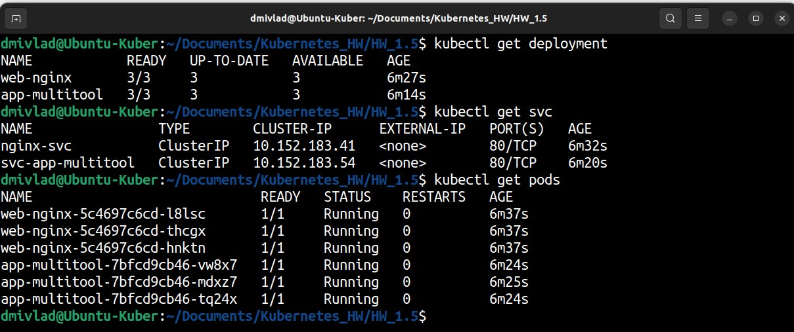
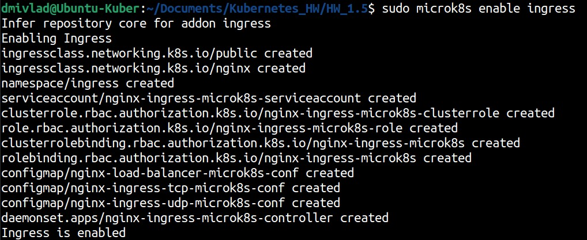
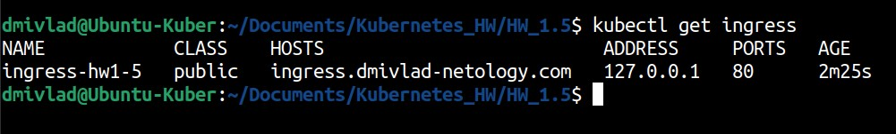
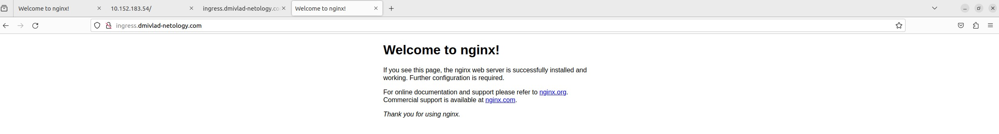
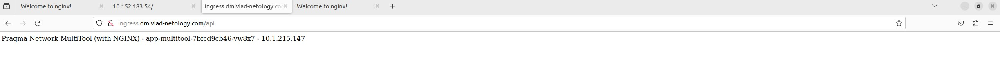

# Ответы на задания kuber-homeworks-1.5  

### Цель задания

В тестовой среде Kubernetes необходимо обеспечить доступ к двум приложениям снаружи кластера по разным путям.

------

### Чеклист готовности к домашнему заданию

1. Установленное k8s-решение (например, MicroK8S).
2. Установленный локальный kubectl.
3. Редактор YAML-файлов с подключённым Git-репозиторием.

------

### Инструменты и дополнительные материалы, которые пригодятся для выполнения задания

1. [Инструкция](https://microk8s.io/docs/getting-started) по установке MicroK8S.
2. [Описание](https://kubernetes.io/docs/concepts/services-networking/service/) Service.
3. [Описание](https://kubernetes.io/docs/concepts/services-networking/ingress/) Ingress.
4. [Описание](https://github.com/wbitt/Network-MultiTool) Multitool.

------

### Задание 1. Создать Deployment приложений backend и frontend

1. Создать Deployment приложения _frontend_ из образа nginx с количеством реплик 3 шт.
2. Создать Deployment приложения _backend_ из образа multitool. 
3. Добавить Service, которые обеспечат доступ к обоим приложениям внутри кластера. 
4. Продемонстрировать, что приложения видят друг друга с помощью Service.
5. Предоставить манифесты Deployment и Service в решении, а также скриншоты или вывод команды п.4.

------

### Задание 2. Создать Ingress и обеспечить доступ к приложениям снаружи кластера

1. Включить Ingress-controller в MicroK8S.
2. Создать Ingress, обеспечивающий доступ снаружи по IP-адресу кластера MicroK8S так, чтобы при запросе только по адресу открывался _frontend_ а при добавлении /api - _backend_.
3. Продемонстрировать доступ с помощью браузера или `curl` с локального компьютера.
4. Предоставить манифесты и скриншоты или вывод команды п.2.

------

### Ответ на Задание 1

Создаем два манифеста, каждый из которых содержит описание Deployment и Service. Первый для Nginx: 

<details>
<summary>Deployment and Service for nginx</summary>

```yaml
apiVersion: apps/v1
kind: Deployment
metadata:
  name: web-nginx
  namespace: hw1-5
spec:
  replicas: 3
  selector:
    matchLabels:
      app: web
  template:
    metadata:
      labels:
        app: web
    spec:
      containers:
      - name: nginx
        image: nginx:1.20

---
apiVersion: v1
kind: Service
metadata:
  name: nginx-svc
  namespace: hw1-5
spec:
  selector:
    app: web
  ports:
  - port: 80
    name: web
```
</details>

Второй для multitool:  

<details>
<summary>Deployment and Service for multitool</summary>

```yaml
apiVersion: apps/v1
kind: Deployment
metadata:
  name: app-multitool
  namespace: hw1-5
spec:
  replicas: 3
  selector:
    matchLabels:
      app: dmivlad-app
  template:
    metadata:
      labels:
        app: dmivlad-app
    spec:
      containers:
      - name: multitool
        image: praqma/network-multitool:alpine-extra

---
apiVersion: v1
kind: Service
metadata:
  name: svc-app-multitool
  namespace: hw1-5
spec:
  selector:
    app: dmivlad-app
  ports:
  - port: 80
    name: dmivlad-app
```
</details>  

Проверяем, что все поднялось:  

  

Проверяем доступность приложений друг для друга сначала одного:  

```
dmivlad@Ubuntu-Kuber:~/Documents/Kubernetes_HW/HW_1.5$ kubectl exec -it web-nginx-5c4697c6cd-l8lsc  -- bin/bash

root@web-nginx-5c4697c6cd-l8lsc:/# curl http://svc-app-multitool

Praqma Network MultiTool (with NGINX) - app-multitool-7bfcd9cb46-mdxz7 - 10.1.215.145

```

Затем второго:  

```
dmivlad@Ubuntu-Kuber:~/Documents/Kubernetes_HW/HW_1.5$ kubectl exec -it app-multitool-7bfcd9cb46-vw8x7 -- bin/bash

bash-5.1# curl http://nginx-svc

<!DOCTYPE html>

<html>

<head>

<title>Welcome to nginx!</title>

<style>

    body {

        width: 35em;

        margin: 0 auto;

        font-family: Tahoma, Verdana, Arial, sans-serif;

    }

</style>

</head>

<body>

<h1>Welcome to nginx!</h1>

<p>If you see this page, the nginx web server is successfully installed and

working. Further configuration is required.</p>


<p>For online documentation and support please refer to

<a href="http://nginx.org/">nginx.org</a>.<br/>

Commercial support is available at

<a href="http://nginx.com/">nginx.com</a>.</p>


<p><em>Thank you for using nginx.</em></p>

</body>

</html>

```

### Ответ на Задание 2  

Включаем Ingress контроллер командой **sudo mikrok8s enable ingress**:  

  

Манифест Ingress файла выглядит следующим образом: 

<details>
<summary>Ingress manifest</summary>

```yaml
apiVersion: networking.k8s.io/v1
kind: Ingress
metadata:
  name: ingress-hw1-5
  namespace: hw1-5
  annotations:
    nginx.ingress.kubernetes.io/rewrite-target: /
spec:
  rules:
  - host: ingress.dmivlad-netology.com
    http:
      paths:
      - pathType: Prefix
        path: /
        backend:
          service:
            name: nginx-svc
            port: 
              name: web
      - pathType: Prefix
        path: /api
        backend:
          service:
            name: svc-app-multitool
            port:
              name: dmivlad-app

```
</details>

Проверяем запуск:  
  

Проверяем работоспособность первого домена:  

  

Проверяем работоспособность второго домена:  

  


