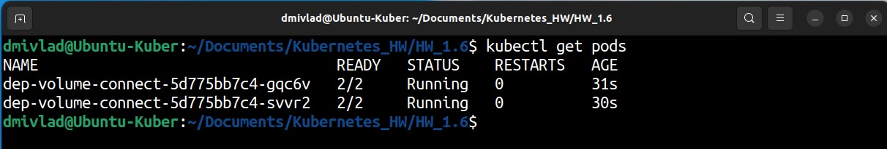
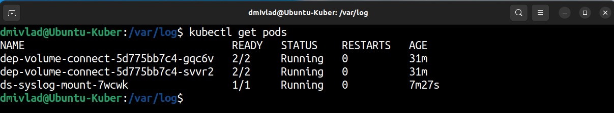

# Ответы на задания kuber-homeworks-1.6  

### Цель задания

В тестовой среде Kubernetes нужно обеспечить обмен файлами между контейнерам пода и доступ к логам ноды.

------

### Чеклист готовности к домашнему заданию

1. Установленное K8s-решение (например, MicroK8S).
2. Установленный локальный kubectl.
3. Редактор YAML-файлов с подключенным GitHub-репозиторием.

------

### Дополнительные материалы для выполнения задания

1. [Инструкция по установке MicroK8S](https://microk8s.io/docs/getting-started).
2. [Описание Volumes](https://kubernetes.io/docs/concepts/storage/volumes/).
3. [Описание Multitool](https://github.com/wbitt/Network-MultiTool).

------

### Задание 1 

**Что нужно сделать**

Создать Deployment приложения, состоящего из двух контейнеров и обменивающихся данными.

1. Создать Deployment приложения, состоящего из контейнеров busybox и multitool.
2. Сделать так, чтобы busybox писал каждые пять секунд в некий файл в общей директории.
3. Обеспечить возможность чтения файла контейнером multitool.
4. Продемонстрировать, что multitool может читать файл, который периодоически обновляется.
5. Предоставить манифесты Deployment в решении, а также скриншоты или вывод команды из п. 4.

------

### Задание 2

**Что нужно сделать**

Создать DaemonSet приложения, которое может прочитать логи ноды.

1. Создать DaemonSet приложения, состоящего из multitool.
2. Обеспечить возможность чтения файла `/var/log/syslog` кластера MicroK8S.
3. Продемонстрировать возможность чтения файла изнутри пода.
4. Предоставить манифесты Deployment, а также скриншоты или вывод команды из п. 2.

------

### Ответ на Задание 1

Подготавливаем Deployment манифест для запуска busybox и multitool, а также с Volume типа EmptyDir:

<details>
<summary>Deployment for busybox and multitool</summary>

```yaml
apiVersion: apps/v1
kind: Deployment
metadata:
  name: dep-volume-connect
  namespace: hw1-6
spec:
  replicas: 2
  selector:
    matchLabels:
      app: busybox-multitool
  template:
    metadata:
      labels:
        app: busybox-multitool
    spec:
      containers:
      - name: busybox
        image: busybox
        resources:
          limits:
            memory: "64Mi"
            cpu: "250m"
        command: ['sh', '-c', "sleep 10; while true; do (echo '====================================='; date; ping -c 3 ya.ru) >> /log_output/pinglog; sleep 10; done"]
        volumeMounts:
          - name: log-volume
            mountPath: /log_output
      - name: multitool
        image: wbitt/network-multitool
        resources:
          limits:
            memory: "64Mi"
            cpu: "125m"
        volumeMounts:
          - name: log-volume
            mountPath: /log_input
      volumes:
      - name: log-volume
        emptyDir: {}
```

</details>

Стартуем манифест и убеждаемся, что поды поднялись:  

  


Подключаемся к контейнеру с multitool на одной из реплик и проверяем доступность записанного лога:  

<details>
<summary>Checking log access</summary>

```yaml
dmivlad@Ubuntu-Kuber:~/Documents/Kubernetes_HW/HW_1.6$ kubectl exec -it dep-volume-connect-5d775bb7c4-gqc6v -c multitool -- bin/bash

dep-volume-connect-5d775bb7c4-gqc6v:/# tail -20 log_input/pinglog 

=====================================

Sun Nov  5 10:08:28 UTC 2023

PING ya.ru (5.255.255.242): 56 data bytes

64 bytes from 5.255.255.242: seq=0 ttl=49 time=35.491 ms

64 bytes from 5.255.255.242: seq=1 ttl=49 time=37.952 ms

64 bytes from 5.255.255.242: seq=2 ttl=49 time=53.024 ms


--- ya.ru ping statistics ---

3 packets transmitted, 3 packets received, 0% packet loss

round-trip min/avg/max = 35.491/42.155/53.024 ms

=====================================

Sun Nov  5 10:08:40 UTC 2023

PING ya.ru (5.255.255.242): 56 data bytes

64 bytes from 5.255.255.242: seq=0 ttl=49 time=31.032 ms

64 bytes from 5.255.255.242: seq=1 ttl=49 time=83.592 ms

64 bytes from 5.255.255.242: seq=2 ttl=49 time=39.020 ms


--- ya.ru ping statistics ---

3 packets transmitted, 3 packets received, 0% packet loss

round-trip min/avg/max = 31.032/51.214/83.592 ms

dep-volume-connect-5d775bb7c4-gqc6v:/# 

```
</details>

------

### Ответ на Задание 2  

Готовим манифест для DaemonSet с созданием Volume типа hostPath для доступа к файлу syslog, расположенному на ноде:  

<details>
<summary>DaemonSet with multitool and hostPath Volume</summary>

```yaml
apiVersion: apps/v1
kind: DaemonSet
metadata:
  name: ds-syslog-mount
  namespace: hw1-6
  labels:
    app: syslog-mount
spec:
  selector:
    matchLabels:
      app: syslog-mount
  template:
    metadata:
      labels:
        app: syslog-mount
    spec:
      containers:
      - name: multitool
        image: wbitt/network-multitool
        resources:
          requests:
            memory: "64Mi"
            cpu: "125m"
          limits:
            memory: "128Mi"
            cpu: "500m"
        volumeMounts:
        - name: cluster-syslog-dir
          # standard logs location directory
          mountPath: /var/cluster-syslog
      volumes:
      - name: cluster-syslog-dir
        hostPath:
          path: /var/log/syslog
          type: ""
```
</details>

Проверяем, что поды DS поднялись:  

  

Подключаемся к POD, в нем должна быть примонтирована директория и доступен файл лога по пути /var/cluster-syslog:  

<details>

<summary>Checking syslog access</summary>

```yaml
dmivlad@Ubuntu-Kuber:/var/log$ kubectl exec -it ds-syslog-mount-7wcwk -c multitool -- bin/bash

ds-syslog-mount-7wcwk:/# tail -n 5 /var/cluster-syslog 

Nov  5 13:37:21 Ubuntu-Kuber microk8s.daemon-kubelite[27568]: Trace[1854470995]: [980.678924ms] [980.678924ms] END

Nov  5 13:37:22 Ubuntu-Kuber microk8s.daemon-kubelite[27568]: I1105 13:37:22.003030   27568 trace.go:219] Trace[1005920859]: "Update" accept:application/json, */*,audit-id:55017eab-1cef-4a8c-830b-12c6001cce04,client:10.1.215.129,protocol:HTTP/2.0,resource:endpoints,scope:resource,url:/api/v1/namespaces/kube-system/endpoints/microk8s.io-hostpath,user-agent:Go-http-client/2.0,verb:PUT (05-Nov-2023 13:37:21.394) (total time: 608ms):

Nov  5 13:37:22 Ubuntu-Kuber microk8s.daemon-kubelite[27568]: Trace[1005920859]: ["GuaranteedUpdate etcd3" audit-id:55017eab-1cef-4a8c-830b-12c6001cce04,key:/services/endpoints/kube-system/microk8s.io-hostpath,type:*core.Endpoints,resource:endpoints 605ms (13:37:21.396)

Nov  5 13:37:22 Ubuntu-Kuber microk8s.daemon-kubelite[27568]: Trace[1005920859]:  ---"Txn call completed" 592ms (13:37:21.998)]

Nov  5 13:37:22 Ubuntu-Kuber microk8s.daemon-kubelite[27568]: Trace[1005920859]: [608.053466ms] [608.053466ms] END

```

</details>

------
